# Table of Contents

- [Multi-Agent AI Research System](#multi-agent-ai-research-system)
  - [Overview](#overview)
  - [Technical Stack](#technical-stack)
  - [Installation & Setup](#installation--setup)
  - [Execution Workflow](#execution-workflow)
  - [Demo Video](#demo-video)
  - [📧 Example Email Output](#-example-email-output)
  - [Key Technical Concepts](#key-technical-concepts)
  - [Workflow Flowchart](#workflow-flowchart)
- [Automated Multi-Agent SDR with Safety Guardrails](#automated-multi-agent-sdr-with-safety-guardrails)
  - [Overview](#overview-1)
  - [Agentic Architecture](#agentic-architecture)
  - [Dependencies](#dependencies)
  - [How to Run](#how-to-run)
  - [How It Works](#how-it-works)
  - [Technical Terms Glossary](#technical-terms-glossary)
  - [Project Flowchart](#project-flowchart)

---

<p align="center">
  
</p>


# Multi-Agent AI Research System

## Overview
This project implements a sophisticated multi-agent AI system designed to automate the process of deep research. Starting with a single user query, the system plans a research strategy, executes parallel web searches, synthesizes the findings into a comprehensive report, and distributes the final report via email. It showcases a classic "Plan and Execute" agentic workflow, leveraging specialized agents, structured data outputs, and both hosted and custom tools to achieve its goal.

## Technical Stack
- **Language:** Python 3.12+
- **Core Libraries:**
    - `openai-agents`: The primary framework for defining and running agents.
    - `pydantic`: For defining structured data schemas for reliable agent outputs.
    - `sendgrid`: For programmatic email sending.
    - `python-dotenv`: For managing environment variables and API keys.
    - `asyncio`: For orchestrating agent tasks and I/O operations concurrently.
- **Environment:** Jupyter Notebook

## Installation & Setup

1.  Create a `.env` file in the project root and add your API keys. You will need keys from both OpenAI and SendGrid. You must also have a verified sender email configured in your SendGrid account.
    ```
    OPENAI_API_KEY="sk-..."
    SENDGRID_API_KEY="SG...."
    ```
2.  Update the `from_email` and `to_email` addresses in the `send_email` function tool in cell `[11]` to use your verified SendGrid email address.

## Execution Workflow
The notebook orchestrates a multi-step, multi-agent workflow to perform research:

1.  **Initial Query:** The process begins with a single string `query`, such as `"Latest AI Agent frameworks in 2025"`.
2.  **Planning Phase:** The `query` is passed to the `planner_agent`. This agent's sole responsibility is to break down the high-level query into a series of specific, actionable web search queries. It returns its output as a structured `WebSearchPlan` object.
3.  **Concurrent Search Execution:** The `perform_searches` orchestrator function takes the `WebSearchPlan`. It uses `asyncio` to run multiple instances of the `search_agent` concurrently, one for each search query in the plan. Each `search_agent` uses the OpenAI-hosted `WebSearchTool` to find relevant information and generate a concise summary.
4.  **Results Aggregation:** The summaries from all parallel searches are collected into a single list of strings (`search_results`).
5.  **Report Synthesis:** The original `query` and the aggregated `search_results` are passed to the `writer_agent`. This agent acts as a senior researcher, synthesizing the raw information into a detailed, well-structured markdown report. Its output is a structured `ReportData` object, containing the full report, a short summary, and suggested follow-up questions.
6.  **Email Distribution:** The `markdown_report` is extracted from the `ReportData` object and passed to the `email_agent`. This agent is equipped with a custom `send_email` tool, which it uses to send the report as a nicely formatted HTML email via the SendGrid API.
7.  **Observability:** The entire end-to-end process is wrapped in an OpenAI `trace` context, allowing for detailed logging and debugging via the OpenAI Traces UI.

## Demo Video

<p align="center">
  <a href="https://vimeo.com/1106368445?share=copy">
    
  </a>
</p>

## 📧 Example Email Output

<p align="center">
  <a href="./Gmail%20-%20Latest%20AI%20Agent%20Frameworks%20in%202025.pdf">
    
  </a>
</p>

---

## Key Technical Concepts
- **Multi-Agent Systems:** The project employs multiple, specialized AI agents (`planner_agent`, `search_agent`, `writer_agent`, `email_agent`) that collaborate to solve a complex problem. Each agent has a distinct instruction set and toolset tailored to its specific task.
- **Plan and Execute Pattern:** A common agentic design pattern where a "planner" agent first creates a step-by-step plan, which is then executed by one or more "executor" agents or tools. This separates high-level reasoning from low-level action.
- **Structured Outputs (Pydantic):** Pydantic models (`WebSearchPlan`, `ReportData`) are used to define strict JSON schemas for agent outputs. This ensures that data passed between agents is reliable, predictable, and machine-readable, preventing errors in the workflow.
- **Hosted Tools (`WebSearchTool`):** The system leverages tools that are provided and managed by a third-party platform (OpenAI's `WebSearchTool`). This allows the agent to access powerful capabilities like web search without requiring local implementation.
- **Custom Tools (`@function_tool`):** The `send_email` function is defined as a custom tool using the `@function_tool` decorator. This grants an agent the ability to call local Python code, enabling it to interact with external APIs and systems (like SendGrid).
- **Asynchronous Orchestration (`asyncio`):** Python's `asyncio` library is used to manage the execution flow, particularly for running multiple web searches in parallel. This significantly improves the efficiency and speed of the research phase.
- **Agent Runner (`Runner`):** The core execution engine within the `openai-agents` SDK. The `Runner.run()` method is responsible for managing the full interaction cycle: sending the user message and agent instructions to the LLM, handling the model's decision to use a tool, invoking the tool with the correct arguments, and returning the final result.
- **Observability and Tracing (`trace`):** The practice of instrumenting a system to provide detailed logs of its internal state. The `with trace(...)` context manager captures all LLM calls, tool uses, and data exchanges between agents, creating a comprehensive log that is viewable in the OpenAI Traces UI for debugging and performance analysis.
- **Tool Forcing (`tool_choice="required"`):** A specific parameter within `ModelSettings` that compels the LLM to use one of its available tools, rather than generating a direct text response. This is critical for functional agents (like the `search_agent`) to ensure they perform their designated action instead of merely describing it.
- **Concurrent Task Execution (`asyncio.gather`):** A powerful `asyncio` function used to run multiple awaitable tasks (in this case, `search_agent` runs) simultaneously. By wrapping multiple search tasks with `asyncio.gather`, the system executes them in parallel, waiting only for the longest search to complete, which is far more efficient than a sequential loop.
- **Schema Definition (Pydantic `BaseModel`):** The use of Python classes inheriting from Pydantic's `BaseModel` to define a rigid data structure. The `openai-agents` framework automatically converts these Pydantic models into a JSON Schema representation that is passed to the LLM, instructing it to generate an output that strictly conforms to the defined fields and data types.

---

## Workflow Flowchart


---
# **Automated Multi-Agent SDR with Safety Guardrails**

## Overview

This project demonstrates a sophisticated, multi-agent system designed to automate the tasks of a Sales Development Representative (SDR). The system uses several AI agents, each powered by a different Large Language Model (LLM), to generate, select, format, and send cold sales emails. A key feature is an input guardrail that prevents the system from processing requests containing personal names, ensuring a degree of compliance and safety.

## Agentic Architecture

The architecture is hierarchical and event-driven, orchestrated by a top-level `Sales Manager` agent.

1.  **Delegation:** The `Sales Manager` receives a high-level goal (e.g., "send a sales email"). Instead of writing the email itself, it delegates the task to three specialized "sales agents," each with a unique personality and powered by a different LLM (DeepSeek, Gemini, Llama 3.3).
2.  **Selection:** The manager reviews the outputs from all three agents and selects the most effective one.
3.  **Handoff:** After selecting the best email body, the `Sales Manager` "hands off" the task to a dedicated `Email Manager` agent.
4.  **Sub-Workflow:** The `Email Manager` executes its own sequential workflow:
    *   It calls a `subject_writer` agent to generate a subject line.
    *   It calls an `html_converter` agent to format the email body into HTML.
    *   It calls the `send_html_email` tool to dispatch the email.
5.  **Safety Layer:** A `Careful Sales Manager` agent is introduced, which is a clone of the original manager but equipped with an `input_guardrail`. Before execution, this guardrail uses a separate `Guardrail Agent` to check the user's initial prompt for personal names. If a name is found, the entire process is halted before any emails are generated.

## Dependencies

*   **Python Version:** Python 3.12+
*   **Key Libraries:**
    *   `openai`: For interacting with OpenAI and compatible model APIs.
    *   `python-dotenv`: For managing environment variables.
    *   `sendgrid`: For sending emails via the SendGrid API.
    *   `pydantic`: For creating structured data models for agent outputs.
    *   `agents`: A custom library providing the core agentic framework (`Agent`, `Runner`, `function_tool`, `input_guardrail`, etc.).

## How to Run

1.  **Installation:**
    ```bash
    pip install openai python-dotenv sendgrid pydantic "agents[jupyter]"
    ```

2.  **API Key Configuration:**
    Create a `.env` file in the project's root directory and add your API keys:
    ```
    OPENAI_API_KEY="sk-proj-..."
    GOOGLE_API_KEY="AI..."
    DEEPSEEK_API_KEY="sk-..."
    GROQ_API_KEY="gsk_..."
    SENDGRID_API_KEY="SG..."
    ```

3.  **Execution:**
    *   Open the `3_lab3.ipynb` notebook in a Jupyter environment.
    *   Run the cells sequentially. The final cells demonstrate the system in action:
        *   The first run with `careful_sales_manager` will fail because the prompt contains the name "Alice".
        *   The second run will succeed because the name is replaced with a job title.

## How It Works

### LLM Models Used

*   `gpt-4o-mini`: Used for orchestration agents (`Sales Manager`, `Email Manager`), utility agents (`subject_writer`, `html_converter`), and the safety guardrail agent.
*   `deepseek-chat`: Powers the "professional" sales agent.
*   `gemini-2.0-flash`: Powers the "humorous" sales agent.
*   `llama-3.3-70b-versatile` (via Groq): Powers the "concise" sales agent.

### Agent & Tool Structure

*   **`sales_agent1`, `sales_agent2`, `sales_agent3`**: Three distinct agents responsible for writing sales emails with different tones. They are used as *tools* by the `Sales Manager`.
*   **`subject_writer` & `html_converter`**: Utility agents that perform specific transformation tasks (text-to-subject, text-to-HTML). They are used as *tools* by the `Email Manager`.
*   **`send_html_email`**: A standard Python function decorated with `@function_tool` that allows an agent to send an email via the SendGrid API.
*   **`emailer_agent`**: An agent that orchestrates the email formatting and sending sub-process. It can be "handed off" to by another agent.
*   **`guardrail_agent`**: A specialized agent that returns a structured Pydantic object (`NameCheckOutput`) indicating if a name was found in a message.
*   **`sales_manager` & `careful_sales_manager`**: The main orchestrator agents. The "careful" version includes the safety guardrail.

### Key Function Summary

*   **`Runner.run(agent, message)`**: The primary entry point to start an agentic workflow. It takes the starting agent and the initial user message.
*   **`agent.as_tool(...)`**: A method that wraps an entire agent, making it callable as a tool by another agent.
*   **`@input_guardrail`**: A decorator that registers a function to run *before* an agent. If the guardrail function's `tripwire_triggered` is `True`, it stops the execution and raises an error.
*   **`@function_tool`**: A decorator to expose a regular Python function as a tool for an agent.
*   **`trace(...)`**: A context manager used for observability, which sends execution traces to a platform like OpenAI Traces for debugging and monitoring.

## Technical Terms Glossary

*   **Agent**: An autonomous entity that uses an LLM to reason, plan, and execute tasks. In this project, agents are defined with instructions, a model, and a set of available tools or handoff capabilities.
*   **Tool**: A function or another agent that a primary agent can call to perform a specific action (e.g., send an email, convert text to HTML). This allows agents to interact with the outside world and delegate complex tasks.
*   **Handoff**: A mechanism where one agent concludes its part of a task and passes control and context to another, specialized agent to continue the workflow. This is used when the `Sales Manager` hands the chosen email to the `Email Manager`.
*   **Input Guardrail**: A safety function that runs before the main agent logic. It inspects the user's input to ensure it complies with predefined rules (e.g., no personal names). If a rule is violated, it triggers a "tripwire" and blocks the agent from running.
*   **Structured Output (Pydantic)**: Using a Pydantic `BaseModel` to define the exact JSON schema an LLM should return. This makes the LLM's output reliable and easy to parse, as seen with the `guardrail_agent` returning a `NameCheckOutput` object.
*   **Runner**: The execution engine of the `agents` library. It manages the entire lifecycle of an agent interaction, including tool calls, handoffs, guardrails, and state management across multiple turns.
*   **Trace**: An observability feature that records the entire execution path of an agentic workflow, including all LLM calls, tool inputs/outputs, and agent-to-agent interactions. This is invaluable for debugging complex systems.

---

## Project Flowchart

```mermaid
graph TD
    subgraph User Interaction
        A[User provides a prompt:<br>'Send a sales email...']
    end

    subgraph Guardrail Check
        B{Careful Sales Manager<br>receives prompt}
        B -- Runs Guardrail --> C[guardrail_against_name]
        C -- Uses --> D[Guardrail Agent]
        D -- Checks prompt<br>for names --> E{Name Found?}
        E -- Yes --> F[❌ Halt Execution<br>& Raise Error]
        E -- No --> G[✅ Proceed]
    end

    subgraph Main Workflow
        G --> H[Sales Manager Agent]
        H -- Invokes 3 agents<br>to generate drafts --> I[sales_agent1<br>DeepSeek]
        H --> J[sales_agent2<br>Gemini]
        H --> K[sales_agent3<br>Llama3.3]

        I -- Writes professional<br>email --> L
        J -- Writes humorous<br>email --> L
        K -- Writes concise<br>email --> L
        
        L{Sales Manager<br>selects best draft<br>& hands off}

        L --> M[Email Manager Agent]
        M -- Uses --> N[subject_writer tool]
        N -- Generates subject --> M
        M -- Uses --> O[html_converter tool]
        O -- Converts body to HTML --> M
        M -- Uses --> P[send_html_email tool]
        P -- Sends email via<br>SendGrid --> Q[📧 Email Sent]
    end

    A --> B
```

