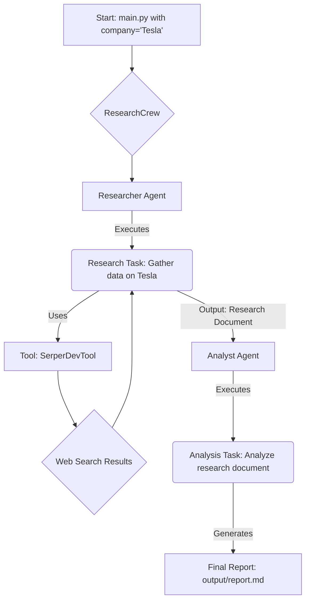

# 🏦 CrewAI Financial Researcher

This project deploys a multi-agent system using the CrewAI framework to perform comprehensive financial research on a specified company. It automates the process of data gathering, analysis, and report generation, delivering a polished, insightful document ready for review.

## 🚀 Quick Start

Get up and running in minutes.

1.  **Clone the repository:**

    ```bash
    git clone https://github.com/your-username/financial-researcher.git
    cd financial-researcher
    ```

2.  **Install dependencies:**

    ```bash
    pip install -r requirements.txt
    ```

3.  **Set up API keys:**

    - Copy the `.env.example` file to a new file named `.env`.
    - Add your API keys for Serper, OpenAI, and Groq to the `.env` file.

    ```bash
    cp .env.example .env
    # Now edit .env with your keys
    ```

4.  **Run the crew:**
    ```bash
    crewai run
    ```

After execution, you will find the final report in `output/report.md`.

## 📊 Project Overview

The CrewAI Financial Researcher is designed to streamline the complex and time-consuming task of corporate financial analysis. By leveraging a team of specialized AI agents, it can quickly research a target company, analyze the findings, and compile a professional report.

**Key Features:**

- **Automated Research:** An agent autonomously scours the web for the latest news, financial data, and performance metrics.
- **In-depth Analysis:** A dedicated analyst agent synthesizes the raw data into meaningful trends, opportunities, and challenges.
- **Configurable & Extensible:** Easily modify agent roles, tasks, and LLMs through simple YAML configuration files.
- **Multi-LLM Integration:** Utilizes different LLMs (OpenAI & Groq) for different tasks, optimizing for cost, speed, and quality.
- **Professional Reporting:** Generates a well-structured Markdown report, complete with an executive summary and detailed sections.

## 🏗️ Architecture

The project is built on the **CrewAI** framework and uses the `CrewBase` class for a structured, configuration-driven setup. The architecture is modular, separating the logic for agents, tasks, and the overall crew orchestration.

- **Configuration-First:** `agents.yaml` and `tasks.yaml` define the core components, allowing for easy modification without changing Python code.
- **Sequential Workflow:** The process is sequential, ensuring that research is completed before analysis begins.
- **Data Flow:** The output of the initial research task is automatically passed as context to the subsequent analysis task, creating a seamless data pipeline.

### Workflow Diagram



## 🤖 Agent Definitions

The crew consists of two specialized agents, each defined in `financial_researcher/config/agents.yaml`.

### 1. Senior Financial Researcher

- **Role**: Senior Financial Researcher for `{company}`.
- **Goal**: To research the company, its news, and its market potential.
- **Backstory**: A seasoned financial researcher with a talent for finding the most relevant and up-to-date information.
- **LLM**: `openai/gpt-4o-mini` (optimized for comprehensive and cost-effective research).
- **Tools**: `SerperDevTool` for efficient web searching.

### 2. Market Analyst

- **Role**: Market Analyst and Report Writer focused on `{company}`.
- **Goal**: To analyze the research findings and create a comprehensive, well-structured report.
- **Backstory**: A meticulous analyst skilled at identifying patterns, extracting insights, and communicating them clearly.
- **LLM**: `groq/llama-3.3-70b-versatile` (optimized for high-speed, high-quality text generation).
- **Tools**: None. This agent focuses purely on processing the context provided by the Researcher.

## ⚙️ Installation & Setup

Follow these steps to set up the project environment.

### Prerequisites

- Python 3.8+
- An active internet connection

### 1. Clone the Repository

```bash
git clone https://github.com/your-username/financial-researcher.git
cd financial-researcher
```

### 2. Create a Virtual Environment (Recommended)

```bash
python -m venv venv
source venv/bin/activate  # On Windows, use `venv\Scripts\activate`
```

### 3. Install Dependencies

The project's dependencies are listed in `requirements.txt`.

```bash
pip install -r requirements.txt
```

This will install `crewai`, `crewai_tools`, `python-dotenv`, `openai`, and `groq`.

### 4. Configure Environment Variables

You need to provide API keys for the services used by the agents.

1.  Create a `.env` file by copying the example:
    ```bash
    cp .env.example .env
    ```
2.  Open the `.env` file and add your keys:
    ```
    # .env
    SERPER_API_KEY="YOUR_SERPER_API_KEY"
    OPENAI_API_KEY="YOUR_OPENAI_API_KEY"
    GROQ_API_KEY="YOUR_GROQ_API_KEY"
    ```

## 🔧 Configuration

The project's behavior can be easily customized through the YAML configuration files located in `financial_researcher/config/`.

- **`agents.yaml`**: Modify agent `role`, `goal`, `backstory`, or change the `llm` they use.
- **`tasks.yaml`**: Adjust task `description` and `expected_output`. The `{company}` placeholder is dynamically filled from the input provided in `main.py`.

**Example: Changing the Analyst's LLM**
To use a different model for the analyst, simply update the `llm` field in `agents.yaml`:

```yaml
# financial_researcher/config/agents.yaml
analyst:
  role: >
    Market Analyst and Report writer focused on {company}
  goal: >
    Analyze company {company} and create a comprehensive, well-structured report
    that presents insights in a clear and engaging way
  backstory: >
    You're a meticulous, skilled analyst...
  llm: openai/gpt-4-turbo # Changed from groq/llama-3.3-70b-versatile
```

## 📈 Usage Examples

To run the financial research crew, execute the main script from the root directory.

### Basic Run

The default configuration runs an analysis on "Tesla".

```bash
crewai run
```

### Changing the Target Company

To research a different company, modify the `inputs` dictionary in `financial_researcher/main.py`:

```python
# src/financial_researcher/main.py
def run():
    """
    Run the research crew.
    """
    inputs = {
        'company': 'NVIDIA'  # Changed from 'Tesla'
    }
    # ... rest of the code
```

### Expected Output

The script will stream the agents' progress to the console. Upon completion, you will see:

1.  A final confirmation message in the console.
2.  The raw output from the final task printed to the terminal.
3.  A new file, `output/report.md`, containing the polished financial report.

## 🛠️ Tools & Integrations

- **CrewAI & CrewAI Tools**: The core framework for creating and managing the agentic workflow.
- **Serper**: A low-cost, fast Google Search API used by the `researcher` agent via `SerperDevTool` for web data gathering.
- **OpenAI**: Provides the `gpt-4o-mini` model, used for its strong reasoning and research capabilities.
- **Groq**: Provides the `llama-3.3-70b-versatile` model on a high-speed inference engine, perfect for generating the final report quickly.
- **Custom Tool Template**: The file `financial_researcher/tools/custom_tool.py` serves as a boilerplate for adding new, custom tools to your agents.

## 🔄 Workflow

The operational flow is a sequential process managed by CrewAI:

1.  **Initialization**: `main.py` is executed. It defines the input variables (e.g., `company: 'Tesla'`).
2.  **Crew Kickoff**: The `ResearchCrew` is instantiated, and its `crew().kickoff(inputs=inputs)` method is called.
3.  **Task 1: Research**:
    - The `researcher` agent is assigned the `research_task`.
    - It uses the `SerperDevTool` to search the web for information based on the task description.
    - It compiles its findings into a structured document, as per its `expected_output`.
4.  **Context Passing**:
    - The output from `research_task` is automatically passed to the context of `analysis_task` because of the `context: [research_task]` configuration.
5.  **Task 2: Analysis & Reporting**:
    - The `analyst` agent is assigned the `analysis_task`.
    - It receives the researcher's document and performs an in-depth analysis.
    - It structures this analysis into a professional report, including an executive summary, key findings, and a market outlook.
6.  **Final Output**: The result of the `analysis_task` is saved to `output/report.md` as specified by the `output_file` parameter in its task configuration.

## ⚡ Performance & Optimization

- **LLM Selection**: The project strategically uses different LLMs for different purposes. `gpt-4o-mini` is used for research due to its balance of cost and capability, while `llama-3.3-70b` on Groq is used for report generation due to its high-speed text production.
- **Efficient Tools**: `SerperDevTool` is chosen over standard search tools for its speed and low cost, which is critical for research tasks that may require multiple queries.
- **Caching**: CrewAI has built-in caching capabilities (not explicitly enabled here but available) that can save costs and time on repeated runs by caching tool outputs.

## 🔒 Security

- **API Key Management**: All API keys and sensitive credentials are managed securely using a `.env` file. The `python-dotenv` library loads these variables into the environment, ensuring they are never hard-coded in the source.
- **`.gitignore`**: A `.gitignore` file should be used to prevent the `.env` file, virtual environment directories (`venv/`), and `output/` files from being committed to version control.
- **Data Privacy**: Be mindful of the data being processed. This project is intended for public company information. Do not use it for sensitive, non-public data.
