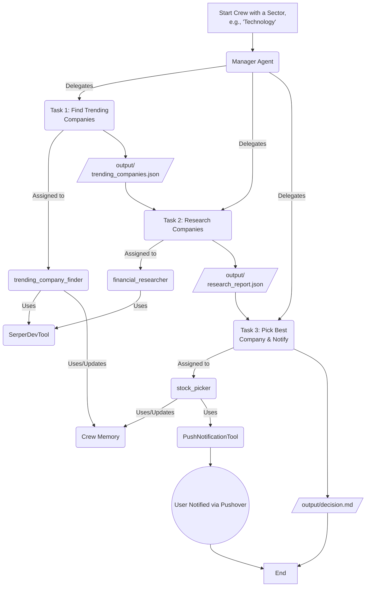
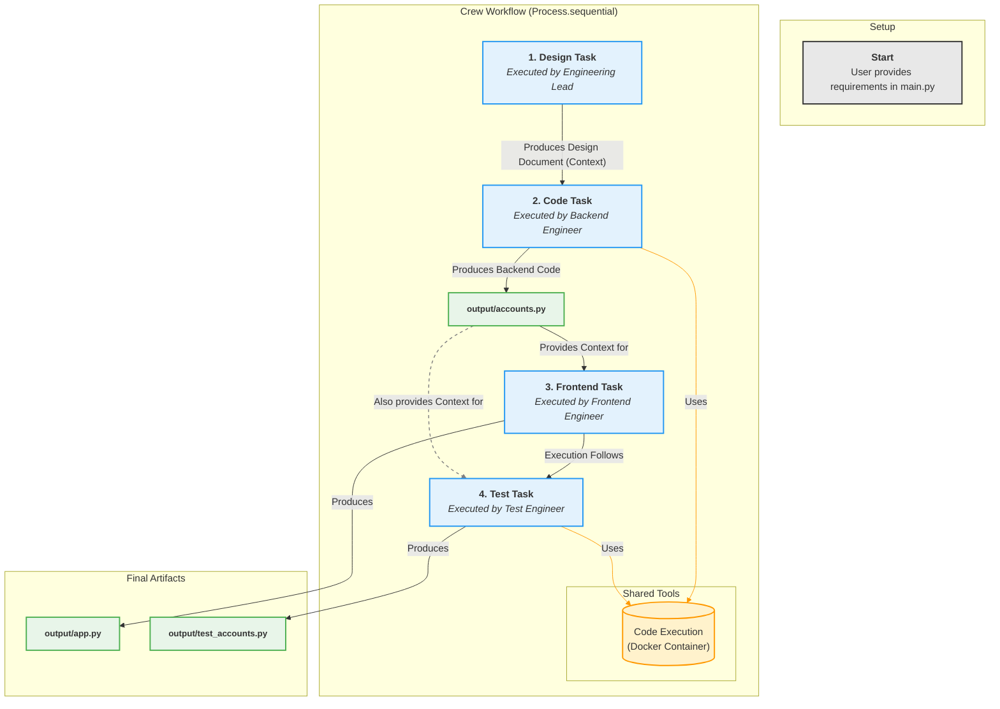

# CrewAI

## Table of Contents

1.  [Financial Researcher](#-financial-researcher)
2.  [Stock Picker Crew](#stock-picker-crew)
3.  [Coding-Capable Agent](#-crewai---coding-capable-agent-)
4.  [Automated Software Engineering Team](#crewai-automated-software-engineering-team)

---

# 🏦 Financial Researcher

*A multi-agent financial research and analysis system powered by CrewAI*

---

<p align="center">
  
</p>

---

## 📖 Overview

**Financial Researcher** is an intelligent multi-agent system built with CrewAI that automates comprehensive financial research and analysis for any company. The system employs specialized AI agents that work collaboratively to gather, analyze, and synthesize financial data into professional reports.

Using advanced web search capabilities and AI-powered analysis, this tool transforms complex financial information into clear, actionable insights. Whether you're researching Tesla, Apple, or any other company, Financial Researcher delivers structured reports with executive summaries, market analysis, and strategic recommendations.

## 🧠 Architecture

The system operates on a **sequential multi-agent workflow** with two specialized roles:

- **🔍 Researcher Agent**: Conducts thorough web-based research using Serper API, gathering current company data, news, and market information
- **📊 Analyst Agent**: Processes research findings and generates comprehensive, professionally formatted reports

**Data Flow:**
```
Input (Company Name) → Researcher Agent → Raw Research Data → Analyst Agent → Final Report (output/report.md)
```

The agents communicate through CrewAI's task context system, ensuring seamless data transfer and collaborative intelligence.

## 🛠 Features

- ✨ **Multi-agent design using CrewAI** - Collaborative AI agents with specialized roles
- 🌐 **Dynamic company research via web search** - Real-time data gathering using Serper API
- 📝 **Report writing with executive summaries** - Professional formatting with structured sections
- 💾 **Output saved as `output/report.md`** - Persistent storage of generated reports
- ⚙️ **Configurable with YAML files** - Easy customization of agents and tasks
- 🔄 **Sequential processing workflow** - Optimized task execution order
- 🎯 **Template-based company research** - Flexible company placeholder system

## 📁 Project Structure

```
financial_researcher/
├── src/financial_researcher/
│   ├── main.py                 # Entry point and execution logic
│   ├── crew.py                 # CrewAI setup and agent definitions
│   └── config/
│       ├── agents.yaml         # Agent roles, goals, and configurations
│       └── tasks.yaml          # Task descriptions and workflows
├── output/
│   └── report.md              # Generated financial reports
├── requirements.txt           # Python dependencies
└── README.md                 # This file
```

## 🚀 How to Run

### Prerequisites
- Python 3.8 or higher
- pip package manager

### Installation & Execution

1. **Create a virtual environment:**
   ```bash
   python -m venv venv
   source venv/bin/activate  # On Windows: venv\Scripts\activate
   ```

2. **Install dependencies:**
   ```bash
   pip install -r requirements.txt
   ```

3. **Set up environment variables:**
   ```bash
   export SERPER_API_KEY="your_serper_api_key"
   export OPENAI_API_KEY="your_openai_api_key"
   export GROQ_API_KEY="your_groq_api_key"
   ```

4. **Run the application:**
   ```bash
   crewai run src/financial_researcher
   ```

The system will automatically create the `output` directory and generate a comprehensive report at `output/report.md`.

## 🧑‍💼 Agent Descriptions

### 🔍 Senior Financial Researcher
- **Role:** Senior Financial Researcher for the target company
- **Goal:** Research company fundamentals, news, and growth potential
- **Backstory:** A seasoned financial researcher with expertise in finding relevant information and presenting it clearly and concisely
- **LLM:** OpenAI GPT-4o-mini
- **Tools:** SerperDevTool for web search capabilities

### 📊 Market Analyst and Report Writer
- **Role:** Market Analyst and Report Writer focused on the target company
- **Goal:** Analyze research data and create comprehensive, well-structured reports with clear insights
- **Backstory:** A meticulous analyst with financial analysis expertise, skilled at identifying patterns and communicating insights through well-crafted reports
- **LLM:** Groq Llama-3.3-70B-Versatile

## 📋 Task Descriptions

### 📝 Research Task
**Objective:** Conduct thorough company research covering:
- Current company status and financial health
- Historical performance metrics and trends
- Major challenges and growth opportunities
- Recent news, events, and market developments
- Future outlook and potential developments

**Output:** A comprehensive research document with structured sections, specific facts, figures, and relevant examples.

### 📊 Analysis Task
**Objective:** Transform research findings into a professional report featuring:
- Executive summary with key insights
- Structured analysis of trends and patterns
- Market outlook and strategic recommendations
- Professional formatting with clear headings
- Disclaimer noting the report is not for trading decisions

**Dependencies:** Uses context from the research task to ensure comprehensive analysis.

## 📊 Example Output

Generated reports are automatically saved to `output/report.md` and include:

- **Executive Summary** - Key findings and company overview
- **Current Status** - Financial health and recent performance
- **Historical Analysis** - Growth trends and performance metrics
- **Challenges & Opportunities** - Strategic SWOT-style analysis
- **Recent News** - Latest developments and market events
- **Future Outlook** - Projections and potential developments
- **Market Analysis** - Industry positioning and competitive landscape
- **Recommendations** - Strategic insights and action items

*View the complete Tesla report example in the `output/report.md` file.*

## 💡 Use Case: Tesla Example

The default configuration analyzes Tesla, Inc. Here's how it works:

**Input:** The system uses `'Tesla'` as the company parameter in `main.py`

**Process:**
1. Researcher agent searches for Tesla-related information using web search
2. Analyst agent processes the research data
3. A comprehensive report is generated covering Tesla's market position, financial health, and growth prospects

**Output:** A detailed 8-section report saved as `output/report.md` with executive summary, market analysis, and strategic recommendations.

## 📦 Dependencies

**Core Requirements:**
- `crewai` - Multi-agent orchestration framework
- `crewai_tools` - Additional tools including SerperDevTool
- `openai` - OpenAI API integration
- `groq` - Groq API integration

**API Keys Required:**
- **Serper API** - For web search functionality
- **OpenAI API** - For GPT-4o-mini model access
- **Groq API** - For Llama-3.3-70B model access

Install all dependencies with:
```bash
pip install -r requirements.txt
```

## 🔧 Configuration

### Changing the Target Company

1. **Method 1: Edit main.py**
   ```python
   inputs = {
       'company': 'Apple'  # Change from 'Tesla' to any company
   }
   ```

2. **Method 2: Dynamic Input** (modify main.py)
   ```python
   company_name = input("Enter company name: ")
   inputs = {'company': company_name}
   ```

### Customizing Agents

Edit `config/agents.yaml` to modify:
- Agent roles and responsibilities
- Goals and objectives
- Backstories and personalities
- LLM models (OpenAI, Groq, etc.)

### Customizing Tasks

Edit `config/tasks.yaml` to adjust:
- Research focus areas
- Report structure and sections
- Output formatting requirements
- Task dependencies and context

## 🧩 Extending the Project

### Add New Agents
- Create additional specialist agents (e.g., Risk Analyst, Compliance Officer)
- Add new tools for data sources (financial APIs, news feeds)
- Implement parallel processing for multiple analysis perspectives

### Enhance Capabilities
- **Data Visualization:** Add chart generation for financial metrics
- **PDF Export:** Implement PDF report generation
- **Email Integration:** Automated report distribution
- **Database Storage:** Persistent storage for historical analysis
- **API Endpoints:** REST API for programmatic access

### New Use Cases
- **Sector Analysis:** Compare multiple companies in the same industry
- **Portfolio Analysis:** Multi-company investment research
- **Market Trends:** Broader market and economic analysis

---

<p align="center">
  
</p>


# Stock Picker Crew

Welcome to the Stock Picker Crew, a sophisticated multi-agent system powered by [crewAI](https://crewai.com) designed to automate the process of finding, researching, and selecting trending companies for investment. This crew leverages a team of AI agents, each with a specialized role, to provide comprehensive financial analysis and actionable insights.

This project showcases the power of a hierarchical agent process, advanced memory management (LTM, STM, Entity), structured data outputs (Pydantic), and custom tool integration within the crewAI framework.

## Key Features

- **Multi-Agent Collaboration**: Utilizes a team of specialized agents (Finder, Researcher, Picker) orchestrated by a Manager agent.
- **Hierarchical Process**: A Manager Agent delegates tasks to specialized agents, ensuring an efficient and logical workflow.
- **Structured Outputs**: Leverages Pydantic models to ensure outputs like research reports and decisions are well-structured and easy to parse.
- **Custom Tool Integration**: Demonstrates how to build and integrate custom tools, such as the `PushNotificationTool` for sending alerts.
- **Advanced Memory Management**: Implements Long-Term, Short-Term (RAG-based), and Entity memory to maintain context, learn from past interactions, and avoid repetitive work.
- **Dynamic Task Execution**: Agents search for real-time news and data to make informed, up-to-date decisions.

## Workflow and Architecture

The Stock Picker Crew operates through a series of sequential tasks, managed and delegated by a lead agent. The workflow is as follows:

1.  **Find Trending Companies**: The `trending_company_finder` agent scans the latest news for a given sector (e.g., 'Technology') to identify 2-3 trending companies. This agent uses its memory to avoid picking the same companies in subsequent runs.
2.  **Research Companies**: The `financial_researcher` agent takes the list of trending companies and conducts in-depth research on each, analyzing their market position, future outlook, and investment potential.
3.  **Select & Notify**: The `stock_picker` agent analyzes the comprehensive research report, selects the single best company for investment, and provides a detailed rationale. It also uses a custom tool to send a push notification with the final decision.

This entire process is overseen by a `manager` agent, which ensures tasks are delegated correctly and the final goal is achieved.

### Flowchart Diagram



## Getting Started

### Prerequisites

- Python >= 3.10, < 3.14
- An [OpenAI API Key](https://platform.openai.com/api-keys)
- A [Serper API Key](https://serper.dev/api-key) for web search capabilities.
- A [Pushover](https://pushover.net/) User Key and Application Token for push notifications.

### Installation

1.  **Install `uv`**: If you don't have it, install `uv`, a fast Python package installer and resolver.
    ```bash
    pip install uv
    ```

2.  **Clone the Repository**:
    ```bash
    git clone https://github.com/joaomdmoura/crewai-stock-picker-template.git
    cd crewai-stock-picker-template
    ```

3.  **Install Dependencies**: Use `uv` to sync the project environment with the dependencies specified in `pyproject.toml` and `uv.lock`.
    ```bash
    uv pip sync
    ```
    Alternatively, you can use the crewAI CLI:
    ```bash
    crewai install
    ```
    
4.  **Set Up Environment Variables**: Create a `.env` file in the root of the project and add your API keys and Pushover credentials.
    ```.env
    OPENAI_API_KEY="sk-..."
    SERPER_API_KEY="YourSerperAPIKey"

    # For Push Notifications
    PUSHOVER_USER="YourPushoverUserKey"
    PUSHOVER_TOKEN="YourPushoverAppToken"
    ```

## Running the Crew

To execute the crew and start the analysis process, run the following command from the project root:

```bash
crewai run
```

The crew will begin its work, and you will see the agents' collaboration in real-time in your terminal. Upon completion, the final reports will be saved in the `output/` directory, and you will receive a push notification with the chosen stock.

## Customization

This project is a template and can be easily customized:

- **Change the Sector**: Modify the `sector` variable in `src/stock_picker/main.py` to research a different industry.
- **Modify Agents & Tasks**: Edit `src/stock_picker/config/agents.yaml` and `src/stock_picker/config/tasks.yaml` to change the roles, goals, tools, or instructions for your agents and tasks.
- **Add New Tools**: Create new tool files in `src/stock_picker/tools/` and integrate them into your agents in `src/stock_picker/crew.py`.
- **Adjust Memory**: The memory configuration can be fine-tuned in `src/stock_picker/crew.py` to use different backends or settings.

---

<div align="center">

# 🚀 CrewAI - Coding-Capable Agent 🚀

</div>

---

## 📝 Overview

This project demonstrates how to build an autonomous agent using the **CrewAI** framework that can not only **write Python code** but also **execute** it—bringing us closer to truly intelligent software agents.

The agent is designed to:

- Interpret and solve problems by generating Python code,
- Execute the generated code autonomously,
- Optionally run the code inside a **Docker container** for safety and isolation,
- Analyze the results of the code execution,
- Use those results to make further decisions and take additional steps.

This capability transforms the agent into more than just a code generator—it's an execution-capable system that can dynamically respond to tasks by generating and running functional software components. Often referred to as a **"Coda agent"**, this type of agent doesn't just produce code—it treats code generation and execution as tools to achieve a broader goal.

What makes this even more impressive is how simple it is to enable. By setting:

```python
allow_code_execution = True
```

the agent gains the ability to execute code. For safer execution:

```python
code_execution_mode = "safe"
```

the agent will use Docker (if installed) to run code inside a sandboxed container, isolating execution from the host system. This ensures security while maintaining full functionality.

It's surprisingly seamless. In fact, you might need to stop Docker manually to believe it's really running in isolation.

This project highlights how CrewAI makes powerful, agentic behaviors accessible with minimal configuration. The agent we’re building focuses on code generation and execution—but this is just one step toward more complex, autonomous problem-solving agents.

---

## 🔧 Agent & Task Configuration

### 🧩 Agent: `coder`

- **Role**: Python Developer
- **Backstory**: You’re a seasoned python developer with a knack for writing clean, efficient code.
- **Objective**: Write python code to achieve the provided assignment, then execute it and validate outputs.
- **LLM**: `gpt-4o-mini`

### 📋 Task: `coding_task`

- **Description**: Write python code to achieve: `{assignment}`
- **Expected Output**: A text file containing both the code and its executed output.
- **Assigned Agent**: `coder`
- **Result File**: `output/code_and_output.txt`

---

### 📂 `coder` Project Structure

- 📁 `knowledge/`
  - 📄 `user_preference.txt`
- 📁 `output/`
  - 📄 `code_and_output.txt`
- 📁 `src/`
  - 📁 `coder/`
    - 📁 `__pycache__/`
    - 📁 `config/`
      - 🔧 `agents.yaml`
      - 🔧 `tasks.yaml`
    - 📁 `tools/`
      - 🐍 `__init__.py`
      - 🐍 `custom_tool.py`
    - 🐍 `__init__.py`
    - 🐍 `crew.py`
    - 🐍 `main.py`
- Git ` .gitignore`
- ⚙️ `pyproject.toml`
- ℹ️ `README.md`
- 🔒 `uv.lock`

---

## 🚀 Example Run

Below is a snippet of the generated code and its output for calculating π via a Leibniz series (first 10,000 terms × 4):

```python
# Calculate the first 10,000 terms of the series 1 - 1/3 + 1/5 - 1/7 + ... and multiply by 4
def calculate_series(terms):
    total = 0
    for n in range(terms):
        if n % 2 == 0:  # even index
            total += 1 / (2 * n + 1)
        else:  # odd index
            total -= 1 / (2 * n + 1)
    return total * 4

num_terms = 10000
result = calculate_series(num_terms)
print(result)
```

Expected output:

```
3.141592653589793
```

_See `output/code_and_output.txt` for full example._

---

## 🔮 Future Possibilities

- **Multi-Agent Collaboration**: Extend the Crew to coordinate multiple specialized agents (e.g., testers, documenters, optimizers) working in concert.
- **Hyperparameter Tuning**: Integrate with AutoML frameworks to automatically optimize generated code performance.
- **Domain Adaptation**: Train domain-specific backstories for agents (e.g., data science, web development, DevOps) to tackle diverse assignments.
- **Continuous Integration**: Hook into CI/CD pipelines—generate, test, and deploy code in fully automated workflows.
- **Real-Time Monitoring**: Implement feedback loops where agents monitor running services and generate hotfixes or optimizations on the fly.

---

<p align="center">
  
</p>


# CrewAI: Automated Software Engineering Team

This project demonstrates a multi-agent system built with CrewAI that automates a basic software development lifecycle. Given a set of high-level requirements, a "crew" of specialized AI agents collaborates to produce a design document, backend Python code, a set of unit tests, and a simple web-based user interface.

## Overview

The core of this project is the `EngineeringTeam` crew, which simulates a small software company. The process begins when a user provides requirements in the `main.py` script. The crew then executes a sequence of tasks:

1.  **Design:** An Engineering Lead drafts a technical design.
2.  **Implementation:** A Backend Engineer writes the Python code based on the design.
3.  **UI Development:** A Frontend Engineer builds a Gradio UI to interact with the backend code.
4.  **Testing:** A Test Engineer writes and validates unit tests for the backend code.

The final output is a collection of ready-to-use files (`accounts.py`, `test_accounts.py`, `app.py`) located in the `output/` directory.


## Agent Descriptions

The crew is composed of four distinct agents defined in `config/agents.yaml`:

-   **Engineering Lead**:
    -   **Role**: Software Architect and Designer.
    -   **Goal**: Takes high-level requirements and produces a detailed technical design for a single, self-contained Python module, specifying all necessary function and method signatures.
    -   **LLM**: `gpt-4o`

-   **Backend Engineer**:
    -   **Role**: Python Developer.
    -   **Goal**: Writes clean and efficient Python code that implements the technical design provided by the Engineering Lead.
    -   **Behavior**: This agent is granted code execution permissions (`allow_code_execution=True`) to validate its code in a secure Docker environment.

-   **Frontend Engineer**:
    -   **Role**: Gradio UI Specialist.
    -   **Goal**: Writes a simple Gradio user interface in a single `app.py` file to demonstrate the functionality of the backend class.
    -   **LLM**: `anthropic/claude-3-7-sonnet-latest`

-   **Test Engineer**:
    -   **Role**: QA and Unit Test Developer.
    -   **Goal**: Writes comprehensive unit tests for the backend module.
    -   **Behavior**: This agent is also granted code execution permissions to run and verify the tests it writes.

## Tooling

The project leverages CrewAI's built-in tool handling capabilities, specifically:

-   **Code Execution**: The `backend_engineer` and `test_engineer` agents have `allow_code_execution` enabled. This allows them to run Python code in an isolated Docker container, enabling them to write, test, and debug code autonomously. Docker must be installed and running for these agents to function correctly.

## Task Design

Tasks are defined in `config/tasks.yaml` and executed sequentially. The `context` key ensures that the output of one task is passed as input to the next, creating a logical workflow.

1.  **`design_task`**: Executed by the `engineering_lead`. It has no dependencies and produces a markdown design file.
2.  **`code_task`**: Executed by the `backend_engineer`. It depends on the `design_task` and produces the core Python module.
3.  **`frontend_task`**: Executed by the `frontend_engineer`. It depends on the `code_task` and produces the Gradio `app.py`.
4.  **`test_task`**: Executed by the `test_engineer`. It also depends on the `code_task` and produces the `unittest` file.

The crew in `engineering_team/crew.py` defines the execution order as `design`, `code`, `frontend`, then `test`.

## Crew Formation & Execution

The `engineering_team/crew.py` script uses the `@CrewBase` class structure to define and assemble the crew.

-   `@agent` decorators instantiate the agents from `agents.yaml`.
-   `@task` decorators instantiate the tasks from `tasks.yaml`.
-   `@crew` decorator assembles the agents and tasks into a `Crew` instance.

The process is set to `Process.sequential`, ensuring that tasks are executed one after another in the order defined, respecting the explicit dependencies. The `main.py` script kicks off the entire process by calling `EngineeringTeam().crew().kickoff(inputs)`.

## Environment Setup

To run this project, follow these steps:

1.  **Clone the repository**.

2.  **Install Docker**: Ensure Docker is installed and the Docker daemon is running. This is required for agents with code execution capabilities.
    -   [Install Docker Engine](https://docs.docker.com/engine/install/)

3.  **Install Python dependencies**:
    ```bash
    pip install crewai crewai-tools gradio python-dotenv openai anthropic
    ```

4.  **Create a `.env` file**: In the root directory, create a `.env` file and add your API keys for the language models used:
    ```
    OPENAI_API_KEY="your-openai-api-key"
    ANTHROPIC_API_KEY="your-anthropic-api-key"
    DEEPSEEK_API_KEY="your-deepseek-api-key"
    
    # Optional: Specify model names if they differ from the defaults in the config
    OPENAI_MODEL_NAME="gpt-4o"
    ```

## Usage
1.  **Run the Gradio UI**: Once the crew has finished, you can run the generated user interface.
    ```bash
    python output/app.py
    ```
    This will launch a local web server, and you can access the Trading Simulation Platform UI in your browser.

## Project Description

### **Project: Automated Software Engineering Team**

This document outlines the components and workflow for a CrewAI project named `engineering_team`. The system is designed to automate a software development lifecycle, from design to implementation, testing, and UI creation, using a team of specialized AI agents.

---

### **1. Agent Definitions**

The project will be composed of four distinct agents, each with a specific role and designated LLM.

**1.1. Engineering Lead**
*   **Role:** Software Architect and Designer.
*   **Goal:** To take high-level requirements and produce a detailed technical design for a backend developer. The design must be for a single, self-contained Python module, specifying all necessary function and method signatures.
*   **Inputs:** `requirements`, `module_name`, `class_name`.
*   **LLM:** `OpenAI/gpt-4`

**1.2. Backend Engineer**
*   **Role:** Python Developer.
*   **Goal:** To write a clean and efficient Python module that implements the technical design provided by the Engineering Lead.
*   **Inputs:** Design document, `requirements`, `module_name`, `class_name`.
*   **LLM:** `Anthropic/claude-3-sonnet-20240229`

**1.3. Frontend Engineer**
*   **Role:** Gradio UI Specialist.
*   **Goal:** To write a simple Gradio user interface in a single `App.py` file. This UI will demonstrate the functionality of the backend class created by the Backend Engineer and must reside in the same directory.
*   **LLM:** `Anthropic/claude-3-sonnet-20240229`

**1.4. Test Engineer**
*   **Role:** QA and Unit Test Developer.
*   **Goal:** To write comprehensive unit tests for the backend module. The generated test file must be named `test_{module_name}.py`.
*   **LLM:** `DeepSeek/deepseek-chat`

---

### **2. Task Definitions**

Each agent is assigned a corresponding task. The tasks are executed sequentially based on dependencies.

**2.1. Design Task**
*   **Description:** Prepare a detailed design based on high-level requirements.
*   **Assigned Agent:** `Engineering Lead`
*   **Dependencies:** None.
*   **Output:** A file named `{module_name}_design.md`.
*   **Constraint:** The output must **only** contain the design in markdown format.

**2.2. Code Task**
*   **Description:** Write a Python module that implements the provided design.
*   **Assigned Agent:** `Backend Engineer`
*   **Dependencies:** `design_task`
*   **Output:** A Python file named `{module_name}.py`.
*   **Constraint:** The output must **only** contain raw Python code, with no markdown formatting or code block delimiters (e.g., ```python).

**2.3. Frontend Task**
*   **Description:** Write a Gradio UI in `App.py` to demonstrate the backend class. The UI should be simple and clean.
*   **Assigned Agent:** `Frontend Engineer`
*   **Dependencies:** `code_task`
*   **Output:** A Python file named `App.py`.
*   **Constraint:** The output must **only** contain raw Python code.

**2.4. Test Task**
*   **Description:** Write unit tests for the given backend module.
*   **Assigned Agent:** `Test Engineer`
*   **Dependencies:** `code_task`
*   **Output:** A Python file named `test_{module_name}.py`.
*   **Constraint:** The output must **only** contain raw Python code.

## Flow Chart Diagram

https://claude.ai/public/artifacts/01c31503-048a-4233-a259-edccebc105a0


