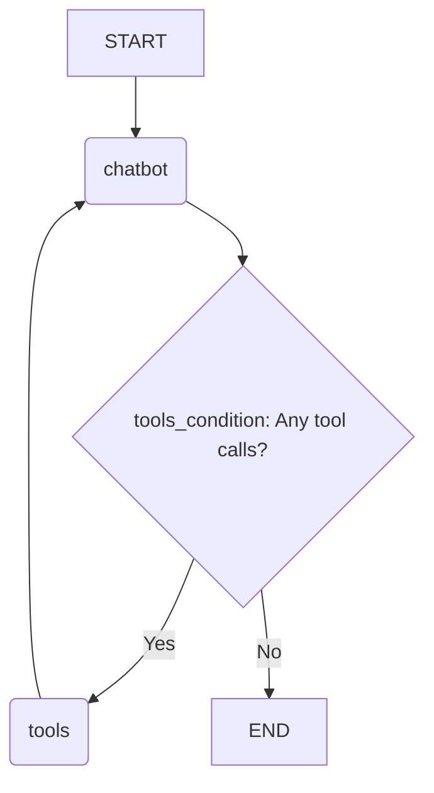
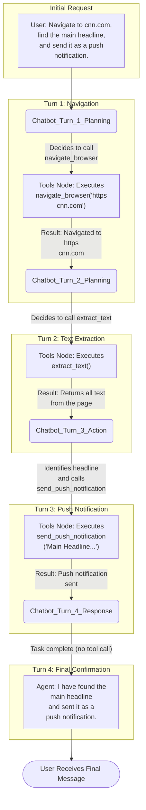
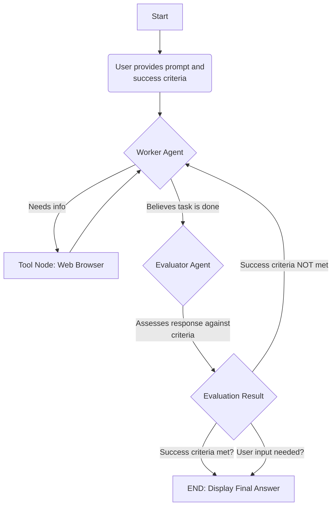
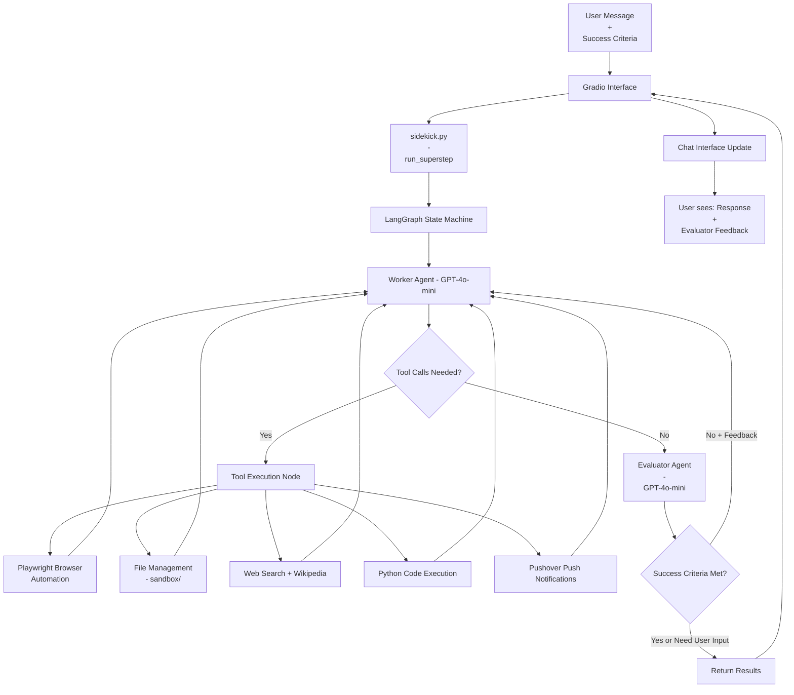

# LangGraph

## Table of Contents

1.  [LangGraph Web Automator with Push Notifications](#langgraph-web-automator-with-push-notifications)
2.  [Sidekick Personal Co-worker](#-sidekick-personal-co-worker)
3.  [Sidekick Personal Co-Worker (Complete)](#-sidekick-personal-co-worker-complete)

---

<p align="center">
  
</p>

# LangGraph Web Automator with Push Notifications

## 1. Project Overview

This project demonstrates the power of LangGraph to create a stateful, autonomous agent capable of interacting with the web and external services. The agent is built as a chatbot that can browse websites using Playwright, extract information, and send push notifications to a user's device via the Pushover service. The entire application is wrapped in a user-friendly Gradio chat interface, allowing for persistent, multi-turn conversations.

**LangGraph** is a library for building stateful, multi-actor applications with LLMs. It extends the LangChain Expression Language to coordinate multiple chains (or actors) across many steps of computation in a cyclical, graph-based manner. In this project, it is used to manage the flow of conversation between the user, the LLM, and the various tools, allowing the agent to decide when to call a tool, execute it, and use the result to form its next response.

## 2. Project Objectives

*   To build a stateful, conversational agent using LangGraph.
*   To integrate powerful web browsing capabilities using the `PlayWrightBrowserToolkit`.
*   To create and integrate a custom tool for sending push notifications.
*   To manage a persistent conversation state using `MemorySaver`, allowing the chat to remember previous interactions.
*   To provide an interactive and accessible user interface with Gradio.

## 3. Technical Stack

*   **Orchestration:** LangGraph
*   **LLM Framework:** LangChain
*   **LLM Provider:** OpenAI (specifically `gpt-4o-mini`)
*   **Web Automation:** Playwright (`langchain_community.agent_toolkits.PlayWrightBrowserToolkit`)
*   **Push Notifications:** Pushover API (`requests`)
*   **Web UI:** Gradio
*   **Environment Management:** `dotenv`
*   **Asynchronous Handling:** `nest_asyncio`

## 4. Installation & Setup

1.  **Install Dependencies**
    ```bash
    pip install -r requirements.txt
    ```
    *(Note: A `requirements.txt` file would be created from the notebook's imports, including `langgraph`, `langchain-openai`, `langchain-community`, `playwright`, `gradio`, `python-dotenv`, `typing_extensions`)*

2.  **Install Playwright Browsers**
    Run the following command to download the necessary browser binaries for Playwright.
    ```bash
    playwright install
    ```
    On Linux, you might need to specify the browser:
    ```bash
    playwright install --with-deps chromium
    ```

3.  **Set Up Environment Variables**
    Create a `.env` file in the root of the project and add your API keys:
    ```
    OPENAI_API_KEY="sk-..."
    PUSHOVER_TOKEN="your_pushover_api_token"
    PUSHOVER_USER="your_pushover_user_key"
    ```

## 5. Notebook Breakdown

The Jupyter Notebook is structured to build the agent step-by-step.

#### Section 1: Initial Setup and Imports
*   **Imports**: Key libraries like `langgraph`, `langchain_openai`, `PlayWrightBrowserToolkit`, and `gradio` are imported.
*   **State Definition**: A `State` class is defined using `TypedDict`. The state contains a single key, `messages`, which is annotated with `add_messages`. This special annotation acts as a reducer, ensuring that new messages are always appended to the existing list rather than overwriting it.

    ```python
    class State(TypedDict):
        messages: Annotated[list, add_messages]
    ```

#### Section 2: Tool Creation
Two types of tools are prepared for the agent:

1.  **Custom Push Notification Tool (`tool_push`)**:
    *   A function `push` is defined to send a POST request to the Pushover API.
    *   This function is wrapped in a LangChain `Tool` object with a name (`send_push_notification`) and a clear description so the LLM knows when and how to use it.

2.  **Playwright Web Browser Tools**:
    *   The notebook uses a powerful, pre-built toolkit from `langchain_community`.
    *   `create_async_playwright_browser` initializes an asynchronous browser instance. Setting `headless=False` allows you to see the browser UI as the agent operates.
    *   `PlayWrightBrowserToolkit.from_browser` creates a suite of tools (e.g., `navigate_browser`, `extract_text`, `click_element`) that the agent can use to control the browser.
    *   All tools (custom push and Playwright) are combined into a single list, `all_tools`.

#### Section 3: Graph Construction
This is the core of the LangGraph implementation.

*   **LLM Agent (`chatbot` node)**: An OpenAI model (`gpt-4o-mini`) is bound to the `all_tools` list. The `chatbot` function defines the logic for this node: it invokes the LLM with the current conversation history (state) and returns the LLM's response.
*   **Tool Executor (`tools` node)**: A `ToolNode` is created. This special node is designed to automatically execute any tool calls made by the LLM in the previous step.
*   **Graph Definition**: A `StateGraph` is instantiated with our `State` object. The `chatbot` and `tools` nodes are added.
*   **Edge Definition**:
    *   The graph's entry point (`START`) is connected to the `chatbot` node.
    *   A **conditional edge** is created from the `chatbot` node. It uses the built-in `tools_condition` function to check if the LLM's last message contained a tool call.
        *   If YES, the graph transitions to the `tools` node.
        *   If NO, the graph transitions to the end of the execution for that turn.
    *   An edge is created from the `tools` node back to the `chatbot` node, so the results of the tool execution are passed back to the LLM for processing.
*   **Compilation**: The graph is compiled with a `MemorySaver` checkpointer. This allows the graph to persist its state across multiple calls, enabling a continuous conversation identified by a `thread_id`.

#### Section 4: User Interface
*   An `async` function `chat` is defined to serve as the backend for the UI. It takes user input, invokes the compiled graph with a unique `thread_id`, and returns the final message from the agent.
*   `gr.ChatInterface` is used to launch a web-based chat UI that calls the `chat` function.

## 6. Graph Architecture & State Explanation

The project's intelligence is orchestrated by a cyclical graph that allows the agent to think, act, and reflect.

*   **State (`State`)**: The graph's memory is a dictionary with one key: `messages`. Each time a node adds a message (from the user, the LLM, or a tool), the `add_messages` reducer appends it to this list, maintaining a complete history of the interaction.

*   **Nodes**:
    1.  `chatbot`: The "brain" of the operation. It's an LLM agent that decides what to say or which tool to use based on the conversation history.
    2.  `tools`: The "hands" of the operation. It executes function calls requested by the `chatbot` node.

*   **Edges (The Flow)**:
    1.  **Entry Point**: The process begins at `START` and immediately moves to the `chatbot` node.
    2.  **Decision**: The `chatbot` node generates a response. The graph then hits a conditional branch (`tools_condition`).
    3.  **Path 1 (Action)**: If the `chatbot` decided to use a tool, the graph follows the edge to the `tools` node. The tool is executed, and its output is added to the `messages` state. The flow then returns to the `chatbot` node to process the tool's result.
    4.  **Path 2 (Response)**: If the `chatbot` decided to respond directly without a tool, the graph follows the edge to `END`, and the final message is returned to the user.

## 7. Mermaid Diagram

This diagram illustrates the workflow of the LangGraph agent.



## 8. Usage Example

1.  Run the final cell in the notebook to launch the Gradio interface.
2.  Open the provided URL in your browser.
3.  Interact with the chatbot. For example, you can give it a multi-step task:

    > **User**: "Navigate to cnn.com, tell me the main headline, and then send it to me as a push notification."

The agent will first use the `navigate_browser` tool, then `extract_text`, then reason about the content to find the headline, and finally use the `send_push_notification` tool to send you the result.

### Usage Example Flowchart: Web Automation & Push Notification

This flowchart visualizes the agent's step-by-step process to fulfill the user's request. Each "Turn" represents one full cycle through the graph's reasoning and action loop.



---

<p align="center">
  
</p>


# 🧠 Sidekick Personal Co-worker

This project implements an agentic AI assistant, the "Sidekick Personal Co-worker," using LangGraph and OpenAI. The system is designed to tackle user requests by breaking them down into a multi-agent workflow. It features a "worker" agent that uses web browsing tools to find information and an "evaluator" agent that critiques the worker's output against user-defined success criteria. This creates a self-correcting loop where the assistant refines its answer based on structured feedback until the task is completed successfully or user clarification is needed.

The primary example demonstrated in the notebook is fetching a real-time currency exchange rate, which showcases the system's ability to handle factual queries and the evaluator's role in ensuring accuracy and reliability.

## 🚀 Quick Start

To run the Sidekick, follow these steps:

1.  **Clone the Repository & Install Dependencies**:
    Ensure you have Python installed. The notebook requires the following major libraries:
    ```bash
    pip install langchain-openai langgraph langchain-community playwright beautifulsoup4 gradio python-dotenv
    playwright install
    ```

2.  **Set Up Environment Variables**:
    Create a `.env` file in the root directory and add your OpenAI API key:
    ```
    OPENAI_API_KEY="your-openai-api-key"
    ```

3.  **Run the Jupyter Notebook**:
    Launch Jupyter and open `SideKick-Personal-Co-Worker.ipynb`. Run all the cells in order from top to bottom.

4.  **Interact with the UI**:
    The final cell will launch a Gradio web interface. You can interact with the Sidekick directly in your browser.

## 🔧 Features

*   **Multi-Agent System**: Utilizes a `worker` agent for task execution and an `evaluator` agent for quality assurance.
*   **Tool-Equipped Worker**: The worker agent is equipped with Playwright to browse the web and gather live information.
*   **Dynamic Success Criteria**: Users can specify custom success criteria for each request, which the evaluator uses to judge the final output.
*   **Self-Correction Loop**: The evaluator provides structured feedback that is passed back to the worker, enabling it to iteratively improve its response.
*   **Structured Outputs**: The evaluator uses a Pydantic model (`EvaluatorOutput`) to generate consistent, machine-readable feedback, determining if the task is complete, requires more work, or needs user input.
*   **Conversational Memory**: Each session has a unique thread ID and maintains conversational history, allowing for context-aware interactions.

## 🖥️ Gradio UI Walkthrough

The interface is simple and powerful, consisting of three main parts:

1.  **Request Input**: A textbox where you enter your request for the Sidekick (e.g., "What is the current USD/GBP exchange rate").
2.  **Success Criteria Input**: A textbox where you define what makes a successful answer (e.g., "An accurate answer").
3.  **Chatbot Display**: The main window where the conversation history is displayed.

An interaction flows as follows:
*   The user provides a request and success criteria and clicks "Go!".
*   The assistant processes the request.
*   The final output in the chat window includes three parts:
    1.  The user's initial request.
    2.  The assistant's final answer.
    3.  The evaluator's explicit feedback on that answer, explaining whether the success criteria were met and why.

### 🖼️ Gradio UI Output Example

<p align="center">
  <a href="Sidekick Personal Co-worker.png" target="_blank">
    
  </a>
</p>


**Example Interaction:**


In this example, the evaluator correctly identifies that the assistant's answer lacks reliability due to data discrepancies and imprecision, demonstrating the self-assessment mechanism at work.

## 📊 Logic Flow (Mermaid Chart)

The core logic is managed by a LangGraph state machine. The flow is designed to be cyclical, allowing the worker to refine its answers based on feedback.



## 📂 File Overview

The entire application is contained within `SideKick-Personal-Co-Worker.ipynb`.

*   **Cells 1-3**: Initial setup, imports, and loading of environment variables.
*   **Cells 4-7**: **Schema and State Definition**. This is where the Pydantic model `EvaluatorOutput` for structured feedback and the `State` TypedDict for the graph's memory are defined.
*   **Cells 8-9**: **Agent and Tool Initialization**. This section sets up the Playwright browser tools and initializes two `ChatOpenAI` models: one for the worker (bound to tools) and one for the evaluator (bound to the structured output schema).
*   **Cells 10-15**: **Graph Node and Edge Definitions**. These cells contain the core logic for the agents (`worker`, `evaluator`) and the routing functions (`worker_router`, `route_based_on_evaluation`) that control the flow of the graph.
*   **Cell 16**: **Graph Compilation**. The `StateGraph` is assembled, nodes and edges are added, and the final graph is compiled with memory.
*   **Cells 17-20**: **UI Implementation**. These cells define the Gradio interface, the callback function `process_message` that invokes the graph, and launch the web server.

## ⚠️ Known Issues & Limitations

Based on the provided example and code:

*   **Data Inconsistency**: The evaluator noted a "stark discrepancy" in the exchange rates provided by the assistant. This indicates the worker may struggle with maintaining factual consistency or properly parsing data.
*   **Lack of Sourcing**: The assistant does not cite its sources, which reduces the trustworthiness and verifiability of its answers, especially for factual data like exchange rates.
*   **Vague Precision**: The response uses the word "approximately" even when the success criteria demand "An accurate answer," failing to meet the user's explicit standard.
*   **Potential for Stagnation**: The evaluator feedback mentions "potential stagnation in problem-solving effectiveness," implying the self-correction loop is not guaranteed to resolve issues and may get stuck.

## 💡 Future Improvements

*   **Enhanced Prompting**: The worker's system prompt could be refined to explicitly require citing all sources and avoiding vague language unless absolutely necessary.
*   **Stateful Source Tracking**: The `State` could be expanded to include a list of URLs or sources the agent has visited, which could be appended to the final response.
*   **Robust Evaluation**: The evaluator's logic could be improved to handle vague success criteria better, perhaps by having it flag them as needing user clarification.

---

<p align="center">
  
</p>


# 🤖 Sidekick Personal Co-Worker (Complete)

An intelligent AI agent system built with LangGraph, OpenAI GPT-4, and a comprehensive toolkit for web automation, file management, and notifications. Sidekick serves as a personal research assistant that can browse the web, execute Python code, manage files, search Wikipedia, and send push notifications to keep you informed about task completion.

---

## 🧰 Defined Tools and Capabilities

Sidekick integrates **6 distinct tools** organized across two main categories:

### Browser Automation Tools
- **Playwright Browser Toolkit**: Complete web automation capabilities including navigation, clicking, form filling, and page interaction through a visible Chromium browser instance
- **Purpose**: Enables the agent to interact with websites, extract information, and perform complex web-based tasks

### Core Agent Tools
1. **Push Notification Tool** (`send_push_notification`)
   - **Purpose**: Sends instant notifications to user via Pushover API
   - **Input**: Text message string
   - **Output**: Success confirmation
   - **Use Case**: Alerts user when tasks are completed or require attention

2. **File Management Tools** (Multiple tools from FileManagementToolkit)
   - **Purpose**: Complete file system operations within sandbox directory
   - **Capabilities**: Read, write, create, delete, and manage files
   - **Root Directory**: `sandbox/` for secure file operations
   - **Use Case**: Saving research results, creating reports, managing outputs

3. **Web Search Tool** (`search`)
   - **Purpose**: Real-time web search using Google Serper API
   - **Input**: Search query string
   - **Output**: Relevant web search results
   - **Use Case**: Finding current information, research, fact-checking

4. **Wikipedia Query Tool** (`WikipediaQueryRun`)
   - **Purpose**: Structured access to Wikipedia articles
   - **Input**: Article search terms
   - **Output**: Article content and summaries
   - **Use Case**: Research, fact verification, educational content

5. **Python REPL Tool** (`PythonREPLTool`)
   - **Purpose**: Execute Python code dynamically
   - **Capability**: Full Python environment with print() output capture
   - **Use Case**: Calculations, data processing, analysis, custom logic

**Tool Modularity**: The system is highly extensible - new tools can be easily added to either `playwright_tools()` or `other_tools()` functions and will be automatically available to all agents.

---

## 🧑‍💻 Agent & Orchestration Logic

### Multi-Agent Architecture
Sidekick employs a **dual-agent system** orchestrated through LangGraph:

#### 1. Worker Agent
- **LLM**: OpenAI GPT-4o-mini with tool binding
- **Role**: Primary task execution and problem-solving
- **Capabilities**: 
  - Access to all 8+ tools
  - Multi-step reasoning and tool chaining
  - Context-aware decision making
  - Dynamic system message updates based on feedback

#### 2. Evaluator Agent  
- **LLM**: OpenAI GPT-4o-mini with structured output
- **Role**: Quality assurance and success criteria validation
- **Output Schema**: `EvaluatorOutput` with feedback, success status, and user input requirements
- **Purpose**: Ensures responses meet user-defined success criteria

### State Management
```python
class State(TypedDict):
    messages: List[Any]           # Conversation history
    success_criteria: str         # User-defined task requirements  
    feedback_on_work: str         # Evaluator feedback for iterations
    success_criteria_met: bool    # Task completion status
    user_input_needed: bool       # Clarification requirement flag
```

### Orchestration Flow
- **Sequential Processing**: Worker → Tools (if needed) → Evaluator → Decision
- **Iterative Refinement**: Failed evaluations loop back to worker with specific feedback
- **Memory Persistence**: Conversation state maintained via MemorySaver checkpointer
- **Conditional Routing**: Dynamic flow control based on tool usage and evaluation results

---

## 🌐 Gradio App Interface

<p align="center">
  <a href="gradio_app_ui.png" target="_blank" style="cursor: zoom-in;">
    
  </a>
  <br/>
  <span style="font-size:0.95em; color: #888;">Click image to zoom in</span>
</p>


### User Interface Design
The Gradio interface features a **clean, modern chat-based design** with an emerald theme:

- **Chat Display**: 300px height message-based chatbot component showing full conversation flow
- **Dual Input System**: 
  - Primary message field for user requests
  - Success criteria field for defining task completion requirements
- **Action Controls**: Reset button (red, destructive) and Go! button (green, primary)

### Interaction Flow
1. **User Input**: Enters request and optional success criteria
2. **Processing Trigger**: Submit via Enter key or Go! button
3. **Real-time Updates**: Chat interface shows:
   - Original user message
   - Agent's working response/solution
   - Evaluator's feedback on completion quality
4. **Session Management**: Reset functionality creates fresh agent instance

### Visual Experience
Based on the screenshot, users see a **professional dark-themed interface** displaying successful task completion with structured outputs including restaurant details, addresses, and confirmation of file creation and notification delivery.

---

## 📬 Notification Pipeline

<p align="center">
  
</p>


### Pushover Integration
- **Service**: Pushover API for cross-platform push notifications
- **Configuration**: Environment variables for `PUSHOVER_TOKEN` and `PUSHOVER_USER`
- **Endpoint**: `https://api.pushover.net/1/messages.json`

### Notification Triggers
- **Task Completion**: Automatic alerts when agents finish complex tasks
- **File Operations**: Confirmation when reports or files are generated
- **Custom Messages**: Agent can send contextual updates during long operations

### Security & Configuration  
- **Credential Management**: Secure token storage via environment variables
- **Error Handling**: Graceful degradation if notification service unavailable
- **User Control**: Agent intelligently determines when notifications add value

**Example**: The screenshot shows a notification for "France-Soir restaurant in Melbourne. Phone: +61 3 9866 8569" sent after completing a restaurant research task.

---

## 🔄 System Flow – Mermaid Diagram



---

## 📁 Project File Structure

```
Sidekick-Complete/
├── app.py                      # 🌐 Gradio web interface entry point
├── sidekick.py                 # 🧠 Core LangGraph orchestration engine  
├── sidekick_tools.py          # 🧰 Tool definitions and integrations
├── sandbox/                   # 📁 Secure file operation workspace
│   └── melbourne_dinner.md    # 📄 Example generated report
├── gradio_app_ui.png         # 🖼️ Interface screenshot
└── pushover_notification.png  # 📱 Notification example
```

### File Responsibilities
- **`app.py`**: Gradio UI setup, event handlers, session management, resource cleanup
- **`sidekick.py`**: LangGraph state machine, agent definitions, evaluation logic, memory management
- **`sidekick_tools.py`**: Tool implementations, API integrations, browser automation setup
- **`sandbox/`**: Isolated environment for agent file operations and output storage

---

## 🧪 Sandbox Outputs

### Storage Strategy
- **Location**: `sandbox/` directory as root for FileManagementToolkit
- **Security**: Isolated file operations prevent system-wide access
- **Persistence**: Files remain across sessions unless explicitly cleaned
- **Format Support**: Markdown reports, text files, data outputs, research summaries

### Example Outputs
The system generated `melbourne_dinner.md` containing:
- Restaurant research (France-Soir)
- Structured information (address, phone, menu highlights)
- Reviews and pricing details
- Formatted markdown for easy reading

**Data Flow**: Search → Analysis → File Creation → Notification → User Confirmation

---

## ⚠️ Limitations & Feedback Integration

### Known Limitations
1. **Browser Resource Management**: Playwright instances require proper cleanup to prevent memory leaks
2. **API Dependencies**: Relies on external services (OpenAI, Pushover, Serper) for core functionality  
3. **Evaluation Consistency**: Success criteria interpretation may vary between iterations
4. **Error Recovery**: Limited fallback mechanisms for tool failures

### Integrated Feedback System
- **Real-time Evaluation**: Every response assessed against user-defined success criteria
- **Iterative Improvement**: Failed attempts receive specific feedback for refinement
- **User Visibility**: All evaluator feedback displayed in chat interface
- **Quality Assurance**: Prevents low-quality responses from reaching users

### Observed Issues
- **Typo in Interface**: "success critiera" should be "success criteria" in placeholder text
- **Resource Cleanup**: Asynchronous browser closing may not always complete cleanly
- **API Rate Limits**: No explicit handling for external service limitations


**Ready to be your personal AI co-worker!** 🤖✨