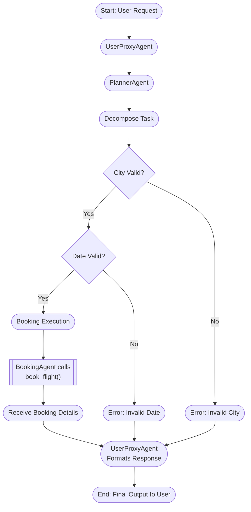

<p align="center">
  
</p>

# AutoGen(A framework for building AI agents and applications)

## Table of Contents

1.  [AutoGen AgentChat: Multi-Agent Orchestrated AI System](#️-autogen-agentchat-multi-agent-orchestrated-ai-system)
2.  [AutoGen Core: A Deep Dive into Multi-Agent Interaction](#autogen-core-a-deep-dive-into-multi-agent-interaction-)
3.  [AutoGen Distributed Runtime - A Technical Overview](#-autogen-distributed-runtime---a-technical-overview)

---

# ✈️ Autogen AgentChat: Multi-Agent Orchestrated AI System

## 🧠 Project Summary

This repository explores **AutoGen AgentChat**, an agentic AI system that leverages Microsoft’s [AutoGen](https://github.com/microsoft/autogen) framework to orchestrate interactive, tool-augmented, multi-modal, and team-based AI workflows. It combines natural language conversation, LangChain tools, structured output validation, and collaborative agents.

---

## 📚 Table of Contents

1. [Features](#features)
2. [Architecture](#architecture)
3. [Getting Started](#getting-started)
4. [Multi-Modal Conversations](#multi-modal-conversations)
5. [Structured Output](#structured-output)
6. [LangChain Tool Integration](#langchain-tool-integration)
7. [Team-Based Agent Simulation](#team-based-agent-simulation)
8. [Flight Booking Use Case](#flight-booking-use-case)
9. [Extensions](#extensions)
10. [License](#license)

---

## 🌟 Features

* 🧑‍🤝‍🧑 Multi-agent collaboration
* 🖼️ Image + Text prompts (Multi-modal support)
* 🛠️ LangChain tool integration
* 📐 Structured schema-based outputs
* 🧾 Flight booking assistant simulation
* 🪄 GPT-4o/4o-mini model support
* 🧼 Pydantic-based data modeling

---

## 🏗️ Architecture

```bash
AutoGen AgentChat.ipynb
├── UserProxyAgent         # Accepts user input
├── AssistantAgent         # Executes reasoning, tools, multimodal inputs
├── MultiModalMessage      # Accepts image and text
├── LangChainToolWrapper   # Integrates LangChain tools with agents
├── Pydantic Schemas       # Validates and parses structured outputs
└── GroupChat              # Simulates team-based decision-making
```

---

## ⚙️ Getting Started

### Requirements

* Python ≥ 3.9
* OpenAI API key
* `pip install -r requirements.txt` or:

```bash
pip install openai pyautogen langchain pydantic pillow python-dotenv
```

### Environment Setup

```bash
export OPENAI_API_KEY="your-api-key"
```

---

## 🧑‍🎨 Multi-Modal Conversations

Using `MultiModalMessage`, agents can now **interpret images** and **combine them with natural language queries**. Here’s a snippet from the notebook:

```python
multi_modal_message = MultiModalMessage(
    content=["Describe the content of this image in detail", img],
    source="User"
)
response = await describer.on_messages([multi_modal_message])
```

🔍 Agent analyzes the image and returns a **Markdown response** describing the content, meaning, and style.

---

## 📐 Structured Output

Using `pydantic`, the model's output is validated against a schema for consistency:

```python
class ImageDescription(BaseModel):
    scene: str
    message: str
    style: str
    orientation: Literal["portrait", "landscape", "square"]
)
```

This ensures your image interpretation results are consistently formatted.

---

## 🔗 LangChain Tool Integration

Seamlessly integrates LangChain tools into AutoGen's agent ecosystem:

```python
from autogen.agentchat.contrib.agent_builder import AgentBuilder
builder = AgentBuilder(tools=langchain_tools)
```

Benefits:

* Leverages community-driven LangChain toolsets
* Removes boilerplate setup
* Enables complex chaining of logic and reasoning

---

## 🧑‍💼 Team-Based Agent Simulation

Multiple agents with specialized roles are created to collaborate on tasks like reasoning, booking, and validating:

| Agent           | Role                             |
| --------------- | -------------------------------- |
| `user_proxy`    | Forwards user prompts            |
| `planner`       | Decomposes tasks                 |
| `booking_agent` | Executes domain-specific tools   |
| `code_agent`    | Handles scripting and validation |

---

## ✈️ Flight Booking Use Case

A real-world simulation is demonstrated where agents collaborate to process a travel booking request:

### Example Prompt:

> “Book a flight from Sydney to New York next Friday.”

### 🧠 Internal Steps:

1. **UserProxyAgent** receives the prompt
2. **PlannerAgent** breaks it into:

   * Validate cities
   * Format date
   * Trigger booking function
3. **BookingAgent** invokes `book_flight(origin, destination, date)`
4. **Result** returned to user with structured details


### 📊 Flowchart



---

# AutoGen Core: A Deep Dive into Multi-Agent Interaction 🤖

[](https://microsoft.github.io/autogen/)
[](https://www.python.org/downloads/)
[](https://opensource.org/licenses/MIT)

This repository contains a Jupyter Notebook (`autogen_core.ipynb`) that provides a hands-on, detailed exploration of the `AutoGen Core` framework. It is designed to demonstrate the fundamental principles of building decoupled, flexible, and powerful multi-agent systems.

The notebook progresses from a very simple "disagreeing" agent to a multi-agent Rock, Paper, Scissors game, showcasing how agents can be composed, orchestrated, and interact with different Large Language Models (LLMs) like OpenAI's GPT and a local Ollama instance.

---

# 🤖 What is AutoGen Core?

## 📌 Overview

**AutoGen Core** is the foundational infrastructure that powers the AutoGen Agent Chat framework. It provides a robust, flexible, and scalable system for managing **agent-to-agent interactions**, regardless of the specific platform, programming language, or framework in use.

AutoGen Core is designed to be **framework-agnostic** and **platform-independent**, making it a powerful backbone for building **agentic AI systems**.

---

## 🧱 Key Characteristics

* **Agent Interaction Focused**:
  At its heart, AutoGen Core is an **agent interaction framework**. It orchestrates how agents communicate, collaborate, and coordinate with one another.

* **Agnostic by Design**:
  It doesn't care whether you're calling LLMs directly or wrapping them through a framework. You can use it with any agent abstraction — even those written in different languages like Python or JavaScript.

* **Supports Heterogeneous Agents**:
  Whether your agents are using custom tools, plugins, or prompt templates, AutoGen Core enables them to seamlessly interact, even if they're built with varying tech stacks or reside in distributed environments.

---

## 🆚 AutoGen Core vs. Semantic Kernel

You may have heard of **[Microsoft's Semantic Kernel](https://github.com/microsoft/semantic-kernel)** and wondered how it compares.

| Feature              | AutoGen Core                          | Semantic Kernel                        |
| -------------------- | ------------------------------------- | -------------------------------------- |
| Purpose              | Agent communication infrastructure    | Glue code for LLM workflows            |
| Focus                | Autonomous agent systems              | Business-oriented LLM integration      |
| Agent Support        | Built for multi-agent systems         | Limited agent support                  |
| Language/Framework   | Cross-language & abstraction agnostic | C# / Python, with its own abstractions |
| Plugin/Tool Handling | Flexible, external or internal tools  | Built-in "plugins" concept             |
| Prompting            | External or framework-agnostic        | Custom prompt templating system        |
| Analogy              | Similar in spirit to **LangGraph**    | Similar in role to **LangChain**       |

**TL;DR**:
Semantic Kernel is more focused on managing LLM pipelines with plugins, memory, and prompt templates, while **AutoGen Core** is solely dedicated to enabling robust **agent interactions** — which is crucial for building **autonomous AI systems**.

---

## 🧠 Architectural Perspective

AutoGen Core plays a role **similar to LangGraph**, in that:

* It emphasizes **agent interactions** rather than implementation details.
* It supports **parallel**, **distributed**, and **asynchronous** communication across agents.
* It is **agnostic** to how agents are implemented, just as LangGraph doesn’t require LangChain.

But the emphasis differs:

| Concept   | LangGraph                               | AutoGen Core                         |
| --------- | --------------------------------------- | ------------------------------------ |
| Core Idea | Replayable, deterministic state updates | Dynamic, diverse agent interaction   |
| Use Case  | Robust workflows with graph dependency  | Enabling diverse, distributed agents |
| Priority  | Reproducibility and flow control        | Flexibility and interoperability     |

---

## 🌐 Why Use AutoGen Core?

* Build **scalable agent ecosystems** with minimal coupling.
* Support **distributed and polyglot agents** (e.g., Python, JavaScript).
* Avoid being locked into any one framework or prompting paradigm.
* Focus on **inter-agent communication**, leaving abstraction layers to your choice of tools.

---

## 🎯 Summary

AutoGen Core provides the infrastructure for a **truly modular, interoperable, and agent-centric AI system**. If you're building multi-agent applications and care about **flexibility, scalability, and interoperability**, AutoGen Core is designed for you.

---

## 📔 Notebook at a Glance

`AutoGen Core` is an agent-agnostic interaction framework. It provides the communication infrastructure and lifecycle management for agents, allowing developers to focus on the agent's internal logic without worrying about the complexities of message delivery.

The fundamental principle of AutoGen Core is the **decoupling of an agent's logic from the communication mechanism**. This is achieved through a central component called a **Runtime**.

-   **Runtime**: The communication backbone of the system. It manages the lifecycle of agents (creation, registration) and handles the routing of messages between them. This notebook focuses on the `SingleThreadedAgentRuntime`, a simple, embedded runtime perfect for local development and debugging.
-   **Agent**: The core unit of work. In AutoGen Core, agents are defined by subclassing `RoutedAgent`. They are responsible for their own tasks and logic.
-   **Message**: The data packet exchanged between agents. A key feature is that you can define your own message structure, making the framework adaptable to any domain.

## 🧠 Key Concepts Explained

This notebook introduces several core concepts that are essential for understanding and using AutoGen.

| Concept                   | Description                                                                                                                                                                                                      |
| ------------------------- | ---------------------------------------------------------------------------------------------------------------------------------------------------------------------------------------------------------------- |
| **`RoutedAgent`**         | The base class for all agents in this framework. It provides the foundational structure for an agent that can be managed by a runtime.                                                                             |
| **`AgentId`**             | A unique identifier for each agent instance, composed of a `type` (e.g., "player1") and a `key` (e.g., "default"). This allows the runtime to route messages to the correct agent instance.                         |
| **`@message_handler`**    | A decorator used to mark methods within an agent class as capable of receiving and processing messages. The runtime will invoke these handlers when a message is sent to the agent.                                |
| **`MessageContext`**      | An object passed to a message handler along with the message itself. It contains metadata about the message, such as the sender, and provides access to runtime services, like cancellation tokens.               |
| **`SingleThreadedAgentRuntime`** | The communication bus. It's responsible for: <br> • **Registering** agent types with factory functions. <br> • **Starting/Stopping** the message processing loop. <br> • **Routing** messages via `send_message`. |
| **Delegation**            | A powerful pattern demonstrated in the notebook where a custom `RoutedAgent` wraps a pre-built agent (like `autogen_agentchat.AssistantAgent`) to leverage its functionality while adapting it to the custom message flow. |

## 🛠️ Prerequisites

Before you can run the `autogen_core.ipynb` notebook, ensure you have the following set up on your system.

### 1. Software
-   **Python**: Version 3.10 or higher.
-   **Jupyter Notebook/Lab**: To run the `.ipynb` file.
-   **(Optional) Ollama**: To run the final Rock, Paper, Scissors example, you need to have [Ollama](https://ollama.com/) installed and running with a model pulled.
    ```bash
    # Install Ollama (see official docs for your OS)
    # Then pull the llama3.2 model
    ollama pull llama3.2
    ```

### 2. Python Libraries
You will need to install several Python packages. You can install them using pip:
```bash
pip install autogen-core py-autogen "pyautogen[gemini,openai,websurfer,wolframalpha,retrievechat,lmm,teachable,graph,redis,websockets,constraind,passio,blendsearch,mathchat,qdrant,chainlit,fastapi,local_script_execution,anthropic,groq,flaml,guidance,ollama]" python-dotenv
```

### 3. Environment Variables
The notebook uses LLMs from OpenAI, which require an API key. The `python-dotenv` library is used to load these keys from a `.env` file in the root directory.

1.  Create a file named `.env` in the same directory as the notebook.
2.  Add your OpenAI API key to this file:
    ```.env
    OPENAI_API_KEY="sk-..."
    ```
The `load_dotenv(override=True)` command in the notebook will automatically load this key into your environment.

---

## 🚶‍♂️ Notebook Walkthrough

The notebook is divided into three main parts, each building upon the last to demonstrate the flexibility and power of AutoGen Core.

### Part 1: The Basics - A Simple "Disagreeing" Agent 🧐

This section introduces the most fundamental components of the framework.

1.  **Custom Message Class**: We start by defining a simple `Message` data class. This highlights that you have full control over the communication protocol between your agents.
    ```python
    @dataclass
    class Message:
        content: str
    ```

2.  **`SimpleAgent` Definition**: We create `SimpleAgent`, which inherits from `RoutedAgent`. Its sole purpose is to receive a `Message` and reply with a disagreement.
    -   The `@message_handler` decorator flags the `on_my_message` method as a message receiver.
    -   The agent uses its `self.id.type` and `self.id.key` to identify itself in the response, demonstrating how agents are aware of their own identity.
    ```python
    class SimpleAgent(RoutedAgent):
        def __init__(self) -> None:
            super().__init__("Simple") # Sets the default type

        @message_handler
        async def on_my_message(self, message: Message, ctx: MessageContext) -> Message:
            return Message(content=f"This is {self.id.type}-{self.id.key}. You said '{message.content}' and I disagree.")
    ```

3.  **Runtime Setup and Interaction**:
    -   A `SingleThreadedAgentRuntime` is instantiated.
    -   The `SimpleAgent` is registered with the runtime using `SimpleAgent.register`. We provide a `type` ("simple_agent") and a factory function (`lambda: SimpleAgent()`) that the runtime will use to create new instances of this agent.
    -   The runtime is started with `runtime.start()`.
    -   A message is sent to a specific agent instance using `runtime.send_message`, targeting it with an `AgentId`.
    -   The notebook shows the agent's predictable, hard-coded response.

### Part 2: Introducing Intelligence - The LLM Agent 🧠

This section demonstrates how to integrate the intelligence of an LLM by wrapping a pre-existing `autogen_agentchat.AssistantAgent`.

1.  **`MyLLMAgent` Definition**: This agent acts as a bridge or an adapter.
    -   In its `__init__`, it creates an instance of `AssistantAgent` and stores it as `self._delegate`. This delegate is configured with an OpenAI model client.
    -   Its `@message_handler` receives our custom `Message`. It then translates this `Message` into a `TextMessage` that the `AssistantAgent` understands.
    -   It calls the delegate's `on_messages` method to get an LLM-generated response.
    -   Finally, it translates the `TextMessage` response back into our custom `Message` format to return it to the runtime.
    ```python
    class MyLLMAgent(RoutedAgent):
        def __init__(self) -> None:
            super().__init__("LLMAgent")
            # ... setup model_client ...
            self._delegate = AssistantAgent("LLMAgent", model_client=model_client)

        @message_handler
        async def handle_my_message_type(self, message: Message, ctx: MessageContext) -> Message:
            # 1. Translate from custom Message to TextMessage
            text_message = TextMessage(content=message.content, source="user")
            # 2. Delegate to the AssistantAgent
            response = await self._delegate.on_messages([text_message], ctx.cancellation_token)
            # 3. Translate back from TextMessage to custom Message
            return Message(content=response.chat_message.content)
    ```

2.  **Two-Agent Conversation**: The notebook orchestrates a simple conversation where the `MyLLMAgent`'s friendly LLM-powered greeting is met by the `SimpleAgent`'s blunt disagreement, showcasing a basic multi-agent interaction.

### Part 3: Multi-Agent Collaboration - Rock, Paper, Scissors 🗿📄✂️

This is the flagship example of the notebook, demonstrating a more complex multi-agent orchestration pattern. It sets up a game of Rock, Paper, Scissors with two player agents and one judge/orchestrator agent.

1.  **The Players**:
    -   `Player1Agent`: Uses OpenAI's `gpt-4o-mini`.
    -   `Player2Agent`: Uses a local Ollama model (`llama3.2`).
    -   Both are thin wrappers around `AssistantAgent`, similar to `MyLLMAgent`. Their purpose is simply to respond to the game prompt.

2.  **The Orchestrator (`RockPaperScissorsAgent`)**: This is the most important agent in this example. It manages the entire game flow *from within its own message handler*.
    -   When it receives a message (e.g., "go"), its `handle_my_message_type` method is triggered.
    -   **Internal Communication**: Inside this handler, it uses `self.send_message` to communicate with the other agents. This is a key pattern: an agent can itself be a client of the runtime, sending messages to other agents to accomplish its task.
    -   **Game Flow**:
        1.  It sends an instruction to both `Player1Agent` and `Player2Agent` to make a choice.
        2.  It `await`s their responses.
        3.  It compiles the results into a new prompt for its *own* LLM delegate.
        4.  It asks its delegate to judge the winner based on the players' choices.
        5.  It combines the players' choices and the final judgment into a single `Message` and returns it as the final result of the interaction.

    ```python
    class RockPaperScissorsAgent(RoutedAgent):
        # ... __init__ ...

        @message_handler
        async def handle_my_message_type(self, message: Message, ctx: MessageContext) -> Message:
            instruction = "You are playing rock, paper, scissors..."
            message = Message(content=instruction)
            
            # Agent sends messages to other agents
            response1 = await self.send_message(message, AgentId("player1", "default"))
            response2 = await self.send_message(message, AgentId("player2", "default"))
            
            result = f"Player 1: {response1.content}\nPlayer 2: {response2.content}\n"
            judgement_prompt = f"..."
            
            # Agent uses its own LLM to reason over the results
            response = await self._delegate.on_messages(...)
            
            return Message(content=result + response.chat_message.content)
    ```
---

# 🧠 AutoGen Distributed Runtime - A Technical Overview

This document provides a technical overview of the **distributed runtime** in the AutoGen framework, using the example notebook `autogen_distributed.ipynb` as a practical guide. It explains the architecture, core components, and demonstrates how to orchestrate communication between agents running in separate, isolated processes.

---

## 📂 File Structure

- `autogen_distributed.ipynb`: An executable notebook that demonstrates AutoGen's distributed runtime. It launches a host, registers agents to one or more workers, and facilitates a collaborative task between them.
- `distributed.readme.md`: This file, providing a conceptual and technical overview of the distributed runtime and its implementation in the example notebook.

---

## 🌐 What is the Distributed Runtime?

The AutoGen distributed runtime is an **experimental** feature designed to scale agent-based applications by allowing agents to run in separate processes or on different machines. It provides an architecture for multi-agent systems to communicate seamlessly, regardless of their location.

This architecture is built on two primary components: the **Host Service** and the **Worker Runtime**.

### 🏠 Host Service (`GrpcWorkerAgentRuntimeHost`)

The Host Service acts as the central coordinator and message broker in the distributed system. Its key responsibilities are:
*   **Managing Connections:** Listens for and accepts connections from multiple Worker Runtimes.
*   **Session Management & Routing:** Handles message delivery between agents, abstracting away the complexity of cross-process communication.
*   **gRPC Communication:** Uses gRPC (Remote Procedure Calls) as the underlying protocol for robust and efficient messaging.

### 👷 Worker Runtime (`GrpcWorkerAgentRuntime`)

The Worker Runtime is responsible for executing agents and managing their lifecycles.
*   **Hosts Agents:** One or more agents can be registered to a single worker.
*   **Agent Registration:** "Advertises" its available agents to the Host Service upon connecting.
*   **Executes Logic:** Receives messages from the Host and executes the corresponding agent's logic. In the notebook, this involves invoking an underlying `AssistantAgent` to process tasks.

---

## 🔗 How It Works: The Architecture

The interaction between the components enables a scalable and decoupled system:

1.  A **Host Service** is started and begins listening for connections on a specific address (e.g., `localhost:50051`).
2.  One or more **Worker Runtimes** are started. Each worker connects to the Host's address.
3.  Each Worker **registers** the agents it hosts (e.g., `Player1Agent`, `Judge`) with the Host.
4.  When one agent sends a message to another, the message is first sent to its local Worker, then relayed to the Host.
5.  The **Host routes the message** to the correct destination Worker, which then delivers it to the target agent for processing.

```
+--------------------+         gRPC          +-----------------------+
|    Host Service    |<--------------------->|    Worker Runtime 1   |
| (localhost:50051)  |                      |  (Hosts Player1Agent) |
+--------------------+                      +-----------------------+
          ^
          | gRPC
          v
+-----------------------+
|    Worker Runtime 2   |
|  (Hosts Player2Agent) |
+-----------------------+
```

---

## 🧪 Demonstration: `autogen_distributed.ipynb`

The example notebook showcases this architecture with a practical experiment.

### Experiment Design

1.  **Objective:** A `Judge` agent needs to decide whether to use AutoGen for a project. It delegates research to two other agents.
    *   `Player1Agent`: Researches the "pros" of using AutoGen.
    *   `Player2Agent`: Researches the "cons" of using AutoGen.
2.  **Setup:**
    *   A single `GrpcWorkerAgentRuntimeHost` is initialized to manage communication.
    *   The notebook uses a flag, `ALL_IN_ONE_WORKER`, to toggle between two deployment modes.
3.  **Execution:**
    *   The `Judge` agent initiates the conversation by sending tasks to `Player1` and `Player2`.
    *   The host routes these messages to the appropriate workers.
    *   The `Player` agents use a search tool to find information and return their findings.
    *   The `Judge` agent collects the pros and cons, synthesizes them, and makes a final decision.

---

## 🧠 Single Worker vs. Multiple Workers

The `ALL_IN_ONE_WORKER` flag in the notebook highlights the flexibility of the runtime.

### 🔁 `True`: All Agents on a Single Worker

All three agents (`Player1`, `Player2`, `Judge`) are registered to the same `GrpcWorkerAgentRuntime`.

-   **Pros:**
    -   Simpler setup for development and debugging.
    -   No network latency from inter-process communication.
    -   Ideal for prototyping and smaller-scale applications.
-   **Cons:**
    -   **No Concurrency:** All agents run within a single process and event loop, limiting true parallelism.
    -   **Single Point of Failure:** An error in one agent or the worker itself can crash the entire system.
    -   **Resource Contention:** All agents share the same CPU and memory resources.

### 🔀 `False`: Agents on Multiple Workers

Each agent is registered to its own dedicated `GrpcWorkerAgentRuntime` (three workers in total).

-   **Pros:**
    -   **True Parallelism & Scalability:** Agents run in independent processes, enabling concurrent execution and horizontal scaling across CPU cores or machines.
    -   **Fault Isolation:** The crash of one worker (e.g., `worker1` running `Player1Agent`) does not affect the others.
    -   **Resource Management:** Resources can be allocated per-worker, allowing for better optimization (e.g., giving a resource-intensive agent its own powerful machine).
-   **Cons:**
    -   **Increased Complexity:** Requires more careful management of worker processes and their connections.
    -   **Network Overhead:** Communication via gRPC introduces latency compared to in-process calls.
    -   **Deployment:** More complex to deploy and monitor in a production environment.

---

## 🛠️ How to Run the Example Locally

1.  **Clone the repository** and navigate to the project directory.
2.  **Install dependencies.** Ensure you have the necessary packages from the notebook's import statements:
    ```bash
    pip install "autogen-core[grpc]>=0.2.22" autogen-agentchat autogen-ext-openai autogen-ext-langchain langchain-community google-search-results python-dotenv
    ```
3.  **Set up environment variables.** Create a `.env` file in the root directory and add your API keys:
    ```
    OPENAI_API_KEY="sk-..."
    SERPER_API_KEY="..."
    ```
4.  **Run the notebook.** Open and execute the cells in `autogen_distributed.ipynb` using Jupyter Lab or Jupyter Notebook. You can toggle the `ALL_IN_ONE_WORKER` boolean to observe the different behaviors.

---

## 🚧 Experimental Notice

The distributed runtime is currently in an **experimental** state. It is not recommended for production use without further hardening. Key considerations for production include:
-   **Security:** Implement TLS for gRPC to ensure secure communication.
-   **Service Discovery:** Use a proper service registry instead of hardcoded addresses.
-   **Fault Tolerance:** Add mechanisms for handling worker crashes, message retries, and host failover.
-   **API Stability:** The APIs are subject to change in future versions.