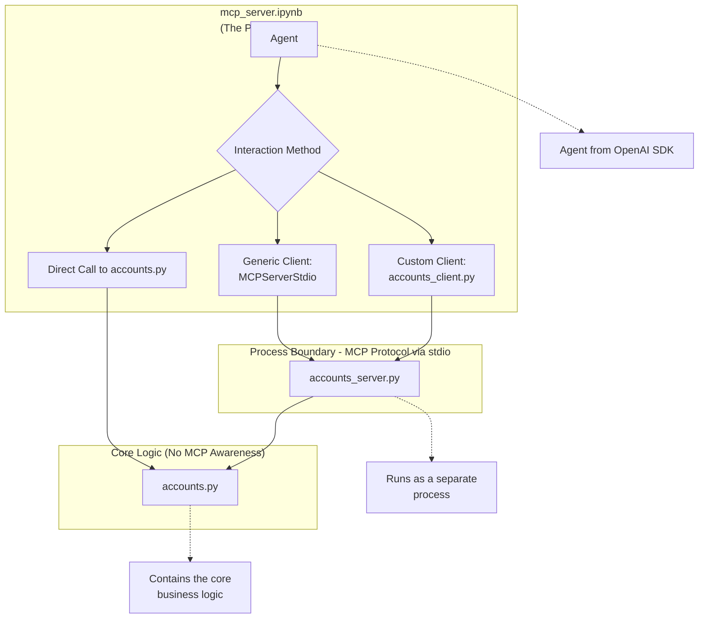

# MCP

## Table of Contents

1.  [Intro to MCP](#intro-to-mcp)
2.  [Create your Own MCP Server](#create-your-own-mcp-server)
3.  [Agentic AI - MCP Memory](#agentic-ai---mcp-memory-)
4.  [Autonomous Traders: An Agentic AI Capstone Project](#autonomous-traders-an-agentic-ai-capstone-project)
5.  [Final Capstone: Autonomous Traders](#--agentic-ai---mcp-capstone-autonomous-traders)

---

# Intro to MCP

## Introduction

Anthropic first announced the Model Context Protocol (MCP) late last year, but it gained significant traction from January through April of this year. MCP is often described by Anthropi c as the **USB‑C of Agentic AI**, a metaphor that highlights its role in providing universal connectivity rather than a novel algorithm or framework.

<p align="center">
  
</p>

Despite its popularity, there are several common misconceptions about MCP. Before diving into its capabilities, let’s clarify what MCP **is not**.

---

## What MCP **Is Not**

1.  **An Agent Framework**
    - MCP does _not_ provide built-in agents or workflows for agent orchestration.
2.  **A Fundamental Paradigm Shift**
    - MCP isn’t a brand-new computational model that transforms how AI operates at its core.
3.  **A Coding Library for Agents**
    - There is no MCP-specific SDK or language for writing agents.

> **Key Takeaway:** MCP is purely a **protocol** and **standard**, not an implementation or toolkit.

---

## What MCP **Is**

- A **Standardized Protocol** for integrating agents with **external tools**, **resources**, and **prompts**.
- A way to define and share:
  1.  **Tools** — functions or APIs that perform specific tasks.
  2.  **RAG Sources** — retrieval-augmented generation data connectors.
  3.  **Prompts** — reusable prompt templates (less popular than tools).

> The core excitement around MCP lies in its **tool-sharing** capabilities.

---

## Why MCP Matters: The USB‑C Analogy

- **Connectivity:** Just as USB‑C unifies power and data transfer standards, MCP unifies how agent-based applications discover and use tools.
- **Interoperability:** One developer can publish a tool, and thousands of other applications can use it seamlessly.

---

## MCP Ecosystem & Adoption

1.  **Vast Tools Catalog**
    - The community has already contributed **thousands** of MCP‑compliant tools.
    - Tools range from simple utility functions to complex APIs.
2.  **Seamless Integration**
    - Using standard decorators (e.g., in the OpenAI Agents SDK), any function can become an MCP tool.
    - Agents can immediately import and invoke external tools with full parameter descriptions.
3.  **Wide Adoption**
    - Standards gain value through adoption, much like HTML for the World Wide Web.
    - Rapid ecosystem growth is driving excitement and further contributions.

> **Pro Tip:** Search popular MCP registries to explore and integrate tools without writing custom code.

---

## Summary

MCP provides a simple yet powerful standard for connecting agentic AI applications to a rich ecosystem of tools. By abstracting away integration details, MCP enables developers to enhance their agents’ capabilities through community-driven resources – truly embodying the **USB‑C of Agentic AI**.

---

# 🧠 MCP Core Concepts - Model Context Protocol

Welcome to the deep dive on the **Model Context Protocol (MCP)** — often described as the _USB-C of Agentic AI_. This guide covers the **three core components** of MCP, how they interact, and the different configurations you might encounter.

---

## 📌 Overview of Core Components

MCP revolves around three fundamental concepts:


### 🧩 1. MCP Host

- The **MCP Host** is the main application environment where an agent is equipped with tools.
- Examples include:

  - 🖥️ **Claude Desktop** – a desktop application that lets you interact with Claude.
  - 🛠️ **Custom agent frameworks** – built using libraries like the OpenAI Agents SDK.

- The **host** is responsible for running and managing the overall agent experience.

---

### 🔌 2. MCP Client

- The **MCP Client** is a lightweight plugin or process that runs **within the host**.
- It acts as a bridge, connecting **1:1** to an **MCP Server**.
- If your host connects to multiple MCP servers, you'll have multiple clients – one for each server.

---

### 🖧 3. MCP Server

- The **MCP Server** is the real powerhouse — running **outside the host**, it provides:

  - 🧰 Tools
  - 🧠 Context
  - ✏️ Prompt Templates

- This is how your agent gets "superpowers" — fetching data, processing content, or executing tasks.

---

## 🏗️ Architecture

- Inside your machine:

  - Hosts run MCP Clients.
  - MCP Clients connect to locally running MCP Servers.

- Outside your machine (less common):

  - MCP Clients may connect to **remote servers** (also called _hosted_ or _managed MCP servers_).

- Typical example: `Claude Desktop (Host)` → `Fetch Server (MCP Server)` → `Internet Search`

---

## 🌐 Real Example: Fetch Server

Let’s look at a concrete example — the `fetch` MCP server:

- 🔍 **Fetch** allows agents to search the web and fetch live pages.
- 🧑‍💻 It launches a **headless browser** (like Chrome) using **Playwright**.
- 📄 It reads and returns webpage content to your agent.
- 🖥️ Typically installed locally and runs outside the host.
- 🤖 Used successfully in **Autogen** last week!

---

## 🧭 Local vs Remote Servers

### 📍 Local MCP Servers (Default)

- ✅ Most common configuration.
- 🚀 Installed from a public repository but **runs on your local machine**.
- 🛠️ Examples include servers that:

  - Read files.
  - Call APIs (e.g., for weather).
  - Browse the web (like `fetch`).

### ☁️ Remote MCP Servers (Rare)

- ❗Less common.
- 🌐 Run on external infrastructure (e.g., cloud).
- 🔐 Requires network communication (HTTPS).
- 🧪 Called "hosted" or "managed" MCP servers.
- ⚠️ Misconception Alert: Despite the name, most MCP servers **do not** live remotely.

---

## 🔄 Hybrid Configs

- Even **locally installed** MCP servers might:

  - Access internet APIs (e.g., weather, search).
  - Process content from online sources.

- 🧠 Key Insight: **Local server** ≠ offline-only.
  It's common for local MCP servers to be internet-connected.

---

## 🛣️ Transport Mechanisms

There are **two ways** MCP Clients communicate with Servers:

### 📤 1. `stdio` (Standard I/O)

- 🔧 **Standard Input/Output** (local only).
- 🧵 Client spawns the server as a subprocess and exchanges messages via stdin/stdout.
- 🌟 Most common method for **local** servers.
- ✅ Easy to implement, simple to debug.
- 🧪 You’ll use this when building your own MCP server.

### 📡 2. `sse` (Server-Sent Events)

- 🌐 Used for **remote** (hosted) MCP servers.
- 📶 Uses HTTPS and streams responses back, similar to LLM streaming.
- 🔗 Required when connecting to external servers outside your local box.

| Transport | Use Case            | Example                      |
| --------- | ------------------- | ---------------------------- |
| `stdio`   | Local communication | Claude Desktop + Local Fetch |
| `sse`     | Remote servers      | Cloud-managed MCP server     |

---

## ✅ Summary

Here’s what you should take away:

- 🧱 **MCP Host** runs the agent software.
- 🔌 **MCP Client** connects the host to external functionality.
- 🛠️ **MCP Server** provides tools, context, and prompts — usually **runs locally**.
- 🌐 **Fetch** is a real-world example that uses headless browsing to fetch web pages.
- 📡 Two communication protocols: `stdio` (local) and `sse` (remote).
- 🧠 Most MCP servers are installed locally — don’t be fooled by the name!

---

## 🧪 Time for a Lab

Get ready to build and run your own MCP server using the OpenAI Agents SDK!

🎯 Goal: Create a local MCP server that communicates with your host using `stdio`.

---

## Technical Documentation: `intro_to_mcp.ipynb` 📓

This section provides a detailed, cell-by-cell walkthrough of the `intro_to_mcp.ipynb` notebook. It demonstrates how to use the Model Context Protocol (MCP) to equip an agent from the OpenAI Agents SDK with powerful, external tools for web browsing and file manipulation.

### Overview 🗺️

The notebook accomplishes the following:

1.  **Sets up the environment** by loading necessary libraries and API keys.
2.  **Spawns three different MCP servers** to discover their tools: a web `fetch` server, a full `Playwright` browser server, and a sandboxed `filesystem` server.
3.  **Integrates multiple servers** into a single agent, providing it with a combined toolset.
4.  **Assigns a complex task** to the agent, which it solves by orchestrating the use of its new tools.

---

### Cell-by-Cell Analysis 🔬

#### **Cells 1-3: Project Setup and Initialization**

- **Imports 📦:** The script imports essential components:
  - `Agent`, `Runner`, `trace`: Core classes for creating, running, and monitoring agents.
  - `MCPServerStdio`: The client class used to spawn and communicate with local MCP servers.
  - `dotenv`: A utility to load environment variables.
- **Environment Variables 🔑:** `load_dotenv(override=True)` is called to load configurations like `OPENAI_API_KEY` from a local `.env` file, making them available to the application.

#### **Cell 4-5: Spawning the Fetch MCP Server**

- **Server Configuration ⚙️:** A dictionary `fetch_params` is created to define how to launch the server. It specifies the command `uvx` and its argument `mcp-server-fetch`.
- **Server Connection 🚀:** An `async with` block instantiates `MCPServerStdio`, which starts the fetch server as a subprocess. This ensures the server is automatically shut down after use.
- **Tool Discovery 🛠️:** Inside the block, `await server.list_tools()` is called. This communicates with the newly spawned server and retrieves a structured list of all the tools it offers (in this case, a single `fetch` tool).

#### **Cell 6-7: Spawning the Playwright (Browser) MCP Server**

- **Server Configuration ⚙️:** Similar to the fetch server, `playwright_params` are defined. This time, it uses `npx` (Node Package Executor) to run the `@playwright/mcp` package, a more powerful browser automation toolset.
- **Server Connection & Discovery 🚀:** The same `async with MCPServerStdio(...)` and `await server.list_tools()` pattern is used to connect to the Playwright server and get its comprehensive list of browser manipulation tools (e.g., `browser_navigate`, `browser_click`, `browser_type`).

#### **Cell 8: Spawning the Filesystem MCP Server**

- **Security Sandboxing 🛡️:** A `sandbox_path` is created by joining the current working directory with a `/sandbox` folder. This is a crucial security step to restrict the server's file access to a single, safe directory.
- **Server Configuration ⚙️:** The `files_params` dictionary is configured to run the filesystem server using `npx`, passing the `sandbox_path` as an argument to enforce the access restrictions.
- **Server Connection & Discovery 🚀:** The notebook once again uses the standard pattern to start the server and retrieve its list of file I/O tools (e.g., `read_file`, `write_file`, `list_directory`).

#### **Cell 9-10: The Grand Finale: Agent Creation and Task Execution**

- **Agent Instructions 📜:** A detailed system prompt (`instructions`) is defined to guide the agent's behavior, encouraging it to be persistent in browsing the web to solve its task.
- **Running Multiple Servers 🔄:** The code uses nested `async with` blocks to run both the **filesystem** and **Playwright browser** servers simultaneously, making their tools available at the same time.
- **Agent Instantiation 🤖:** An `Agent` instance named "investigator" is created. Crucially, the list of running server clients (`mcp_servers=[mcp_server_files, mcp_server_browser]`) is passed during initialization. The Agents SDK automatically queries all these servers and consolidates their tools into a single toolset for the agent.
- **Tracing and Execution ✨:**
  - The entire operation is wrapped in a `with trace("investigate"):` block, which sends detailed logs of the agent's thoughts and actions to the OpenAI platform for debugging and analysis.
  - `Runner.run()` is called with the agent and a complex prompt: _"Find a great recipe for Banoffee Pie, then summarize it in markdown to banoffee.md"_.
  - The agent autonomously uses the browser tools to find a recipe and then uses the filesystem tools to save the result, demonstrating successful tool orchestration.
- **Final Output 📄:** The script prints the `result.final_output`, which is the agent's final, user-facing message confirming task completion.

#### **Cell 11: Further Exploration**

- **Resources 🔗:** This final markdown cell provides a list of helpful links to explore the wider MCP ecosystem, including tool marketplaces and community articles.

---

### Conclusion and Further Exploration

This notebook provides a hands-on demonstration of the Model Context Protocol's core value: **interoperability**. By adhering to a simple standard, developers can easily plug powerful, pre-built toolsets (like browser automation and filesystem access) into any compliant agent framework.

For more tools and information, explore the growing MCP ecosystem:

- **MCP Marketplaces & Registries:**
  - [https://mcp.so](https://mcp.so)
  - [https://glama.ai/mcp](https://glama.ai/mcp)
  - [https://smithery.ai/](https://smithery.ai/)
- **Community Articles:**
  - [Top 11 Essential MCP Libraries](https://huggingface.co/blog/LLMhacker/top-11-essential-mcp-libraries)
  - [HuggingFace Community Article on MCP](https://huggingface.co/blog/Kseniase/mcp)
- **OpenAI Tracing:**
  - Review your agent's run at [https://platform.openai.com/traces](https://platform.openai.com/traces)

---

<p align="center">
  
</p>

# Create your Own MCP Server

## 🛠️ Making an MCP Server

Before jumping into building an MCP server, it's important to pause and ask:

## 🤔 Why build an MCP server?

There are a few key reasons you'd want to build an MCP (Model Context Protocol) server, and understanding them will help guide your decision-making.

### ✅ **1. For Sharing Tools with Others**

*   The **primary** reason to make an MCP server is **sharing**.
*   If you’ve built a tool that you'd like **others to use with their agents**, MCP provides a standardized way to expose it.
*   With MCP, you define the tool interface, describe how it works (e.g., via prompt templates or RAG contexts), and others can **integrate** it into their own agent pipelines.

### 📦 **2. Consistent Packaging for Agent Systems**

*   If you're building a **larger agentic system** using several MCP servers, it’s often useful to package even your own tools as MCP servers.
*   This promotes **consistency** in how your agent accesses external capabilities.

> 🧪 Even if it's a bit of a stretch, treating your internal tools the same as external MCP tools can help **debugging** and **scalability** down the road.

### 🔧 **3. Learn the Internals (Plumbing)**

*   Building an MCP server from scratch helps you understand the **underlying mechanics** of agent-tool interaction.
*   It’s a great exercise if you’re curious about **how things work under the hood**.

---

## ❌ When **Not** to Build an MCP Server

Let’s flip the coin: **When is building an MCP server overkill?**

### 🚫 **If You're Only Using the Tool Yourself**

*   If you're writing a function **just for yourself or your own agent**, then don't build an MCP server.
*   Instead, use the simpler approach:

    *   Decorate your function with `@tool` (or similar).
    *   Register it with your LLM using the **OpenAI Agents SDK** or via a `tools` array using JSON.

```python
@tool
def my_custom_tool(input):
    return "This runs directly in your process"
```

*   This approach runs **directly within the Python process** – no extra scaffolding needed.

### 🧱 MCP Adds Plumbing You Might Not Need

Building an MCP server means:

*   Spawning a **separate process**.
*   Communicating over **stdin/stdout** using the MCP protocol.
*   Managing **serialization, process lifecycle**, and possibly dockerization.

That’s a lot of overhead if your tool is meant to be used **only locally**.

---

## 💡 TL;DR

| ✅ Build an MCP Server When...                                         | ❌ Don’t Build One If...                                     |
| --------------------------------------------------------------------- | ----------------------------------------------------------- |
| You want to **share** tools with others.                              | It's a **local-only** utility function.                     |
| You want **standardized** tooling across multiple agents.             | You're just **testing** things quickly.                     |
| You're learning or want to understand the **MCP protocol internals**. | You already have **agent SDK support** for local functions. |

---

### 🧠 Final Thought

MCP servers are **about sharing and modularity**.
If your tool is meant for others to plug into their own agents, **MCP is the way to go**.
If you're just using something in your own Python process, **keep it simple**.

> 🚀 Use the right tool for the job. MCP is powerful—but not always necessary.

---

## Technical Documentation: `mcp_server.ipynb` and Supporting Files

This documentation provides a comprehensive analysis of the `mcp_server.ipynb` notebook and its interconnected Python modules. Together, they demonstrate the end-to-end process of taking existing business logic, wrapping it in an MCP server, and making it accessible to an AI agent.

### The Big Picture: How the Files Connect 🔗

The entire system is designed with a clear separation of concerns, where each file has a distinct role. Understanding this architecture is key to grasping the project's design.

The system follows a clear separation of concerns across three layers:



*   **`accounts.py` (The Core Logic ❤️):** Contains all the business logic for managing financial accounts. It has no knowledge of MCP.
*   **`accounts_server.py` (The MCP Bridge 🌉):** A thin wrapper that exposes the functions from `accounts.py` as MCP tools and resources.
*   **`accounts_client.py` (The Translator & Helper 🗣️):** A client library that knows how to start and communicate with the `accounts_server`, and translates MCP tools into a format the OpenAI Agents SDK can use.
*   **`mcp_server.ipynb` (The Demonstration Lab 🔬):** The main notebook that brings everything together, showing how to use the core logic directly and through the MCP server.

---

### File-by-File Analysis

#### 1. `accounts.py` - The Business Logic

This module is the heart of the application. It was generated by an agent in a previous exercise and updated to include data persistence.

*   **Role:** Defines the data structures and business rules for a trading account system.
*   **Key Components:**
    *   `Transaction(BaseModel)`: A Pydantic model for a single buy/sell transaction.
    *   `Account(BaseModel)`: The main Pydantic model representing a user's account, including balance, holdings, and transaction history.
*   **Core Functionality:**
    *   **Persistence:** Uses `database.py` to read (`Account.get()`) and write (`.save()`) account data, making state persistent between runs.
    *   **Account Management:** Provides methods like `buy_shares()`, `sell_shares()`, and `report()`.
    *   **Market Interaction:** Uses `market.py` to fetch simulated share prices.
*   **Key Takeaway:** This module is completely decoupled from the agent framework. It could be used in any Python application, not just one involving MCP or AI agents.

#### 2. `accounts_server.py` - The MCP Server

This file acts as the bridge, making the functionality in `accounts.py` available over the Model Context Protocol.

*   **Role:** To expose the business logic as a standardized set of tools and resources that any MCP-compliant client can discover and use.
*   **Key Components:**
    *   `mcp = FastMCP("accounts_server")`: Initializes an MCP server instance.
    *   `@mcp.tool()`: A decorator that wraps a function and exposes it as a callable MCP tool. It automatically generates the input schema from the function's type hints (e.g., `get_balance`, `buy_shares`).
    *   `@mcp.resource("uri")`: A decorator that exposes a function as a readable resource, perfect for providing context (RAG). For example, `accounts://accounts_server/{name}` allows an agent to read a full report for an account.
    *   `mcp.run(transport='stdio')`: The entry point that starts the server, listening for communication on standard input/output.

#### 3. `accounts_client.py` - The Custom Client

This helper module simplifies the process of interacting with our specific `accounts_server` from a Python application, especially one using the OpenAI SDK.

*   **Role:** To provide a simple, high-level API for connecting to the server, calling its tools, and adapting them for the OpenAI Agents SDK.
*   **Key Components:**
    *   `params`: Defines the command (`uv run accounts_server.py`) needed to launch the server process.
    *   `call_accounts_tool(...)`: A function that handles the low-level MCP communication to invoke a tool by name.
    *   `read_accounts_resource(...)`: A function to read data from a resource URI.
    *   `get_accounts_tools_openai()`: The most important function. It fetches the generic MCP tool definitions from the server and converts them into `FunctionTool` objects, which is the format the OpenAI `Agent` class expects in its `tools` parameter. This is a critical **adapter** step.

---

### Notebook Walkthrough: `mcp_server.ipynb` 🔬

The notebook is structured as a practical lab, demonstrating the concepts in three distinct acts.

#### **Act 1: Direct Interaction with Business Logic (Cells 4-8) 🐍**

*   **🎯 Goal:** To prove that the core `accounts.py` logic is a standalone, functional Python module that works without any MCP or AI components.

## 📦 Working with the MCP Python Module: `accounts.py`

### 🐍 Starting with Python Modules

This week, we’ll be diving into both:

*   🧪 **Labs**
*   📁 **Python code modules**

We'll start with labs and **quickly transition to modules**.
And our main focus will be on one particular module: `accounts.py`.

---

### 💼 The `accounts` Module

The `accounts` module is packed with business logic related to account management.

Here’s what it can do:

*   💰 Manage user accounts with balances
*   📈 Buy and sell shares based on market prices
*   🧾 List transaction history
*   📊 Calculate profit and loss
*   💸 Execute trades (buy/sell)

It’s a full-featured simulation of a trading account system.

---

### 🤖 Agent-Generated Code from 3_crew

> 🎉 You might find this code familiar—because it was **generated by our agent team** back in **3_crew**!

*   Developed by the **engineering team in Crewe**
*   Contains:
    *   Helpful 💬 comments
    *   🧠 Type hints
*   Unlike my own *hacky* style 😅, this one’s pretty polished!

---

### 🛠️ Updates to the Module

I’ve made a few minimal changes:

### ✅ 1. Persistent Storage

*   Introduced a new module called `database.py`
*   Uses **SQLite** (nothing fancy—just good ol' vanilla persistence)
*   Allows reading/writing **accounts as JSON objects**

#### 🔗 2. Integrated with `accounts.py`

*   The `accounts` module now works with `database.py` for I/O
*   Otherwise, the core logic remains **untouched**

---

### 🧩 Summary

| Feature       | Description                                |
| ------------- | ------------------------------------------ |
| Module name   | `accounts.py`                              |
| Key functions | Buy/sell shares, profit/loss, transactions |
| Source        | Agent-generated (3\_crew)                  |
| Updated with  | `database.py` using SQLite                 |
| Code quality  | Clean, typed, and well-commented           |

*   **▶️ Steps:**
    *   **Importing the Core Class:**
        *   `from accounts import Account`: The notebook directly imports the `Account` class from the business logic file.
    *   **Instantiating an Object:**
        *   `account = Account.get("Ed")`: It calls a class method to either load an existing "Ed" account from the database or create a new one. This demonstrates the data persistence layer is working.
    *   **Calling Methods Directly:**
        *   `account.buy_shares(...)`, `account.report()`, `account.list_transactions()`: The code calls methods directly on the `account` Python object, just like in any standard application.

*   **✨ Key Insight:** This section establishes a crucial baseline. It confirms the business logic is robust and **decoupled**, a best practice in software engineering. This separation makes the code easier to test, maintain, and reuse.

#### **Act 2: Using the Generic MCP Client (Cells 9-14) 🔌**

*   **🎯 Goal:** To demonstrate the standard, "out-of-the-box" way to connect an agent to our custom MCP server using the built-in client from the `agents` SDK.

*   **▶️ Steps:**
    *   **🚀 Server Launch Configuration:**
        *   `params = {"command": "uv", "args": ["run", "accounts_server.py"]}`: A dictionary is created that tells the client exactly how to start the `accounts_server.py` script as a new process.
    *   **🤝 Connecting with the SDK's Generic Client:**
        *   `async with MCPServerStdio(...) as mcp_server:`: This is the key command. The `MCPServerStdio` class from the `agents` library handles all the complex work:
            1.  It spawns the server process using the `params`.
            2.  It establishes a communication channel with the new process via its standard input and output (`stdio`).
            3.  It ensures the server process is automatically terminated when the `with` block is exited.
    *   **🤖 Agent Integration:**
        *   `agent = Agent(..., mcp_servers=[mcp_server])`: A new agent is created. The `mcp_server` object is passed to the special `mcp_servers` parameter.
        *   Behind the scenes, the `Agent` class automatically communicates with the server, calls its `list_tools` method, and makes all discovered tools available for use.
    *   **✅ Task Execution:**
        *   `Runner.run(agent, request)`: The agent is given a task. It autonomously determines which tools to call (e.g., `get_balance`, `get_holdings`), calls them, and uses the results to answer the user's question.

*   **✨ Key Insight:** This showcases the "plug-and-play" power of the MCP standard. As a *consumer* of a server, you don't need to write any complex client code. You just need to know how to start the server, and the framework handles the rest.

#### **Act 3: Using the Custom MCP Client (Cells 15-18) 🛠️**

*   **🎯 Goal:** To demonstrate a more manual, but powerful and developer-friendly, way of interacting with our server by using a dedicated client library (`accounts_client.py`).

*   **▶️ Steps:**
    *   **🧰 Importing Helper Functions:**
        *   `from accounts_client import ...`: The code now imports functions directly from our custom-built client module.
    *   **📚 Preparing Tools for the Agent:**
        *   `openai_tools = await get_accounts_tools_openai()`: This is the most important function in the custom client. It acts as an **adapter**:
            1.  It connects to the `accounts_server` and gets the list of tools.
            2.  It translates those generic MCP tools into `FunctionTool` objects, the specific format that the OpenAI `Agent` class expects for its `tools` parameter.
        *   `agent = Agent(..., tools=openai_tools)`: The agent is now initialized using the pre-formatted list of tools via the standard `tools` parameter.
    *   **📖 Reading Contextual Data (RAG):**
        *   `context = await read_accounts_resource("ed")`: This demonstrates how the custom client can also provide simple helper functions to access MCP `resources`, which is perfect for feeding rich context to an agent.

*   **✨ Key Insight:** Creating a custom client library is an excellent pattern for anyone who wants to **share their MCP server**. It abstracts away the connection logic and provides a clean API, making it incredibly easy for other developers to integrate your tools into their own applications. It effectively acts as a mini-**SDK for your MCP server**.

---

<p align="center">
  
</p>

# Agentic AI - MCP Memory 🧠🌐

Welcome to `Agentic AI - MCP Memory`! This project explores the fascinating world of AI Agents and the Model Context Protocol (MCP), demonstrating how agents can leverage various MCP servers for enhanced capabilities like persistent memory, web search, and real-time financial data.

## 🌟 Project Overview

This repository showcases different types of MCP (Model Context Protocol) servers and how they empower AI agents with advanced functionalities. We delve into setting up local memory, integrating with external web services (Brave Search), and connecting to financial data APIs (Polygon.io), all orchestrated through the MCP framework.

## 🔑 Key Concepts & Technologies

### 💡 Model Context Protocol (MCP)

MCP is a powerful protocol designed to connect AI agents with various tools, resources, and prompt templates. It simplifies the integration of external capabilities, allowing agents to perform tasks beyond their core reasoning, such as accessing persistent memory or external data sources.

### 💾 Agent Memory & MCP Servers

Agents often require memory to maintain context and recall past interactions. MCP servers can act as a bridge for agents to access different types of memory and tools.

#### 🟢 Type 1: Local MCP Server (Persistent Memory)

*   **What is it?** A knowledge-graph based memory server that runs entirely on your local machine.
*   **Key Features:**
    *   **Persistent Memory:** Stores entities, observations, and relationships.
    *   **Knowledge Graph:** Organizes information for easy retrieval and reasoning.
    *   **Local Operation:** No cloud dependencies required.
*   **Why use it?** Provides agents with long-term memory, enabling them to store and recall facts and context across conversations.

#### 🔎 Type 2: Local MCP Server Calling a Web Service (e.g., Brave Search)

*   **What is it?** An MCP server that runs locally but makes calls to external web services for data.
*   **Example:** Integration with Brave Search API for web browsing capabilities. This allows agents to fetch up-to-date information directly from the internet.

#### 📈 Type 2 (Continued): Custom & Official Polygon.io MCP Servers

*   **What is it?** MCP servers designed to interact with the Polygon.io financial data API.
*   We demonstrate both a custom-built MCP server (`market_server.py`) and the official Polygon.io MCP server. These enable agents to query stock prices and other financial market data.

#### ☁️ Type 3: Running MCP Servers Remotely

*   **What is it?** MCP servers hosted on external infrastructure (not your local machine).
*   **Availability:** While possible, public or managed remote MCP servers are currently **rare** and lack a standard discovery mechanism.
*   **Providers:**
    *   **Anthropic:** Lists some remote MCP servers primarily for paid, business users.
    *   **Cloudflare:** Provides tooling to create and deploy your own remote MCP servers.
*   **Note:** Most users will run MCP servers locally or within their own cloud.

## 🚀 Setup & Prerequisites

To run this project, ensure you have the following:

1.  **Python Environment**: Python 3.9+ recommended.
2.  **`uv`**: A fast Python package installer and runner.
    *   Install with `pip install uv` or refer to `uv` documentation.
3.  **`npx`**: Part of Node.js, used to run Node.js packages.
    *   Ensure Node.js and npm/npx are installed on your system.
4.  **`.env` File**: Create a `.env` file in the project root for API keys.
    *   `load_dotenv(override=True)` is used to load these variables.

### API Key Configuration 🔑

#### Brave Search API Key (Optional for web search demo)

1.  Sign up for Brave Search API: [https://brave.com/search/api/](https://brave.com/search/api/)
2.  Obtain your `BRAVE_API_KEY`.
3.  Add it to your `.env` file:
    ```
    BRAVE_API_KEY=your_brave_api_key_here
    ```

#### Polygon.io API Key (Essential for financial data demos)

Polygon.io offers both free and paid plans.

1.  **Sign up for Polygon.io**: [https://polygon.io](https://polygon.io)
2.  **Get your API Key**:
    *   Once signed in, go to "Keys" in the left navigation.
    *   Press the blue "New Key" button.
    *   Copy your key.
3.  **Add to `.env`**:
    ```
    POLYGON_API_KEY=your_polygon_api_key_here
    ```
4.  **Optional: Specify Polygon Plan (for advanced features)**
    If you subscribe to a paid plan, update your `.env` to indicate the plan type:
    *   For the monthly paid plan (15 min delay data):
        ```
        POLYGON_PLAN=paid
        ```
    *   For the real-time API plan:
        ```
        POLYGON_PLAN=realtime
        ```
    If not specified, the project defaults to the free plan (End-Of-Day prices).

## 🏃‍♀️ Usage Examples (from `mcp_agent_memory.ipynb`)

The `mcp_agent_memory.ipynb` notebook provides interactive examples for each MCP server type.

To run the notebook, ensure you have Jupyter installed (`pip install jupyter`).

### 1. 🧠 Persistent Memory with Local MCP Server

This demonstrates how an agent can remember information across sessions using a knowledge graph.

```python
# Launch the memory server and interact with it
# Stores information like "My name's Ed. I'm an LLM engineer..."
# Then, the agent can recall this information: "My name's Ed. What do you know about me?"
# Refer to the notebook cells under "🟢 Type 1: Local MCP Server (Everything Runs Locally)"
```

### 2. 🌐 Web Search with Brave Search MCP Server

Enables the agent to perform web searches and summarize findings.

```python
# Configure Brave Search API key in .env
# Launch the Brave Search MCP server
# Agent performs a search: "Please research the latest news on Amazon stock price..."
# Refer to the notebook cells under "The 2nd type of MCP server - runs locally, calls a web service"
```

### 3. 📊 Stock Price Lookup with Custom Polygon.io MCP Server

Uses a custom `market_server.py` to provide stock prices (cached EOD prices for free plan users).

```python
# Configure Polygon.io API key in .env
# Launch the custom market_server.py MCP server
# Agent queries: "What's the share price of Apple?"
# Refer to the notebook cells under "And I've made this into an MCP Server"
```

### 4. 📈 Full Polygon.io MCP Server (Optional, Paid Plan)

If you have a paid Polygon.io plan, this section demonstrates using their official, more comprehensive MCP server.

```python
# Ensure POLYGON_PLAN=paid or POLYGON_PLAN=realtime in .env
# Launch the official mcp_polygon server
# Agent queries: "What's the share price of Apple? Use your get_snapshot_ticker tool..."
# Refer to the notebook cells under "Polygon.io Part 2: Paid Plan - Totally Optional!"
```

## 📂 File Structure

*   `mcp_agent_memory.ipynb`: 🧪 The main Jupyter notebook containing all the runnable examples and explanations for exploring different MCP server types and agent memory.
*   `market.py`: 📊 A Python module that encapsulates the Polygon.io API interactions. It includes logic for fetching and caching End-Of-Day (EOD) market data, and conditionally uses real-time/minute data based on your Polygon.io plan.
*   `market_server.py`: 💻 A custom MCP server built on `FastMCP` that exposes a `lookup_share_price` tool, utilizing the functionality from `market.py`.

## 🐛 Debugging & Tracing

For detailed insights into agent interactions and tool usage, remember to check your OpenAI traces:

🔗 [https://platform.openai.com/traces](https://platform.openai.com/traces)

This helps in understanding how the agent processes requests and utilizes the MCP tools.

---
Happy Experimenting! ✨🚀

---

<p align="center">
  
</p>

# Autonomous Traders: An Agentic AI Capstone Project

Welcome to Autonomous Traders, an advanced equity trading simulation designed to showcase the power of autonomous AI agents. This project leverages a rich ecosystem of tools and resources, all interconnected via the Multi-Channel Protocol (MCP), to create a dynamic and intelligent trading floor.

> **Disclaimer**
>
> ⚠️ **This is a simulation project for educational purposes only.** The agents, strategies, and tools provided are not intended for financial advice or real-world trading. Do not use this project for actual trading decisions.

---

## The Narrative: Learning Through Experimentation

The best way to understand this project is to start with **`capstone_project_v1.ipynb`**. This Jupyter Notebook is more than just a file; it's a guided journey that walks you through the entire process of building an agentic system from the ground up.

### Introduction (Setting the Stage)

The notebook begins by setting up the environment and introducing the core challenge: creating an autonomous agent capable of making informed trading decisions. It establishes the foundational concepts and prepares the workspace for what's to come.

### The Body (A Journey of Discovery)

The notebook persuasively builds the system piece by piece, allowing you to experiment and understand each component in isolation before combining them. Key milestones in this journey include:
- **Configuring MCP Servers:** You'll learn how to define parameters for launching various MCP servers that provide essential tools for account management (`accounts_server.py`), market data, and web research (Brave Search).
- **Building the Researcher Agent:** You'll create and test a specialized "Researcher" agent. This agent is equipped with web search and page-fetching tools, allowing it to perform in-depth market analysis.
- **Agent-as-a-Tool:** You'll witness a powerful agentic pattern by wrapping the entire Researcher agent into a single tool.
- **Building the Trader Agent:** You'll construct the "Trader" agent, providing it with the "Researcher" tool, enabling it to delegate complex research tasks.
- **End-to-End Simulation:** You'll run a complete trading simulation directly within the notebook, observing how the Trader agent uses its tools to analyze the market, make decisions, and execute trades.

### The Conclusion (From Lab to Application)

The final part of the notebook demonstrates how the experimental code and concepts explored are refactored into robust, reusable Python modules. This transition from an experimental "lab" environment to a clean, production-ready architecture is a key takeaway of the project.

---

## System Architecture and File Breakdown

This project is built on a modular architecture, where each file has a distinct and clear responsibility. This separation of concerns makes the system easier to understand, maintain, and extend.

| File                          | Role                                       | Connections & Relationships                                                                                                                                                                           |
| ----------------------------- | ------------------------------------------ | ----------------------------------------------------------------------------------------------------------------------------------------------------------------------------------------------------- |
| `capstone_project_v1.ipynb`   | **Narrative & Experimental Hub**           | The educational starting point. It contains the exploratory code and narrative that led to the creation of the other modules. It imports and uses functions from the `.py` files to demonstrate concepts. |
| `traders.py`                  | **Core Application Logic**                 | The heart of the application. Defines the reusable `Trader` class which orchestrates the entire agentic workflow. It imports from `templates.py`, `mcp_params.py`, `tracers.py`, and `accounts_client.py`. |
| `templates.py`                | **Prompt Engineering Module**              | Decouples all agent instructions and prompt templates from the main logic. This file is imported by `traders.py` to provide the agents with their system prompts and dynamic messages.                    |
| `mcp_params.py`               | **MCP Server Configuration**               | Centralizes the configuration parameters for launching all external MCP servers (accounts, market data, web search, memory, etc.). This is imported by `traders.py` to create `MCPServerStdio` instances. |
| `accounts_server.py`          | **Domain-Specific MCP Server**             | A custom-built MCP server providing essential, domain-specific tools (`get_balance`, `buy_shares`, etc.) and resources (`accounts://...`). It's a critical dependency for the Trader agent.            |
| `accounts_client.py`          | **MCP Client Library**                     | A client-side module used to interact directly with `accounts_server.py`. It provides functions to read resources and call tools, which are used in the notebook and by `traders.py`.                   |
| `push_server.py`              | **Utility MCP Server**                     | A simple, single-purpose MCP server that provides a `push` notification tool, demonstrating how easily utility services can be added to the agent's toolkit.                                        |
| `tracers.py`                  | **Observability & Logging**                | A custom tracing processor that integrates with the `agents` framework to log the execution flow of the agents for debugging and analysis. Used by `traders.py` to generate unique trace IDs.            |

---

## Core Concepts

This project is built on several key technologies and design patterns:

-   **Multi-Channel Protocol (MCP):** A standardized protocol that allows AI agents to discover and communicate with external services. It enables agents to access a universe of tools and data resources without needing them to be hard-coded into the agent itself.
-   **Agents:** The autonomous entities (`Trader`, `Researcher`) at the core of the system. Powered by large language models, they can reason, plan, and use tools to accomplish complex goals.
-   **Tools:** Functions that an agent can call to interact with the outside world. In this project, tools include `buy_shares`, `get_balance`, web search, and even the entire `Researcher` agent itself.
-   **Resources:** Structured or unstructured data that an agent can read via a URI (e.g., `accounts://accounts_server/Ed`). This allows agents to pull in real-time, contextual information (like an account report) directly into their prompts to inform their decision-making.

---

This project serves as a comprehensive example of how to build sophisticated, multi-agent systems. By completing the notebook and studying the modular code, you will gain a deep understanding of agentic architecture, prompt engineering, and the power of the Multi-Channel Protocol. Feel free to extend the project by adding new tools, new agents, or more complex strategies

---

<p align="center">
  
</p>


# 📈 Agentic AI - MCP Capstone: Autonomous Traders

Welcome to the **Final Capstone Project**, where Agentic AI meets real-world finance. This module showcases how to combine autonomous agents, trading strategies, and extensible tooling to simulate a trading floor powered by the **Model Context Protocol (MCP)** and the **OpenAI Agents SDK**.

---

## 🧠 1. Final Capstone Project: Autonomous Trading Floor

### 🧩 Overview

The final lab brings together all course concepts in one comprehensive project:
A **trading floor simulation** composed of **four autonomous traders**, each inspired by iconic investors.

🔧 **Key Ingredients**:

* Multiple MCP Servers (e.g., memory, push notifications, etc.)
* Agent autonomy & dynamic strategy evolution
* Scalable tool integration via OpenAI's Agent SDK
* A **UI with real-time trace visualization**
* Extensibility via SDK hooks and new server modules

---

### 🧑‍💼 Meet the Traders

Each trader agent is named after a renowned figure in investment history and comes with a uniquely inspired trading strategy:

| Trader        | Description                                                                                                                |
| ------------- | -------------------------------------------------------------------------------------------------------------------------- |
| 🧓 **Warren** | Long-term value investor using fundamental analysis. Buys undervalued, high-quality stocks. Ignores short-term volatility. |
| 🧠 **George** | Contrarian macro trader who seeks geopolitical and economic imbalances. Acts boldly and quickly.                           |
| 📊 **Ray**    | Systematic investor using risk parity and economic indicators to balance asset allocation.                                 |
| 🚀 **Cathie** | Aggressive disruptor focused on high-growth tech and Crypto ETFs. Follows innovation and market sentiment.   

These agents aren't just static replicas — they evolve their strategies over time using memory, feedback loops, and agent autonomy provided by the MCP infrastructure.

---

### 🗂️ MCP Server Suite

As of the last lab recording, the project includes:

* **6+ MCP Servers**
* **44 Tools**
* **2 Shared Resources**

📦 You can find them under `mcp/servers/`. These servers include core features such as:

* `memory_server.py` – contextual memory and retrieval
* `push_notification_server.py` – alerts and triggers
* Future expansion encouraged 🚀

Feel free to contribute additional servers to grow the platform.

---

## 🔄 2. Strategy Definition Module: `reset.py`

The `reset.py` module is responsible for initializing trader strategies and providing the blueprint for their financial personas.

```python
# reset.py – Strategy Initialization
def reset_traders():
    Account.get("Warren").reset(waren_strategy)
    Account.get("George").reset(george_strategy)
    Account.get("Ray").reset(ray_strategy)
    Account.get("Cathie").reset(cathie_strategy)
```
🔁 Run this script directly (`python reset.py`) to reset all trader strategies.
🔌 Backed by the `Account` interface, which must support `get()` and `reset()` functionality.

---

## 🏦 Autonomous Trading Floor — `trading_floor.py`

The **`trading_floor.py`** script is the *orchestrator* of the Autonomous Traders system. It brings together strategy definitions, agent instantiation, trace observability, and an asynchronous execution loop — simulating a real-time trading floor powered by **Agentic AI**.

---

### 📦 Environment Configuration (.env)

The script uses environment variables to control runtime behavior. These are loaded via the `python-dotenv` package.

| Variable                         | Default | Description                                         |
| -------------------------------- | ------- | --------------------------------------------------- |
| `RUN_EVERY_N_MINUTES`            | `60`    | Interval between trading runs in minutes            |
| `RUN_EVEN_WHEN_MARKET_IS_CLOSED` | `true`  | Whether to continue trading when markets are closed |
| `USE_MANY_MODELS`                | `false` | Enables model diversity across agents               |

```env
# Example .env
RUN_EVERY_N_MINUTES=60
RUN_EVEN_WHEN_MARKET_IS_CLOSED=true
USE_MANY_MODELS=true
```

---

### 👤 Agent Setup: Trader Initialization

The trading agents are based on well-known investor archetypes:

| Name      | Strategy Style    | Model (if `USE_MANY_MODELS=true`) |
| --------- | ----------------- | --------------------------------- |
| 🧓 Warren | Value Investing   | GPT-4.1 Mini                      |
| 🧠 George | Macro Trading     | DeepSeek V3                       |
| 📊 Ray    | Systematic Macro  | Gemini 2.5 Flash                  |
| 🚀 Cathie | Disruptive Crypto | Grok 3 Mini                       |

### ✅ Trader Creation Logic

```python
def create_traders() -> List[Trader]:
    traders = []
    for name, lastname, model_name in zip(names, lastnames, model_names):
        traders.append(Trader(name, lastname, model_name))
    return traders
```

Each agent is created with:

* A **persona** (`name`)
* A **style label** (`lastname`)
* An **underlying LLM** (`model_name`)

---

### 🔁 Asynchronous Trading Loop

At the heart of the system is an `async` scheduler that:

* Creates the traders
* Registers a custom `LogTracer` for trace logging
* Runs each trader concurrently
* Waits for the configured interval
* Repeats forever

### ⚙️ Key Function: `run_every_n_minutes()`

```python
async def run_every_n_minutes():
    add_trace_processor(LogTracer())     # Enable tracing
    traders = create_traders()           # Initialize traders

    while True:
        if RUN_EVEN_WHEN_MARKET_IS_CLOSED or is_market_open():
            await asyncio.gather(*[trader.run() for trader in traders])  # Parallel execution
        else:
            print("Market is closed, skipping run")

        await asyncio.sleep(RUN_EVERY_N_MINUTES * 60)  # Sleep and repeat
```

🧠 Uses `asyncio.gather()` to run all trader agents **concurrently**, simulating a real-time trading floor where each trader operates autonomously but in parallel.

---

### 📡 Trace Logging Integration

The script registers the `LogTracer` class from `tracers.py`, which:

* Logs trace and span events
* Captures agent behavior like tool calls and errors
* Enables UI visualization of what traders are doing in real-time

```python
add_trace_processor(LogTracer())
```

✅ This trace data is stored in a **SQLite DB** and shown in the front-end UI — allowing observers to **watch traders think, decide, and act**.

---

## 🏁 Entry Point

The script is started from the command line:

```bash
uv run trading_floor.py
```

This kicks off the scheduler loop:

```python
if __name__ == "__main__":
    print(f"Starting scheduler to run every {RUN_EVERY_N_MINUTES} minutes")
    asyncio.run(run_every_n_minutes())
```

---

### 🖥️ Live UI Integration

When running, the UI reflects:

* ✅ Trader decisions in real-time
* 🔴 Red = Account logic executed
* 📈 Color-coded trace spans (MCP servers, tools, etc.)
* 🔔 Sound notifications when a trader makes a decision
* 💼 Live portfolio snapshots and transaction logs


---

## 🛠️ 3. Custom Trace Logging System

File: **`tracers.py`**

The `LogTracer` class is a customized subclass of `TracingProcessor` from OpenAI’s Agents SDK, providing a structured way to record trace and span lifecycle events. It improves observability and allows integration with custom logging backends (e.g., SQLite via `write_log()`).

---

### 🧬 Trace ID Utility

```python
def make_trace_id(tag: str) -> str:
    """Generates a 32-character trace ID with a prefixed tag."""
```

* Example output: `trace_george0ab34f9df0123def567abc9dfe0a9ab`
* Helps map logs back to trader identity

---

### 🧾 LogTracer Class

| Method                                | Purpose                                     |
| ------------------------------------- | ------------------------------------------- |
| `on_trace_start()` / `on_trace_end()` | Log when a trace begins or ends             |
| `on_span_start()` / `on_span_end()`   | Log when an operation (span) starts or ends |
| `get_name()`                          | Extracts trader name from trace ID          |
| `force_flush()` / `shutdown()`        | Reserved for future use; currently no-ops   |

Example of logged event:

```
Trader: George
Type: tool_call
Message: Started tool_call AnalyzeMacroTrends EconomicServer
```

🔐 Uses secure ID generation via Python’s `secrets` module
📥 Logs stored via `write_log(name, type, message)` into the app's local or remote database

---

### 📡 Span Trace Details

When a span starts or ends, the tracer extracts:

* `type`: span type (e.g., tool call)
* `name`: tool or operation name
* `server`: backend or MCP server name
* `error`: if any error occurred

Logged information includes both metadata and semantic tags to aid UI rendering and agent debugging.

---

## 🖥️ 4. User Interface and Observability

Trace data recorded via `LogTracer` is displayed in a UI panel that allows developers and analysts to:

* 🧭 See what agents are doing
* 🔍 Understand why decisions are made
* 🪄 React to specific operations or errors in real-time

🗃️ Data is persisted in a structured format (SQLite or equivalent) and can be used for audit trails, debugging, or analytics.

---

## 🧱 Architecture Overview (🔜 Add Diagram)

> *(Placeholder for architecture image)*
> Include:

* Agents & Strategy Core (`reset.py`)
* MCP Servers (Memory, Notification, Tool Hub)
* Tracing Layer (`tracers.py`)
* Data Store (SQLite or external)
* Frontend Trace Dashboard

---

## 🧱 Summary

This capstone ties together:

* **MCP-powered agent infrastructure**
* **Autonomous trading logic**
* **Custom trace observability**
* **Extensible open-source components**


## 🎯 Learning Point

The key takeaway from this capstone project is to **gain a tangible, visual understanding** of how multiple autonomous agents can:

* Collaborate and communicate by **calling other agents**
* Leverage various **MCP servers** (e.g., memory, tools, notification) to accomplish a shared **commercial objective**
* Provide a transparent window into **large model (LM) activity** and decision-making workflows

This setup serves not only as a simulation of autonomous trading but also as a powerful framework for **inspecting and debugging complex agent interactions** operating behind the scenes.