<p align="center">
  
</p>

# Agentic AI

## Table of Contents

- [Groq Personal Career Chatbot](#personal-career-alter-ego-chatbot-ed-donner-edition)
  - [Overview](#overview)
  - [Features](#features)
  - [Technology Stack](#technology-stack)
  - [Project Structure](#project-structure)
  - [Setup and Installation](#setup-and-installation)
  - [Running the Application](#running-the-application)
  - [Core Components](#core-components)
  - [Workflow](#workflow)
- [OpenAI Multi-Agent Systems](#multi-agent-ai-research-system)
  - [Multi-Agent AI Research System](#multi-agent-ai-research-system)
  - [Automated Multi-Agent SDR with Safety Guardrails](#automated-multi-agent-sdr-with-safety-guardrails)
- [CrewAI Projects](#crewai)
  - [Financial Researcher](#-financial-researcher)
  - [Stock Picker Crew](#stock-picker-crew)
  - [Coding-Capable Agent](#-crewai---coding-capable-agent-)
  - [Automated Software Engineering Team](#crewai-automated-software-engineering-team)
- [LangGraph Projects](#langgraph)
  - [LangGraph Web Automator with Push Notifications](#langgraph-web-automator-with-push-notifications)
  - [Sidekick Personal Co-worker](#-sidekick-personal-co-worker)
  - [Sidekick Personal Co-Worker (Complete)](#-sidekick-personal-co-worker-complete)
- [AutoGen Projects](#autogena-framework-for-building-ai-agents-and-applications)
  - [AutoGen AgentChat: Multi-Agent Orchestrated AI System](#️-autogen-agentchat-multi-agent-orchestrated-ai-system)
  - [AutoGen Core: A Deep Dive into Multi-Agent Interaction](#autogen-core-a-deep-dive-into-multi-agent-interaction-)
  - [AutoGen Distributed Runtime - A Technical Overview](#-autogen-distributed-runtime---a-technical-overview)
- [MCP (Model Context Protocol)](#mcp)
  - [Intro to MCP](#intro-to-mcp)
  - [Create your Own MCP Server](#create-your-own-mcp-server)
  - [Agentic AI - MCP Memory](#agentic-ai---mcp-memory-)
  - [Autonomous Traders: An Agentic AI Capstone Project](#autonomous-traders-an-agentic-ai-capstone-project)
  - [Final Capstone: Autonomous Traders](#--agentic-ai---mcp-capstone-autonomous-traders)

---

<p align="center">
  
</p>


# Personal Career Alter Ego Chatbot (Ed Donner Edition)

This project implements an agentic AI chatbot that acts as a "Personal Career Alter Ego" for Ed Donner. It leverages the Groq API for fast LLM inference, Gradio for a web-based chat interface, and function calling to perform specific actions like recording user details or unanswerable questions.

## Overview

The chatbot is designed to be hosted on Ed Donner's personal website. It engages with users, answering questions about Ed's career, background, skills, and experience based on provided context (LinkedIn profile and a summary document). The agent aims to be professional and engaging, with a goal of encouraging users to get in touch by providing their email.

## Features

*   **Persona-Driven Chat:** Emulates Ed Donner using context from `summary.txt` and `me/linkedin.pdf`.
*   **LLM Powered:** Utilizes the `llama-3.3-70b-versatile` model via the Groq API for responses.
*   **Function Calling:**
    *   `record_user_details`: Captures user's email, name, and notes if they express interest in connecting.
    *   `record_unknown_question`: Logs questions the AI cannot answer, allowing for future knowledge base improvements.
*   **Real-time Notifications:** Uses Pushover to send push notifications when tool functions are executed.
*   **Web Interface:** Provides a user-friendly chat interface using Gradio.
*   **Context Ingestion:** Reads a PDF (`me/linkedin.pdf`) and a text file (`me/summary.txt`) to build its knowledge base.

## Technology Stack

*   **Python 3.x**
*   **LLM API:** Groq (via `openai` SDK compatible interface)
*   **Web UI:** Gradio
*   **PDF Parsing:** `pypdf`
*   **Environment Management:** `python-dotenv`
*   **HTTP Requests:** `requests` (for Pushover)
*   **Core Libraries:** `os`, `json`

## Project Structure

```
.
├── app_groq.py        # Main application logic, Me class, Gradio interface
├── me/
│   ├── linkedin.pdf   # Ed Donner's LinkedIn profile (PDF format)
│   └── summary.txt    # Summary text including OCR of LinkedIn pages

```

## Setup and Installation

1.  **Create and activate a virtual environment (recommended):**
    ```bash
    python -m venv venv
    # On Windows
    venv\Scripts\activate
    # On macOS/Linux
    source venv/bin/activate
    ```

2.  **Prepare Context Files:**
    *   Ensure you have a `me/` directory in the project root.
    *   Place Ed Donner's LinkedIn profile as `me/linkedin.pdf`.
    *   Place the summary text (as seen in `summary.txt`) in `me/summary.txt`.

3.  **Configure Environment Variables:**
    Create a `.env` file in the project root with the following content:
    ```env
    GROQ_API_KEY="your_groq_api_key"
    PUSHOVER_TOKEN="your_pushover_application_token"
    PUSHOVER_USER="your_pushover_user_key"
    ```
    *   `GROQ_API_KEY`: Your API key for the Groq service.
    *   `PUSHOVER_TOKEN`: Your Pushover application API token.
    *   `PUSHOVER_USER`: Your Pushover user key.

## Running the Application

Once the setup is complete, run the application using:

```bash
python app_groq.py
```

This will start the Gradio web server. Open the URL provided in the console (usually `http://127.0.0.1:7860` or similar) in your web browser to interact with the chatbot.

## Core Components

### `Me` Class (`app_groq.py`)

This is the central class managing the chatbot's logic.

*   **`__init__(self)`:**
    *   Initializes the Groq API client.
    *   Sets the agent's name (`self.name = "Ed Donner"`).
    *   Loads data from `me/linkedin.pdf` using `PdfReader`.
    *   Loads data from `me/summary.txt`.
*   **`handle_tool_call(self, tool_calls)`:**
    *   Receives tool call requests from the LLM.
    *   Dynamically calls the appropriate Python function (`record_user_details` or `record_unknown_question`) based on `tool_call.function.name`.
    *   Parses arguments from `tool_call.function.arguments`.
    *   Returns the results of the tool execution in the format expected by the LLM.
*   **`system_prompt(self)`:**
    *   Constructs the detailed system prompt for the LLM. This prompt instructs the LLM on its persona, responsibilities, available tools, and provides the concatenated content from `summary.txt` and `linkedin.pdf` as its knowledge base.
*   **`format_messages(self, history)`:**
    *   Converts Gradio's message history format into the OpenAI/Groq message format.
*   **`chat(self, message, history)`:**
    *   The main method called by Gradio for each user interaction.
    *   Formats the conversation history.
    *   Sends the message history (including system prompt and user message) to the Groq API (`self.groq.chat.completions.create`).
    *   Specifies `model="llama-3.3-70b-versatile"` and the available `tools`.
    *   Handles responses:
        *   If the LLM decides to call a tool (`response.choices[0].finish_reason == "tool_calls"`):
            *   It extracts the tool call information.
            *   Calls `self.handle_tool_call` to execute the tool(s).
            *   Sends the tool execution results back to the LLM in a new API call to get a final natural language response.
        *   If the LLM generates a direct text response, it's returned.
    *   Returns the final assistant message content to Gradio.

### Tool Functions (`app_groq.py`)

*   **`push(text)`:**
    *   A helper function to send messages to Pushover.
    *   Uses `requests.post` to the Pushover API.
*   **`record_user_details(email, name="Name not provided", notes="not provided")`:**
    *   Called by the LLM when a user provides contact details.
    *   Sends a Pushover notification with the collected information.
    *   Returns a JSON confirmation.
    *   **JSON Schema (`record_user_details_json`):**
        ```json
        {
            "name": "record_user_details",
            "description": "Use this tool to record that a user is interested in being in touch and provided an email address",
            "parameters": {
                "type": "object",
                "properties": {
                    "email": {"type": "string", "description": "The email address of this user"},
                    "name": {"type": "string", "description": "The user's name, if they provided it"},
                    "notes": {"type": "string", "description": "Any additional information about the conversation that's worth recording to give context"}
                },
                "required": ["email"],
                "additionalProperties": False
            }
        }
        ```
*   **`record_unknown_question(question)`:**
    *   Called by the LLM when it cannot answer a user's question.
    *   Sends a Pushover notification with the unanswerable question.
    *   Returns a JSON confirmation.
    *   **JSON Schema (`record_unknown_question_json`):**
        ```json
        {
            "name": "record_unknown_question",
            "description": "Always use this tool to record any question that couldn't be answered as you didn't know the answer",
            "parameters": {
                "type": "object",
                "properties": {
                    "question": {"type": "string", "description": "The question that couldn't be answered"}
                },
                "required": ["question"],
                "additionalProperties": False
            }
        }
        ```

### `tools` List

This list bundles the JSON schemas of the available functions, which is passed to the Groq API to inform the LLM about the tools it can use.

## Workflow

1.  User types a message in the Gradio interface.
2.  Gradio calls `me.chat(message, history)`.
3.  `me.chat` constructs the full message list, including the system prompt and conversation history.
4.  The message list is sent to the Groq API's `chat.completions.create` endpoint with the `llama-3.3-70b-versatile` model and tool definitions.
5.  The LLM processes the input. It can either:
    a.  Generate a direct text response.
    b.  Decide to use one of the provided tools (e.g., `record_user_details`). If so, it returns a `tool_calls` object.
6.  **If a tool is called:**
    a.  `me.chat` receives the `tool_calls` object.
    b.  `me.handle_tool_call` is invoked with the `tool_calls`.
    c.  The corresponding Python function (`record_user_details` or `record_unknown_question`) is executed. This function also triggers a Pushover notification.
    d.  The result from the tool function (a JSON string) is appended to the message history.
    e.  The updated message history (now including the assistant's request to use a tool and the tool's response) is sent back to the Groq API.
    f.  The LLM generates a natural language response based on the tool's output.
7.  The final assistant message is returned by `me.chat` and displayed in the Gradio interface.

---
# Table of Contents

- [Multi-Agent AI Research System](#multi-agent-ai-research-system)
  - [Overview](#overview)
  - [Technical Stack](#technical-stack)
  - [Installation & Setup](#installation--setup)
  - [Execution Workflow](#execution-workflow)
  - [Demo Video](#demo-video)
  - [📧 Example Email Output](#-example-email-output)
  - [Key Technical Concepts](#key-technical-concepts)
  - [Workflow Flowchart](#workflow-flowchart)
- [Automated Multi-Agent SDR with Safety Guardrails](#automated-multi-agent-sdr-with-safety-guardrails)
  - [Overview](#overview-1)
  - [Agentic Architecture](#agentic-architecture)
  - [Dependencies](#dependencies)
  - [How to Run](#how-to-run)
  - [How It Works](#how-it-works)
  - [Technical Terms Glossary](#technical-terms-glossary)
  - [Project Flowchart](#project-flowchart)

---

<p align="center">
  
</p>


# Multi-Agent AI Research System

## Overview
This project implements a sophisticated multi-agent AI system designed to automate the process of deep research. Starting with a single user query, the system plans a research strategy, executes parallel web searches, synthesizes the findings into a comprehensive report, and distributes the final report via email. It showcases a classic "Plan and Execute" agentic workflow, leveraging specialized agents, structured data outputs, and both hosted and custom tools to achieve its goal.

## Technical Stack
- **Language:** Python 3.12+
- **Core Libraries:**
    - `openai-agents`: The primary framework for defining and running agents.
    - `pydantic`: For defining structured data schemas for reliable agent outputs.
    - `sendgrid`: For programmatic email sending.
    - `python-dotenv`: For managing environment variables and API keys.
    - `asyncio`: For orchestrating agent tasks and I/O operations concurrently.
- **Environment:** Jupyter Notebook

## Installation & Setup

1.  Create a `.env` file in the project root and add your API keys. You will need keys from both OpenAI and SendGrid. You must also have a verified sender email configured in your SendGrid account.
    ```
    OPENAI_API_KEY="sk-..."
    SENDGRID_API_KEY="SG...."
    ```
2.  Update the `from_email` and `to_email` addresses in the `send_email` function tool in cell `[11]` to use your verified SendGrid email address.

## Execution Workflow
The notebook orchestrates a multi-step, multi-agent workflow to perform research:

1.  **Initial Query:** The process begins with a single string `query`, such as `"Latest AI Agent frameworks in 2025"`.
2.  **Planning Phase:** The `query` is passed to the `planner_agent`. This agent's sole responsibility is to break down the high-level query into a series of specific, actionable web search queries. It returns its output as a structured `WebSearchPlan` object.
3.  **Concurrent Search Execution:** The `perform_searches` orchestrator function takes the `WebSearchPlan`. It uses `asyncio` to run multiple instances of the `search_agent` concurrently, one for each search query in the plan. Each `search_agent` uses the OpenAI-hosted `WebSearchTool` to find relevant information and generate a concise summary.
4.  **Results Aggregation:** The summaries from all parallel searches are collected into a single list of strings (`search_results`).
5.  **Report Synthesis:** The original `query` and the aggregated `search_results` are passed to the `writer_agent`. This agent acts as a senior researcher, synthesizing the raw information into a detailed, well-structured markdown report. Its output is a structured `ReportData` object, containing the full report, a short summary, and suggested follow-up questions.
6.  **Email Distribution:** The `markdown_report` is extracted from the `ReportData` object and passed to the `email_agent`. This agent is equipped with a custom `send_email` tool, which it uses to send the report as a nicely formatted HTML email via the SendGrid API.
7.  **Observability:** The entire end-to-end process is wrapped in an OpenAI `trace` context, allowing for detailed logging and debugging via the OpenAI Traces UI.

## Demo Video

<p align="center">
  <a href="https://vimeo.com/1106368445?share=copy">
    
  </a>
</p>

## 📧 Example Email Output

<p align="center">
  <a href="./Gmail%20-%20Latest%20AI%20Agent%20Frameworks%20in%202025.pdf">
    
  </a>
</p>

---

## Key Technical Concepts
- **Multi-Agent Systems:** The project employs multiple, specialized AI agents (`planner_agent`, `search_agent`, `writer_agent`, `email_agent`) that collaborate to solve a complex problem. Each agent has a distinct instruction set and toolset tailored to its specific task.
- **Plan and Execute Pattern:** A common agentic design pattern where a "planner" agent first creates a step-by-step plan, which is then executed by one or more "executor" agents or tools. This separates high-level reasoning from low-level action.
- **Structured Outputs (Pydantic):** Pydantic models (`WebSearchPlan`, `ReportData`) are used to define strict JSON schemas for agent outputs. This ensures that data passed between agents is reliable, predictable, and machine-readable, preventing errors in the workflow.
- **Hosted Tools (`WebSearchTool`):** The system leverages tools that are provided and managed by a third-party platform (OpenAI's `WebSearchTool`). This allows the agent to access powerful capabilities like web search without requiring local implementation.
- **Custom Tools (`@function_tool`):** The `send_email` function is defined as a custom tool using the `@function_tool` decorator. This grants an agent the ability to call local Python code, enabling it to interact with external APIs and systems (like SendGrid).
- **Asynchronous Orchestration (`asyncio`):** Python's `asyncio` library is used to manage the execution flow, particularly for running multiple web searches in parallel. This significantly improves the efficiency and speed of the research phase.
- **Agent Runner (`Runner`):** The core execution engine within the `openai-agents` SDK. The `Runner.run()` method is responsible for managing the full interaction cycle: sending the user message and agent instructions to the LLM, handling the model's decision to use a tool, invoking the tool with the correct arguments, and returning the final result.
- **Observability and Tracing (`trace`):** The practice of instrumenting a system to provide detailed logs of its internal state. The `with trace(...)` context manager captures all LLM calls, tool uses, and data exchanges between agents, creating a comprehensive log that is viewable in the OpenAI Traces UI for debugging and performance analysis.
- **Tool Forcing (`tool_choice="required"`):** A specific parameter within `ModelSettings` that compels the LLM to use one of its available tools, rather than generating a direct text response. This is critical for functional agents (like the `search_agent`) to ensure they perform their designated action instead of merely describing it.
- **Concurrent Task Execution (`asyncio.gather`):** A powerful `asyncio` function used to run multiple awaitable tasks (in this case, `search_agent` runs) simultaneously. By wrapping multiple search tasks with `asyncio.gather`, the system executes them in parallel, waiting only for the longest search to complete, which is far more efficient than a sequential loop.
- **Schema Definition (Pydantic `BaseModel`):** The use of Python classes inheriting from Pydantic's `BaseModel` to define a rigid data structure. The `openai-agents` framework automatically converts these Pydantic models into a JSON Schema representation that is passed to the LLM, instructing it to generate an output that strictly conforms to the defined fields and data types.

---

## Workflow Flowchart


---
# **Automated Multi-Agent SDR with Safety Guardrails**

## Overview

This project demonstrates a sophisticated, multi-agent system designed to automate the tasks of a Sales Development Representative (SDR). The system uses several AI agents, each powered by a different Large Language Model (LLM), to generate, select, format, and send cold sales emails. A key feature is an input guardrail that prevents the system from processing requests containing personal names, ensuring a degree of compliance and safety.

## Agentic Architecture

The architecture is hierarchical and event-driven, orchestrated by a top-level `Sales Manager` agent.

1.  **Delegation:** The `Sales Manager` receives a high-level goal (e.g., "send a sales email"). Instead of writing the email itself, it delegates the task to three specialized "sales agents," each with a unique personality and powered by a different LLM (DeepSeek, Gemini, Llama 3.3).
2.  **Selection:** The manager reviews the outputs from all three agents and selects the most effective one.
3.  **Handoff:** After selecting the best email body, the `Sales Manager` "hands off" the task to a dedicated `Email Manager` agent.
4.  **Sub-Workflow:** The `Email Manager` executes its own sequential workflow:
    *   It calls a `subject_writer` agent to generate a subject line.
    *   It calls an `html_converter` agent to format the email body into HTML.
    *   It calls the `send_html_email` tool to dispatch the email.
5.  **Safety Layer:** A `Careful Sales Manager` agent is introduced, which is a clone of the original manager but equipped with an `input_guardrail`. Before execution, this guardrail uses a separate `Guardrail Agent` to check the user's initial prompt for personal names. If a name is found, the entire process is halted before any emails are generated.

## Dependencies

*   **Python Version:** Python 3.12+
*   **Key Libraries:**
    *   `openai`: For interacting with OpenAI and compatible model APIs.
    *   `python-dotenv`: For managing environment variables.
    *   `sendgrid`: For sending emails via the SendGrid API.
    *   `pydantic`: For creating structured data models for agent outputs.
    *   `agents`: A custom library providing the core agentic framework (`Agent`, `Runner`, `function_tool`, `input_guardrail`, etc.).

## How to Run

1.  **Installation:**
    ```bash
    pip install openai python-dotenv sendgrid pydantic "agents[jupyter]"
    ```

2.  **API Key Configuration:**
    Create a `.env` file in the project's root directory and add your API keys:
    ```
    OPENAI_API_KEY="sk-proj-..."
    GOOGLE_API_KEY="AI..."
    DEEPSEEK_API_KEY="sk-..."
    GROQ_API_KEY="gsk_..."
    SENDGRID_API_KEY="SG..."
    ```

3.  **Execution:**
    *   Open the `3_lab3.ipynb` notebook in a Jupyter environment.
    *   Run the cells sequentially. The final cells demonstrate the system in action:
        *   The first run with `careful_sales_manager` will fail because the prompt contains the name "Alice".
        *   The second run will succeed because the name is replaced with a job title.

## How It Works

### LLM Models Used

*   `gpt-4o-mini`: Used for orchestration agents (`Sales Manager`, `Email Manager`), utility agents (`subject_writer`, `html_converter`), and the safety guardrail agent.
*   `deepseek-chat`: Powers the "professional" sales agent.
*   `gemini-2.0-flash`: Powers the "humorous" sales agent.
*   `llama-3.3-70b-versatile` (via Groq): Powers the "concise" sales agent.

### Agent & Tool Structure

*   **`sales_agent1`, `sales_agent2`, `sales_agent3`**: Three distinct agents responsible for writing sales emails with different tones. They are used as *tools* by the `Sales Manager`.
*   **`subject_writer` & `html_converter`**: Utility agents that perform specific transformation tasks (text-to-subject, text-to-HTML). They are used as *tools* by the `Email Manager`.
*   **`send_html_email`**: A standard Python function decorated with `@function_tool` that allows an agent to send an email via the SendGrid API.
*   **`emailer_agent`**: An agent that orchestrates the email formatting and sending sub-process. It can be "handed off" to by another agent.
*   **`guardrail_agent`**: A specialized agent that returns a structured Pydantic object (`NameCheckOutput`) indicating if a name was found in a message.
*   **`sales_manager` & `careful_sales_manager`**: The main orchestrator agents. The "careful" version includes the safety guardrail.

### Key Function Summary

*   **`Runner.run(agent, message)`**: The primary entry point to start an agentic workflow. It takes the starting agent and the initial user message.
*   **`agent.as_tool(...)`**: A method that wraps an entire agent, making it callable as a tool by another agent.
*   **`@input_guardrail`**: A decorator that registers a function to run *before* an agent. If the guardrail function's `tripwire_triggered` is `True`, it stops the execution and raises an error.
*   **`@function_tool`**: A decorator to expose a regular Python function as a tool for an agent.
*   **`trace(...)`**: A context manager used for observability, which sends execution traces to a platform like OpenAI Traces for debugging and monitoring.

## Technical Terms Glossary

*   **Agent**: An autonomous entity that uses an LLM to reason, plan, and execute tasks. In this project, agents are defined with instructions, a model, and a set of available tools or handoff capabilities.
*   **Tool**: A function or another agent that a primary agent can call to perform a specific action (e.g., send an email, convert text to HTML). This allows agents to interact with the outside world and delegate complex tasks.
*   **Handoff**: A mechanism where one agent concludes its part of a task and passes control and context to another, specialized agent to continue the workflow. This is used when the `Sales Manager` hands the chosen email to the `Email Manager`.
*   **Input Guardrail**: A safety function that runs before the main agent logic. It inspects the user's input to ensure it complies with predefined rules (e.g., no personal names). If a rule is violated, it triggers a "tripwire" and blocks the agent from running.
*   **Structured Output (Pydantic)**: Using a Pydantic `BaseModel` to define the exact JSON schema an LLM should return. This makes the LLM's output reliable and easy to parse, as seen with the `guardrail_agent` returning a `NameCheckOutput` object.
*   **Runner**: The execution engine of the `agents` library. It manages the entire lifecycle of an agent interaction, including tool calls, handoffs, guardrails, and state management across multiple turns.
*   **Trace**: An observability feature that records the entire execution path of an agentic workflow, including all LLM calls, tool inputs/outputs, and agent-to-agent interactions. This is invaluable for debugging complex systems.

---

## Project Flowchart

```mermaid
graph TD
    subgraph User Interaction
        A[User provides a prompt:<br>'Send a sales email...']
    end

    subgraph Guardrail Check
        B{Careful Sales Manager<br>receives prompt}
        B -- Runs Guardrail --> C[guardrail_against_name]
        C -- Uses --> D[Guardrail Agent]
        D -- Checks prompt<br>for names --> E{Name Found?}
        E -- Yes --> F[❌ Halt Execution<br>& Raise Error]
        E -- No --> G[✅ Proceed]
    end

    subgraph Main Workflow
        G --> H[Sales Manager Agent]
        H -- Invokes 3 agents<br>to generate drafts --> I[sales_agent1<br>DeepSeek]
        H --> J[sales_agent2<br>Gemini]
        H --> K[sales_agent3<br>Llama3.3]

        I -- Writes professional<br>email --> L
        J -- Writes humorous<br>email --> L
        K -- Writes concise<br>email --> L
        
        L{Sales Manager<br>selects best draft<br>& hands off}

        L --> M[Email Manager Agent]
        M -- Uses --> N[subject_writer tool]
        N -- Generates subject --> M
        M -- Uses --> O[html_converter tool]
        O -- Converts body to HTML --> M
        M -- Uses --> P[send_html_email tool]
        P -- Sends email via<br>SendGrid --> Q[📧 Email Sent]
    end

    A --> B
```


---
# CrewAI

## Table of Contents

1.  [Financial Researcher](#-financial-researcher)
2.  [Stock Picker Crew](#stock-picker-crew)
3.  [Coding-Capable Agent](#-crewai---coding-capable-agent-)
4.  [Automated Software Engineering Team](#crewai-automated-software-engineering-team)

---

# 🏦 Financial Researcher

*A multi-agent financial research and analysis system powered by CrewAI*

---

<p align="center">
  
</p>

---

## 📖 Overview

**Financial Researcher** is an intelligent multi-agent system built with CrewAI that automates comprehensive financial research and analysis for any company. The system employs specialized AI agents that work collaboratively to gather, analyze, and synthesize financial data into professional reports.

Using advanced web search capabilities and AI-powered analysis, this tool transforms complex financial information into clear, actionable insights. Whether you're researching Tesla, Apple, or any other company, Financial Researcher delivers structured reports with executive summaries, market analysis, and strategic recommendations.

## 🧠 Architecture

The system operates on a **sequential multi-agent workflow** with two specialized roles:

- **🔍 Researcher Agent**: Conducts thorough web-based research using Serper API, gathering current company data, news, and market information
- **📊 Analyst Agent**: Processes research findings and generates comprehensive, professionally formatted reports

**Data Flow:**
```
Input (Company Name) → Researcher Agent → Raw Research Data → Analyst Agent → Final Report (output/report.md)
```

The agents communicate through CrewAI's task context system, ensuring seamless data transfer and collaborative intelligence.

## 🛠 Features

- ✨ **Multi-agent design using CrewAI** - Collaborative AI agents with specialized roles
- 🌐 **Dynamic company research via web search** - Real-time data gathering using Serper API
- 📝 **Report writing with executive summaries** - Professional formatting with structured sections
- 💾 **Output saved as `output/report.md`** - Persistent storage of generated reports
- ⚙️ **Configurable with YAML files** - Easy customization of agents and tasks
- 🔄 **Sequential processing workflow** - Optimized task execution order
- 🎯 **Template-based company research** - Flexible company placeholder system

## 📁 Project Structure

```
financial_researcher/
├── src/financial_researcher/
│   ├── main.py                 # Entry point and execution logic
│   ├── crew.py                 # CrewAI setup and agent definitions
│   └── config/
│       ├── agents.yaml         # Agent roles, goals, and configurations
│       └── tasks.yaml          # Task descriptions and workflows
├── output/
│   └── report.md              # Generated financial reports
├── requirements.txt           # Python dependencies
└── README.md                 # This file
```

## 🚀 How to Run

### Prerequisites
- Python 3.8 or higher
- pip package manager

### Installation & Execution

1. **Create a virtual environment:**
   ```bash
   python -m venv venv
   source venv/bin/activate  # On Windows: venv\Scripts\activate
   ```

2. **Install dependencies:**
   ```bash
   pip install -r requirements.txt
   ```

3. **Set up environment variables:**
   ```bash
   export SERPER_API_KEY="your_serper_api_key"
   export OPENAI_API_KEY="your_openai_api_key"
   export GROQ_API_KEY="your_groq_api_key"
   ```

4. **Run the application:**
   ```bash
   crewai run src/financial_researcher
   ```

The system will automatically create the `output` directory and generate a comprehensive report at `output/report.md`.

## 🧑‍💼 Agent Descriptions

### 🔍 Senior Financial Researcher
- **Role:** Senior Financial Researcher for the target company
- **Goal:** Research company fundamentals, news, and growth potential
- **Backstory:** A seasoned financial researcher with expertise in finding relevant information and presenting it clearly and concisely
- **LLM:** OpenAI GPT-4o-mini
- **Tools:** SerperDevTool for web search capabilities

### 📊 Market Analyst and Report Writer
- **Role:** Market Analyst and Report Writer focused on the target company
- **Goal:** Analyze research data and create comprehensive, well-structured reports with clear insights
- **Backstory:** A meticulous analyst with financial analysis expertise, skilled at identifying patterns and communicating insights through well-crafted reports
- **LLM:** Groq Llama-3.3-70B-Versatile

## 📋 Task Descriptions

### 📝 Research Task
**Objective:** Conduct thorough company research covering:
- Current company status and financial health
- Historical performance metrics and trends
- Major challenges and growth opportunities
- Recent news, events, and market developments
- Future outlook and potential developments

**Output:** A comprehensive research document with structured sections, specific facts, figures, and relevant examples.

### 📊 Analysis Task
**Objective:** Transform research findings into a professional report featuring:
- Executive summary with key insights
- Structured analysis of trends and patterns
- Market outlook and strategic recommendations
- Professional formatting with clear headings
- Disclaimer noting the report is not for trading decisions

**Dependencies:** Uses context from the research task to ensure comprehensive analysis.

## 📊 Example Output

Generated reports are automatically saved to `output/report.md` and include:

- **Executive Summary** - Key findings and company overview
- **Current Status** - Financial health and recent performance
- **Historical Analysis** - Growth trends and performance metrics
- **Challenges & Opportunities** - Strategic SWOT-style analysis
- **Recent News** - Latest developments and market events
- **Future Outlook** - Projections and potential developments
- **Market Analysis** - Industry positioning and competitive landscape
- **Recommendations** - Strategic insights and action items

*View the complete Tesla report example in the `output/report.md` file.*

## 💡 Use Case: Tesla Example

The default configuration analyzes Tesla, Inc. Here's how it works:

**Input:** The system uses `'Tesla'` as the company parameter in `main.py`

**Process:**
1. Researcher agent searches for Tesla-related information using web search
2. Analyst agent processes the research data
3. A comprehensive report is generated covering Tesla's market position, financial health, and growth prospects

**Output:** A detailed 8-section report saved as `output/report.md` with executive summary, market analysis, and strategic recommendations.

## 📦 Dependencies

**Core Requirements:**
- `crewai` - Multi-agent orchestration framework
- `crewai_tools` - Additional tools including SerperDevTool
- `openai` - OpenAI API integration
- `groq` - Groq API integration

**API Keys Required:**
- **Serper API** - For web search functionality
- **OpenAI API** - For GPT-4o-mini model access
- **Groq API** - For Llama-3.3-70B model access

Install all dependencies with:
```bash
pip install -r requirements.txt
```

## 🔧 Configuration

### Changing the Target Company

1. **Method 1: Edit main.py**
   ```python
   inputs = {
       'company': 'Apple'  # Change from 'Tesla' to any company
   }
   ```

2. **Method 2: Dynamic Input** (modify main.py)
   ```python
   company_name = input("Enter company name: ")
   inputs = {'company': company_name}
   ```

### Customizing Agents

Edit `config/agents.yaml` to modify:
- Agent roles and responsibilities
- Goals and objectives
- Backstories and personalities
- LLM models (OpenAI, Groq, etc.)

### Customizing Tasks

Edit `config/tasks.yaml` to adjust:
- Research focus areas
- Report structure and sections
- Output formatting requirements
- Task dependencies and context

## 🧩 Extending the Project

### Add New Agents
- Create additional specialist agents (e.g., Risk Analyst, Compliance Officer)
- Add new tools for data sources (financial APIs, news feeds)
- Implement parallel processing for multiple analysis perspectives

### Enhance Capabilities
- **Data Visualization:** Add chart generation for financial metrics
- **PDF Export:** Implement PDF report generation
- **Email Integration:** Automated report distribution
- **Database Storage:** Persistent storage for historical analysis
- **API Endpoints:** REST API for programmatic access

### New Use Cases
- **Sector Analysis:** Compare multiple companies in the same industry
- **Portfolio Analysis:** Multi-company investment research
- **Market Trends:** Broader market and economic analysis

---

<p align="center">
  
</p>


# Stock Picker Crew

Welcome to the Stock Picker Crew, a sophisticated multi-agent system powered by [crewAI](https://crewai.com) designed to automate the process of finding, researching, and selecting trending companies for investment. This crew leverages a team of AI agents, each with a specialized role, to provide comprehensive financial analysis and actionable insights.

This project showcases the power of a hierarchical agent process, advanced memory management (LTM, STM, Entity), structured data outputs (Pydantic), and custom tool integration within the crewAI framework.

## Key Features

- **Multi-Agent Collaboration**: Utilizes a team of specialized agents (Finder, Researcher, Picker) orchestrated by a Manager agent.
- **Hierarchical Process**: A Manager Agent delegates tasks to specialized agents, ensuring an efficient and logical workflow.
- **Structured Outputs**: Leverages Pydantic models to ensure outputs like research reports and decisions are well-structured and easy to parse.
- **Custom Tool Integration**: Demonstrates how to build and integrate custom tools, such as the `PushNotificationTool` for sending alerts.
- **Advanced Memory Management**: Implements Long-Term, Short-Term (RAG-based), and Entity memory to maintain context, learn from past interactions, and avoid repetitive work.
- **Dynamic Task Execution**: Agents search for real-time news and data to make informed, up-to-date decisions.

## Workflow and Architecture

The Stock Picker Crew operates through a series of sequential tasks, managed and delegated by a lead agent. The workflow is as follows:

1.  **Find Trending Companies**: The `trending_company_finder` agent scans the latest news for a given sector (e.g., 'Technology') to identify 2-3 trending companies. This agent uses its memory to avoid picking the same companies in subsequent runs.
2.  **Research Companies**: The `financial_researcher` agent takes the list of trending companies and conducts in-depth research on each, analyzing their market position, future outlook, and investment potential.
3.  **Select & Notify**: The `stock_picker` agent analyzes the comprehensive research report, selects the single best company for investment, and provides a detailed rationale. It also uses a custom tool to send a push notification with the final decision.

This entire process is overseen by a `manager` agent, which ensures tasks are delegated correctly and the final goal is achieved.

### Flowchart Diagram


## Getting Started

### Prerequisites

- Python >= 3.10, < 3.14
- An [OpenAI API Key](https://platform.openai.com/api-keys)
- A [Serper API Key](https://serper.dev/api-key) for web search capabilities.
- A [Pushover](https://pushover.net/) User Key and Application Token for push notifications.

### Installation

1.  **Install `uv`**: If you don't have it, install `uv`, a fast Python package installer and resolver.
    ```bash
    pip install uv
    ```

2.  **Clone the Repository**:
    ```bash
    git clone https://github.com/joaomdmoura/crewai-stock-picker-template.git
    cd crewai-stock-picker-template
    ```

3.  **Install Dependencies**: Use `uv` to sync the project environment with the dependencies specified in `pyproject.toml` and `uv.lock`.
    ```bash
    uv pip sync
    ```
    Alternatively, you can use the crewAI CLI:
    ```bash
    crewai install
    ```
    
4.  **Set Up Environment Variables**: Create a `.env` file in the root of the project and add your API keys and Pushover credentials.
    ```.env
    OPENAI_API_KEY="sk-..."
    SERPER_API_KEY="YourSerperAPIKey"

    # For Push Notifications
    PUSHOVER_USER="YourPushoverUserKey"
    PUSHOVER_TOKEN="YourPushoverAppToken"
    ```

## Running the Crew

To execute the crew and start the analysis process, run the following command from the project root:

```bash
crewai run
```

The crew will begin its work, and you will see the agents' collaboration in real-time in your terminal. Upon completion, the final reports will be saved in the `output/` directory, and you will receive a push notification with the chosen stock.

## Customization

This project is a template and can be easily customized:

- **Change the Sector**: Modify the `sector` variable in `src/stock_picker/main.py` to research a different industry.
- **Modify Agents & Tasks**: Edit `src/stock_picker/config/agents.yaml` and `src/stock_picker/config/tasks.yaml` to change the roles, goals, tools, or instructions for your agents and tasks.
- **Add New Tools**: Create new tool files in `src/stock_picker/tools/` and integrate them into your agents in `src/stock_picker/crew.py`.
- **Adjust Memory**: The memory configuration can be fine-tuned in `src/stock_picker/crew.py` to use different backends or settings.

---

<div align="center">

# 🚀 CrewAI - Coding-Capable Agent 🚀

</div>

---

## 📝 Overview

This project demonstrates how to build an autonomous agent using the **CrewAI** framework that can not only **write Python code** but also **execute** it—bringing us closer to truly intelligent software agents.

The agent is designed to:

- Interpret and solve problems by generating Python code,
- Execute the generated code autonomously,
- Optionally run the code inside a **Docker container** for safety and isolation,
- Analyze the results of the code execution,
- Use those results to make further decisions and take additional steps.

This capability transforms the agent into more than just a code generator—it's an execution-capable system that can dynamically respond to tasks by generating and running functional software components. Often referred to as a **"Coda agent"**, this type of agent doesn't just produce code—it treats code generation and execution as tools to achieve a broader goal.

What makes this even more impressive is how simple it is to enable. By setting:

```python
allow_code_execution = True
```

the agent gains the ability to execute code. For safer execution:

```python
code_execution_mode = "safe"
```

the agent will use Docker (if installed) to run code inside a sandboxed container, isolating execution from the host system. This ensures security while maintaining full functionality.

It's surprisingly seamless. In fact, you might need to stop Docker manually to believe it's really running in isolation.

This project highlights how CrewAI makes powerful, agentic behaviors accessible with minimal configuration. The agent we’re building focuses on code generation and execution—but this is just one step toward more complex, autonomous problem-solving agents.

---

## 🔧 Agent & Task Configuration

### 🧩 Agent: `coder`

- **Role**: Python Developer
- **Backstory**: You’re a seasoned python developer with a knack for writing clean, efficient code.
- **Objective**: Write python code to achieve the provided assignment, then execute it and validate outputs.
- **LLM**: `gpt-4o-mini`

### 📋 Task: `coding_task`

- **Description**: Write python code to achieve: `{assignment}`
- **Expected Output**: A text file containing both the code and its executed output.
- **Assigned Agent**: `coder`
- **Result File**: `output/code_and_output.txt`

---

### 📂 `coder` Project Structure

- 📁 `knowledge/`
  - 📄 `user_preference.txt`
- 📁 `output/`
  - 📄 `code_and_output.txt`
- 📁 `src/`
  - 📁 `coder/`
    - 📁 `__pycache__/`
    - 📁 `config/`
      - 🔧 `agents.yaml`
      - 🔧 `tasks.yaml`
    - 📁 `tools/`
      - 🐍 `__init__.py`
      - 🐍 `custom_tool.py`
    - 🐍 `__init__.py`
    - 🐍 `crew.py`
    - 🐍 `main.py`
- Git ` .gitignore`
- ⚙️ `pyproject.toml`
- ℹ️ `README.md`
- 🔒 `uv.lock`

---

## 🚀 Example Run

Below is a snippet of the generated code and its output for calculating π via a Leibniz series (first 10,000 terms × 4):

```python
# Calculate the first 10,000 terms of the series 1 - 1/3 + 1/5 - 1/7 + ... and multiply by 4
def calculate_series(terms):
    total = 0
    for n in range(terms):
        if n % 2 == 0:  # even index
            total += 1 / (2 * n + 1)
        else:  # odd index
            total -= 1 / (2 * n + 1)
    return total * 4

num_terms = 10000
result = calculate_series(num_terms)
print(result)
```

Expected output:

```
3.141592653589793
```

_See `output/code_and_output.txt` for full example._

---

## 🔮 Future Possibilities

- **Multi-Agent Collaboration**: Extend the Crew to coordinate multiple specialized agents (e.g., testers, documenters, optimizers) working in concert.
- **Hyperparameter Tuning**: Integrate with AutoML frameworks to automatically optimize generated code performance.
- **Domain Adaptation**: Train domain-specific backstories for agents (e.g., data science, web development, DevOps) to tackle diverse assignments.
- **Continuous Integration**: Hook into CI/CD pipelines—generate, test, and deploy code in fully automated workflows.
- **Real-Time Monitoring**: Implement feedback loops where agents monitor running services and generate hotfixes or optimizations on the fly.

---

<p align="center">
  
</p>


# CrewAI: Automated Software Engineering Team

This project demonstrates a multi-agent system built with CrewAI that automates a basic software development lifecycle. Given a set of high-level requirements, a "crew" of specialized AI agents collaborates to produce a design document, backend Python code, a set of unit tests, and a simple web-based user interface.

## Overview

The core of this project is the `EngineeringTeam` crew, which simulates a small software company. The process begins when a user provides requirements in the `main.py` script. The crew then executes a sequence of tasks:

1.  **Design:** An Engineering Lead drafts a technical design.
2.  **Implementation:** A Backend Engineer writes the Python code based on the design.
3.  **UI Development:** A Frontend Engineer builds a Gradio UI to interact with the backend code.
4.  **Testing:** A Test Engineer writes and validates unit tests for the backend code.

The final output is a collection of ready-to-use files (`accounts.py`, `test_accounts.py`, `app.py`) located in the `output/` directory.


## Agent Descriptions

The crew is composed of four distinct agents defined in `config/agents.yaml`:

-   **Engineering Lead**:
    -   **Role**: Software Architect and Designer.
    -   **Goal**: Takes high-level requirements and produces a detailed technical design for a single, self-contained Python module, specifying all necessary function and method signatures.
    -   **LLM**: `gpt-4o`

-   **Backend Engineer**:
    -   **Role**: Python Developer.
    -   **Goal**: Writes clean and efficient Python code that implements the technical design provided by the Engineering Lead.
    -   **Behavior**: This agent is granted code execution permissions (`allow_code_execution=True`) to validate its code in a secure Docker environment.

-   **Frontend Engineer**:
    -   **Role**: Gradio UI Specialist.
    -   **Goal**: Writes a simple Gradio user interface in a single `app.py` file to demonstrate the functionality of the backend class.
    -   **LLM**: `anthropic/claude-3-7-sonnet-latest`

-   **Test Engineer**:
    -   **Role**: QA and Unit Test Developer.
    -   **Goal**: Writes comprehensive unit tests for the backend module.
    -   **Behavior**: This agent is also granted code execution permissions to run and verify the tests it writes.

## Tooling

The project leverages CrewAI's built-in tool handling capabilities, specifically:

-   **Code Execution**: The `backend_engineer` and `test_engineer` agents have `allow_code_execution` enabled. This allows them to run Python code in an isolated Docker container, enabling them to write, test, and debug code autonomously. Docker must be installed and running for these agents to function correctly.

## Task Design

Tasks are defined in `config/tasks.yaml` and executed sequentially. The `context` key ensures that the output of one task is passed as input to the next, creating a logical workflow.

1.  **`design_task`**: Executed by the `engineering_lead`. It has no dependencies and produces a markdown design file.
2.  **`code_task`**: Executed by the `backend_engineer`. It depends on the `design_task` and produces the core Python module.
3.  **`frontend_task`**: Executed by the `frontend_engineer`. It depends on the `code_task` and produces the Gradio `app.py`.
4.  **`test_task`**: Executed by the `test_engineer`. It also depends on the `code_task` and produces the `unittest` file.

The crew in `engineering_team/crew.py` defines the execution order as `design`, `code`, `frontend`, then `test`.

## Crew Formation & Execution

The `engineering_team/crew.py` script uses the `@CrewBase` class structure to define and assemble the crew.

-   `@agent` decorators instantiate the agents from `agents.yaml`.
-   `@task` decorators instantiate the tasks from `tasks.yaml`.
-   `@crew` decorator assembles the agents and tasks into a `Crew` instance.

The process is set to `Process.sequential`, ensuring that tasks are executed one after another in the order defined, respecting the explicit dependencies. The `main.py` script kicks off the entire process by calling `EngineeringTeam().crew().kickoff(inputs)`.

## Environment Setup

To run this project, follow these steps:

1.  **Clone the repository**.

2.  **Install Docker**: Ensure Docker is installed and the Docker daemon is running. This is required for agents with code execution capabilities.
    -   [Install Docker Engine](https://docs.docker.com/engine/install/)

3.  **Install Python dependencies**:
    ```bash
    pip install crewai crewai-tools gradio python-dotenv openai anthropic
    ```

4.  **Create a `.env` file**: In the root directory, create a `.env` file and add your API keys for the language models used:
    ```
    OPENAI_API_KEY="your-openai-api-key"
    ANTHROPIC_API_KEY="your-anthropic-api-key"
    DEEPSEEK_API_KEY="your-deepseek-api-key"
    
    # Optional: Specify model names if they differ from the defaults in the config
    OPENAI_MODEL_NAME="gpt-4o"
    ```

## Usage
1.  **Run the Gradio UI**: Once the crew has finished, you can run the generated user interface.
    ```bash
    python output/app.py
    ```
    This will launch a local web server, and you can access the Trading Simulation Platform UI in your browser.

## Project Description

### **Project: Automated Software Engineering Team**

This document outlines the components and workflow for a CrewAI project named `engineering_team`. The system is designed to automate a software development lifecycle, from design to implementation, testing, and UI creation, using a team of specialized AI agents.

## Gradio UI

Below are three key UI screens for the Trading Simulation Platform, each represented by an image. Hover over any image to zoom in for a closer look.

<div style="display: flex; gap: 24px; flex-wrap: wrap;">

  <div style="flex: 1; min-width: 250px; max-width: 300px; text-align: center;">
    <div style="overflow: hidden; border-radius: 12px; box-shadow: 0 2px 8px rgba(0,0,0,0.08); transition: box-shadow 0.2s;">
      
    </div>
    <div style="margin-top: 8px; font-weight: 500;">Account Management</div>
  </div>

  <div style="flex: 1; min-width: 250px; max-width: 300px; text-align: center;">
    <div style="overflow: hidden; border-radius: 12px; box-shadow: 0 2px 8px rgba(0,0,0,0.08); transition: box-shadow 0.2s;">
      
    </div>
    <div style="margin-top: 8px; font-weight: 500;">Portfolio</div>
  </div>

  <div style="flex: 1; min-width: 250px; max-width: 300px; text-align: center;">
    <div style="overflow: hidden; border-radius: 12px; box-shadow: 0 2px 8px rgba(0,0,0,0.08); transition: box-shadow 0.2s;">
      
    </div>
    <div style="margin-top: 8px; font-weight: 500;">Trading</div>
  </div>

</div>

> **Tip:** Hover over any image to zoom in and examine the UI details more closely.

---

### **1. Agent Definitions**

The project will be composed of four distinct agents, each with a specific role and designated LLM.

**1.1. Engineering Lead**
*   **Role:** Software Architect and Designer.
*   **Goal:** To take high-level requirements and produce a detailed technical design for a backend developer. The design must be for a single, self-contained Python module, specifying all necessary function and method signatures.
*   **Inputs:** `requirements`, `module_name`, `class_name`.
*   **LLM:** `OpenAI/gpt-4`

**1.2. Backend Engineer**
*   **Role:** Python Developer.
*   **Goal:** To write a clean and efficient Python module that implements the technical design provided by the Engineering Lead.
*   **Inputs:** Design document, `requirements`, `module_name`, `class_name`.
*   **LLM:** `Anthropic/claude-3-sonnet-20240229`

**1.3. Frontend Engineer**
*   **Role:** Gradio UI Specialist.
*   **Goal:** To write a simple Gradio user interface in a single `App.py` file. This UI will demonstrate the functionality of the backend class created by the Backend Engineer and must reside in the same directory.
*   **LLM:** `Anthropic/claude-3-sonnet-20240229`

**1.4. Test Engineer**
*   **Role:** QA and Unit Test Developer.
*   **Goal:** To write comprehensive unit tests for the backend module. The generated test file must be named `test_{module_name}.py`.
*   **LLM:** `DeepSeek/deepseek-chat`

---

### **2. Task Definitions**

Each agent is assigned a corresponding task. The tasks are executed sequentially based on dependencies.

**2.1. Design Task**
*   **Description:** Prepare a detailed design based on high-level requirements.
*   **Assigned Agent:** `Engineering Lead`
*   **Dependencies:** None.
*   **Output:** A file named `{module_name}_design.md`.
*   **Constraint:** The output must **only** contain the design in markdown format.

**2.2. Code Task**
*   **Description:** Write a Python module that implements the provided design.
*   **Assigned Agent:** `Backend Engineer`
*   **Dependencies:** `design_task`
*   **Output:** A Python file named `{module_name}.py`.
*   **Constraint:** The output must **only** contain raw Python code, with no markdown formatting or code block delimiters (e.g., ```python).

**2.3. Frontend Task**
*   **Description:** Write a Gradio UI in `App.py` to demonstrate the backend class. The UI should be simple and clean.
*   **Assigned Agent:** `Frontend Engineer`
*   **Dependencies:** `code_task`
*   **Output:** A Python file named `App.py`.
*   **Constraint:** The output must **only** contain raw Python code.

**2.4. Test Task**
*   **Description:** Write unit tests for the given backend module.
*   **Assigned Agent:** `Test Engineer`
*   **Dependencies:** `code_task`
*   **Output:** A Python file named `test_{module_name}.py`.
*   **Constraint:** The output must **only** contain raw Python code.

## Flow Chart Diagram

https://claude.ai/public/artifacts/01c31503-048a-4233-a259-edccebc105a0


---
# LangGraph

## Table of Contents

1.  [LangGraph Web Automator with Push Notifications](#langgraph-web-automator-with-push-notifications)
2.  [Sidekick Personal Co-worker](#-sidekick-personal-co-worker)
3.  [Sidekick Personal Co-Worker (Complete)](#-sidekick-personal-co-worker-complete)

---

<p align="center">
  
</p>

# LangGraph Web Automator with Push Notifications

## 1. Project Overview

This project demonstrates the power of LangGraph to create a stateful, autonomous agent capable of interacting with the web and external services. The agent is built as a chatbot that can browse websites using Playwright, extract information, and send push notifications to a user's device via the Pushover service. The entire application is wrapped in a user-friendly Gradio chat interface, allowing for persistent, multi-turn conversations.

**LangGraph** is a library for building stateful, multi-actor applications with LLMs. It extends the LangChain Expression Language to coordinate multiple chains (or actors) across many steps of computation in a cyclical, graph-based manner. In this project, it is used to manage the flow of conversation between the user, the LLM, and the various tools, allowing the agent to decide when to call a tool, execute it, and use the result to form its next response.

## 2. Project Objectives

*   To build a stateful, conversational agent using LangGraph.
*   To integrate powerful web browsing capabilities using the `PlayWrightBrowserToolkit`.
*   To create and integrate a custom tool for sending push notifications.
*   To manage a persistent conversation state using `MemorySaver`, allowing the chat to remember previous interactions.
*   To provide an interactive and accessible user interface with Gradio.

## 3. Technical Stack

*   **Orchestration:** LangGraph
*   **LLM Framework:** LangChain
*   **LLM Provider:** OpenAI (specifically `gpt-4o-mini`)
*   **Web Automation:** Playwright (`langchain_community.agent_toolkits.PlayWrightBrowserToolkit`)
*   **Push Notifications:** Pushover API (`requests`)
*   **Web UI:** Gradio
*   **Environment Management:** `dotenv`
*   **Asynchronous Handling:** `nest_asyncio`

## 4. Installation & Setup

1.  **Install Dependencies**
    ```bash
    pip install -r requirements.txt
    ```
    *(Note: A `requirements.txt` file would be created from the notebook's imports, including `langgraph`, `langchain-openai`, `langchain-community`, `playwright`, `gradio`, `python-dotenv`, `typing_extensions`)*

2.  **Install Playwright Browsers**
    Run the following command to download the necessary browser binaries for Playwright.
    ```bash
    playwright install
    ```
    On Linux, you might need to specify the browser:
    ```bash
    playwright install --with-deps chromium
    ```

3.  **Set Up Environment Variables**
    Create a `.env` file in the root of the project and add your API keys:
    ```
    OPENAI_API_KEY="sk-..."
    PUSHOVER_TOKEN="your_pushover_api_token"
    PUSHOVER_USER="your_pushover_user_key"
    ```

## 5. Notebook Breakdown

The Jupyter Notebook is structured to build the agent step-by-step.

#### Section 1: Initial Setup and Imports
*   **Imports**: Key libraries like `langgraph`, `langchain_openai`, `PlayWrightBrowserToolkit`, and `gradio` are imported.
*   **State Definition**: A `State` class is defined using `TypedDict`. The state contains a single key, `messages`, which is annotated with `add_messages`. This special annotation acts as a reducer, ensuring that new messages are always appended to the existing list rather than overwriting it.

    ```python
    class State(TypedDict):
        messages: Annotated[list, add_messages]
    ```

#### Section 2: Tool Creation
Two types of tools are prepared for the agent:

1.  **Custom Push Notification Tool (`tool_push`)**:
    *   A function `push` is defined to send a POST request to the Pushover API.
    *   This function is wrapped in a LangChain `Tool` object with a name (`send_push_notification`) and a clear description so the LLM knows when and how to use it.

2.  **Playwright Web Browser Tools**:
    *   The notebook uses a powerful, pre-built toolkit from `langchain_community`.
    *   `create_async_playwright_browser` initializes an asynchronous browser instance. Setting `headless=False` allows you to see the browser UI as the agent operates.
    *   `PlayWrightBrowserToolkit.from_browser` creates a suite of tools (e.g., `navigate_browser`, `extract_text`, `click_element`) that the agent can use to control the browser.
    *   All tools (custom push and Playwright) are combined into a single list, `all_tools`.

#### Section 3: Graph Construction
This is the core of the LangGraph implementation.

*   **LLM Agent (`chatbot` node)**: An OpenAI model (`gpt-4o-mini`) is bound to the `all_tools` list. The `chatbot` function defines the logic for this node: it invokes the LLM with the current conversation history (state) and returns the LLM's response.
*   **Tool Executor (`tools` node)**: A `ToolNode` is created. This special node is designed to automatically execute any tool calls made by the LLM in the previous step.
*   **Graph Definition**: A `StateGraph` is instantiated with our `State` object. The `chatbot` and `tools` nodes are added.
*   **Edge Definition**:
    *   The graph's entry point (`START`) is connected to the `chatbot` node.
    *   A **conditional edge** is created from the `chatbot` node. It uses the built-in `tools_condition` function to check if the LLM's last message contained a tool call.
        *   If YES, the graph transitions to the `tools` node.
        *   If NO, the graph transitions to the end of the execution for that turn.
    *   An edge is created from the `tools` node back to the `chatbot` node, so the results of the tool execution are passed back to the LLM for processing.
*   **Compilation**: The graph is compiled with a `MemorySaver` checkpointer. This allows the graph to persist its state across multiple calls, enabling a continuous conversation identified by a `thread_id`.

#### Section 4: User Interface
*   An `async` function `chat` is defined to serve as the backend for the UI. It takes user input, invokes the compiled graph with a unique `thread_id`, and returns the final message from the agent.
*   `gr.ChatInterface` is used to launch a web-based chat UI that calls the `chat` function.

## 6. Graph Architecture & State Explanation

The project's intelligence is orchestrated by a cyclical graph that allows the agent to think, act, and reflect.

*   **State (`State`)**: The graph's memory is a dictionary with one key: `messages`. Each time a node adds a message (from the user, the LLM, or a tool), the `add_messages` reducer appends it to this list, maintaining a complete history of the interaction.

*   **Nodes**:
    1.  `chatbot`: The "brain" of the operation. It's an LLM agent that decides what to say or which tool to use based on the conversation history.
    2.  `tools`: The "hands" of the operation. It executes function calls requested by the `chatbot` node.

*   **Edges (The Flow)**:
    1.  **Entry Point**: The process begins at `START` and immediately moves to the `chatbot` node.
    2.  **Decision**: The `chatbot` node generates a response. The graph then hits a conditional branch (`tools_condition`).
    3.  **Path 1 (Action)**: If the `chatbot` decided to use a tool, the graph follows the edge to the `tools` node. The tool is executed, and its output is added to the `messages` state. The flow then returns to the `chatbot` node to process the tool's result.
    4.  **Path 2 (Response)**: If the `chatbot` decided to respond directly without a tool, the graph follows the edge to `END`, and the final message is returned to the user.

## 7. Mermaid Diagram

This diagram illustrates the workflow of the LangGraph agent.


## 8. Usage Example

1.  Run the final cell in the notebook to launch the Gradio interface.
2.  Open the provided URL in your browser.
3.  Interact with the chatbot. For example, you can give it a multi-step task:

    > **User**: "Navigate to cnn.com, tell me the main headline, and then send it to me as a push notification."

The agent will first use the `navigate_browser` tool, then `extract_text`, then reason about the content to find the headline, and finally use the `send_push_notification` tool to send you the result.

### Usage Example Flowchart: Web Automation & Push Notification

This flowchart visualizes the agent's step-by-step process to fulfill the user's request. Each "Turn" represents one full cycle through the graph's reasoning and action loop.


---

<p align="center">
  
</p>


# 🧠 Sidekick Personal Co-worker

This project implements an agentic AI assistant, the "Sidekick Personal Co-worker," using LangGraph and OpenAI. The system is designed to tackle user requests by breaking them down into a multi-agent workflow. It features a "worker" agent that uses web browsing tools to find information and an "evaluator" agent that critiques the worker's output against user-defined success criteria. This creates a self-correcting loop where the assistant refines its answer based on structured feedback until the task is completed successfully or user clarification is needed.

The primary example demonstrated in the notebook is fetching a real-time currency exchange rate, which showcases the system's ability to handle factual queries and the evaluator's role in ensuring accuracy and reliability.

## 🚀 Quick Start

To run the Sidekick, follow these steps:

1.  **Clone the Repository & Install Dependencies**:
    Ensure you have Python installed. The notebook requires the following major libraries:
    ```bash
    pip install langchain-openai langgraph langchain-community playwright beautifulsoup4 gradio python-dotenv
    playwright install
    ```

2.  **Set Up Environment Variables**:
    Create a `.env` file in the root directory and add your OpenAI API key:
    ```
    OPENAI_API_KEY="your-openai-api-key"
    ```

3.  **Run the Jupyter Notebook**:
    Launch Jupyter and open `SideKick-Personal-Co-Worker.ipynb`. Run all the cells in order from top to bottom.

4.  **Interact with the UI**:
    The final cell will launch a Gradio web interface. You can interact with the Sidekick directly in your browser.

## 🔧 Features

*   **Multi-Agent System**: Utilizes a `worker` agent for task execution and an `evaluator` agent for quality assurance.
*   **Tool-Equipped Worker**: The worker agent is equipped with Playwright to browse the web and gather live information.
*   **Dynamic Success Criteria**: Users can specify custom success criteria for each request, which the evaluator uses to judge the final output.
*   **Self-Correction Loop**: The evaluator provides structured feedback that is passed back to the worker, enabling it to iteratively improve its response.
*   **Structured Outputs**: The evaluator uses a Pydantic model (`EvaluatorOutput`) to generate consistent, machine-readable feedback, determining if the task is complete, requires more work, or needs user input.
*   **Conversational Memory**: Each session has a unique thread ID and maintains conversational history, allowing for context-aware interactions.

## 🖥️ Gradio UI Walkthrough

The interface is simple and powerful, consisting of three main parts:

1.  **Request Input**: A textbox where you enter your request for the Sidekick (e.g., "What is the current USD/GBP exchange rate").
2.  **Success Criteria Input**: A textbox where you define what makes a successful answer (e.g., "An accurate answer").
3.  **Chatbot Display**: The main window where the conversation history is displayed.

An interaction flows as follows:
*   The user provides a request and success criteria and clicks "Go!".
*   The assistant processes the request.
*   The final output in the chat window includes three parts:
    1.  The user's initial request.
    2.  The assistant's final answer.
    3.  The evaluator's explicit feedback on that answer, explaining whether the success criteria were met and why.

### 🖼️ Gradio UI Output Example

<p align="center">
  <a href="Sidekick Personal Co-worker.png" target="_blank">
    
  </a>
</p>


**Example Interaction:**


In this example, the evaluator correctly identifies that the assistant's answer lacks reliability due to data discrepancies and imprecision, demonstrating the self-assessment mechanism at work.

## 📊 Logic Flow (Mermaid Chart)

The core logic is managed by a LangGraph state machine. The flow is designed to be cyclical, allowing the worker to refine its answers based on feedback.


## 📂 File Overview

The entire application is contained within `SideKick-Personal-Co-Worker.ipynb`.

*   **Cells 1-3**: Initial setup, imports, and loading of environment variables.
*   **Cells 4-7**: **Schema and State Definition**. This is where the Pydantic model `EvaluatorOutput` for structured feedback and the `State` TypedDict for the graph's memory are defined.
*   **Cells 8-9**: **Agent and Tool Initialization**. This section sets up the Playwright browser tools and initializes two `ChatOpenAI` models: one for the worker (bound to tools) and one for the evaluator (bound to the structured output schema).
*   **Cells 10-15**: **Graph Node and Edge Definitions**. These cells contain the core logic for the agents (`worker`, `evaluator`) and the routing functions (`worker_router`, `route_based_on_evaluation`) that control the flow of the graph.
*   **Cell 16**: **Graph Compilation**. The `StateGraph` is assembled, nodes and edges are added, and the final graph is compiled with memory.
*   **Cells 17-20**: **UI Implementation**. These cells define the Gradio interface, the callback function `process_message` that invokes the graph, and launch the web server.

## ⚠️ Known Issues & Limitations

Based on the provided example and code:

*   **Data Inconsistency**: The evaluator noted a "stark discrepancy" in the exchange rates provided by the assistant. This indicates the worker may struggle with maintaining factual consistency or properly parsing data.
*   **Lack of Sourcing**: The assistant does not cite its sources, which reduces the trustworthiness and verifiability of its answers, especially for factual data like exchange rates.
*   **Vague Precision**: The response uses the word "approximately" even when the success criteria demand "An accurate answer," failing to meet the user's explicit standard.
*   **Potential for Stagnation**: The evaluator feedback mentions "potential stagnation in problem-solving effectiveness," implying the self-correction loop is not guaranteed to resolve issues and may get stuck.

## 💡 Future Improvements

*   **Enhanced Prompting**: The worker's system prompt could be refined to explicitly require citing all sources and avoiding vague language unless absolutely necessary.
*   **Stateful Source Tracking**: The `State` could be expanded to include a list of URLs or sources the agent has visited, which could be appended to the final response.
*   **Robust Evaluation**: The evaluator's logic could be improved to handle vague success criteria better, perhaps by having it flag them as needing user clarification.

---

<p align="center">
  
</p>


# 🤖 Sidekick Personal Co-Worker (Complete)

An intelligent AI agent system built with LangGraph, OpenAI GPT-4, and a comprehensive toolkit for web automation, file management, and notifications. Sidekick serves as a personal research assistant that can browse the web, execute Python code, manage files, search Wikipedia, and send push notifications to keep you informed about task completion.

---

## 🧰 Defined Tools and Capabilities

Sidekick integrates **6 distinct tools** organized across two main categories:

### Browser Automation Tools
- **Playwright Browser Toolkit**: Complete web automation capabilities including navigation, clicking, form filling, and page interaction through a visible Chromium browser instance
- **Purpose**: Enables the agent to interact with websites, extract information, and perform complex web-based tasks

### Core Agent Tools
1. **Push Notification Tool** (`send_push_notification`)
   - **Purpose**: Sends instant notifications to user via Pushover API
   - **Input**: Text message string
   - **Output**: Success confirmation
   - **Use Case**: Alerts user when tasks are completed or require attention

2. **File Management Tools** (Multiple tools from FileManagementToolkit)
   - **Purpose**: Complete file system operations within sandbox directory
   - **Capabilities**: Read, write, create, delete, and manage files
   - **Root Directory**: `sandbox/` for secure file operations
   - **Use Case**: Saving research results, creating reports, managing outputs

3. **Web Search Tool** (`search`)
   - **Purpose**: Real-time web search using Google Serper API
   - **Input**: Search query string
   - **Output**: Relevant web search results
   - **Use Case**: Finding current information, research, fact-checking

4. **Wikipedia Query Tool** (`WikipediaQueryRun`)
   - **Purpose**: Structured access to Wikipedia articles
   - **Input**: Article search terms
   - **Output**: Article content and summaries
   - **Use Case**: Research, fact verification, educational content

5. **Python REPL Tool** (`PythonREPLTool`)
   - **Purpose**: Execute Python code dynamically
   - **Capability**: Full Python environment with print() output capture
   - **Use Case**: Calculations, data processing, analysis, custom logic

**Tool Modularity**: The system is highly extensible - new tools can be easily added to either `playwright_tools()` or `other_tools()` functions and will be automatically available to all agents.

---

## 🧑‍💻 Agent & Orchestration Logic

### Multi-Agent Architecture
Sidekick employs a **dual-agent system** orchestrated through LangGraph:

#### 1. Worker Agent
- **LLM**: OpenAI GPT-4o-mini with tool binding
- **Role**: Primary task execution and problem-solving
- **Capabilities**: 
  - Access to all 8+ tools
  - Multi-step reasoning and tool chaining
  - Context-aware decision making
  - Dynamic system message updates based on feedback

#### 2. Evaluator Agent  
- **LLM**: OpenAI GPT-4o-mini with structured output
- **Role**: Quality assurance and success criteria validation
- **Output Schema**: `EvaluatorOutput` with feedback, success status, and user input requirements
- **Purpose**: Ensures responses meet user-defined success criteria

### State Management
```python
class State(TypedDict):
    messages: List[Any]           # Conversation history
    success_criteria: str         # User-defined task requirements  
    feedback_on_work: str         # Evaluator feedback for iterations
    success_criteria_met: bool    # Task completion status
    user_input_needed: bool       # Clarification requirement flag
```

### Orchestration Flow
- **Sequential Processing**: Worker → Tools (if needed) → Evaluator → Decision
- **Iterative Refinement**: Failed evaluations loop back to worker with specific feedback
- **Memory Persistence**: Conversation state maintained via MemorySaver checkpointer
- **Conditional Routing**: Dynamic flow control based on tool usage and evaluation results

---

## 🌐 Gradio App Interface

<p align="center">
  <a href="gradio_app_ui.png" target="_blank" style="cursor: zoom-in;">
    
  </a>
  <br/>
  <span style="font-size:0.95em; color: #888;">Click image to zoom in</span>
</p>


### User Interface Design
The Gradio interface features a **clean, modern chat-based design** with an emerald theme:

- **Chat Display**: 300px height message-based chatbot component showing full conversation flow
- **Dual Input System**: 
  - Primary message field for user requests
  - Success criteria field for defining task completion requirements
- **Action Controls**: Reset button (red, destructive) and Go! button (green, primary)

### Interaction Flow
1. **User Input**: Enters request and optional success criteria
2. **Processing Trigger**: Submit via Enter key or Go! button
3. **Real-time Updates**: Chat interface shows:
   - Original user message
   - Agent's working response/solution
   - Evaluator's feedback on completion quality
4. **Session Management**: Reset functionality creates fresh agent instance

### Visual Experience
Based on the screenshot, users see a **professional dark-themed interface** displaying successful task completion with structured outputs including restaurant details, addresses, and confirmation of file creation and notification delivery.

---

## 📬 Notification Pipeline

<p align="center">
  
</p>


### Pushover Integration
- **Service**: Pushover API for cross-platform push notifications
- **Configuration**: Environment variables for `PUSHOVER_TOKEN` and `PUSHOVER_USER`
- **Endpoint**: `https://api.pushover.net/1/messages.json`

### Notification Triggers
- **Task Completion**: Automatic alerts when agents finish complex tasks
- **File Operations**: Confirmation when reports or files are generated
- **Custom Messages**: Agent can send contextual updates during long operations

### Security & Configuration  
- **Credential Management**: Secure token storage via environment variables
- **Error Handling**: Graceful degradation if notification service unavailable
- **User Control**: Agent intelligently determines when notifications add value

**Example**: The screenshot shows a notification for "France-Soir restaurant in Melbourne. Phone: +61 3 9866 8569" sent after completing a restaurant research task.

---

## 🔄 System Flow – Mermaid Diagram


---

## 📁 Project File Structure

```
Sidekick-Complete/
├── app.py                      # 🌐 Gradio web interface entry point
├── sidekick.py                 # 🧠 Core LangGraph orchestration engine  
├── sidekick_tools.py          # 🧰 Tool definitions and integrations
├── sandbox/                   # 📁 Secure file operation workspace
│   └── melbourne_dinner.md    # 📄 Example generated report
├── gradio_app_ui.png         # 🖼️ Interface screenshot
└── pushover_notification.png  # 📱 Notification example
```

### File Responsibilities
- **`app.py`**: Gradio UI setup, event handlers, session management, resource cleanup
- **`sidekick.py`**: LangGraph state machine, agent definitions, evaluation logic, memory management
- **`sidekick_tools.py`**: Tool implementations, API integrations, browser automation setup
- **`sandbox/`**: Isolated environment for agent file operations and output storage

---

## 🧪 Sandbox Outputs

### Storage Strategy
- **Location**: `sandbox/` directory as root for FileManagementToolkit
- **Security**: Isolated file operations prevent system-wide access
- **Persistence**: Files remain across sessions unless explicitly cleaned
- **Format Support**: Markdown reports, text files, data outputs, research summaries

### Example Outputs
The system generated `melbourne_dinner.md` containing:
- Restaurant research (France-Soir)
- Structured information (address, phone, menu highlights)
- Reviews and pricing details
- Formatted markdown for easy reading

**Data Flow**: Search → Analysis → File Creation → Notification → User Confirmation

---

## ⚠️ Limitations & Feedback Integration

### Known Limitations
1. **Browser Resource Management**: Playwright instances require proper cleanup to prevent memory leaks
2. **API Dependencies**: Relies on external services (OpenAI, Pushover, Serper) for core functionality  
3. **Evaluation Consistency**: Success criteria interpretation may vary between iterations
4. **Error Recovery**: Limited fallback mechanisms for tool failures

### Integrated Feedback System
- **Real-time Evaluation**: Every response assessed against user-defined success criteria
- **Iterative Improvement**: Failed attempts receive specific feedback for refinement
- **User Visibility**: All evaluator feedback displayed in chat interface
- **Quality Assurance**: Prevents low-quality responses from reaching users

### Observed Issues
- **Typo in Interface**: "success critiera" should be "success criteria" in placeholder text
- **Resource Cleanup**: Asynchronous browser closing may not always complete cleanly
- **API Rate Limits**: No explicit handling for external service limitations


**Ready to be your personal AI co-worker!** 🤖✨
---
<p align="center">
  
</p>

# AutoGen(A framework for building AI agents and applications)

## Table of Contents

1.  [AutoGen AgentChat: Multi-Agent Orchestrated AI System](#️-autogen-agentchat-multi-agent-orchestrated-ai-system)
2.  [AutoGen Core: A Deep Dive into Multi-Agent Interaction](#autogen-core-a-deep-dive-into-multi-agent-interaction-)
3.  [AutoGen Distributed Runtime - A Technical Overview](#-autogen-distributed-runtime---a-technical-overview)

---

# ✈️ Autogen AgentChat: Multi-Agent Orchestrated AI System

## 🧠 Project Summary

This repository explores **AutoGen AgentChat**, an agentic AI system that leverages Microsoft’s [AutoGen](https://github.com/microsoft/autogen) framework to orchestrate interactive, tool-augmented, multi-modal, and team-based AI workflows. It combines natural language conversation, LangChain tools, structured output validation, and collaborative agents.

---

## 📚 Table of Contents

1. [Features](#features)
2. [Architecture](#architecture)
3. [Getting Started](#getting-started)
4. [Multi-Modal Conversations](#multi-modal-conversations)
5. [Structured Output](#structured-output)
6. [LangChain Tool Integration](#langchain-tool-integration)
7. [Team-Based Agent Simulation](#team-based-agent-simulation)
8. [Flight Booking Use Case](#flight-booking-use-case)
9. [Extensions](#extensions)
10. [License](#license)

---

## 🌟 Features

* 🧑‍🤝‍🧑 Multi-agent collaboration
* 🖼️ Image + Text prompts (Multi-modal support)
* 🛠️ LangChain tool integration
* 📐 Structured schema-based outputs
* 🧾 Flight booking assistant simulation
* 🪄 GPT-4o/4o-mini model support
* 🧼 Pydantic-based data modeling

---

## 🏗️ Architecture

```bash
AutoGen AgentChat.ipynb
├── UserProxyAgent         # Accepts user input
├── AssistantAgent         # Executes reasoning, tools, multimodal inputs
├── MultiModalMessage      # Accepts image and text
├── LangChainToolWrapper   # Integrates LangChain tools with agents
├── Pydantic Schemas       # Validates and parses structured outputs
└── GroupChat              # Simulates team-based decision-making
```

---

## ⚙️ Getting Started

### Requirements

* Python ≥ 3.9
* OpenAI API key
* `pip install -r requirements.txt` or:

```bash
pip install openai pyautogen langchain pydantic pillow python-dotenv
```

### Environment Setup

```bash
export OPENAI_API_KEY="your-api-key"
```

---

## 🧑‍🎨 Multi-Modal Conversations

Using `MultiModalMessage`, agents can now **interpret images** and **combine them with natural language queries**. Here’s a snippet from the notebook:

```python
multi_modal_message = MultiModalMessage(
    content=["Describe the content of this image in detail", img],
    source="User"
)
response = await describer.on_messages([multi_modal_message])
```

🔍 Agent analyzes the image and returns a **Markdown response** describing the content, meaning, and style.

---

## 📐 Structured Output

Using `pydantic`, the model's output is validated against a schema for consistency:

```python
class ImageDescription(BaseModel):
    scene: str
    message: str
    style: str
    orientation: Literal["portrait", "landscape", "square"]
)
```

This ensures your image interpretation results are consistently formatted.

---

## 🔗 LangChain Tool Integration

Seamlessly integrates LangChain tools into AutoGen's agent ecosystem:

```python
from autogen.agentchat.contrib.agent_builder import AgentBuilder
builder = AgentBuilder(tools=langchain_tools)
```

Benefits:

* Leverages community-driven LangChain toolsets
* Removes boilerplate setup
* Enables complex chaining of logic and reasoning

---

## 🧑‍💼 Team-Based Agent Simulation

Multiple agents with specialized roles are created to collaborate on tasks like reasoning, booking, and validating:

| Agent           | Role                             |
| --------------- | -------------------------------- |
| `user_proxy`    | Forwards user prompts            |
| `planner`       | Decomposes tasks                 |
| `booking_agent` | Executes domain-specific tools   |
| `code_agent`    | Handles scripting and validation |

---

## ✈️ Flight Booking Use Case

A real-world simulation is demonstrated where agents collaborate to process a travel booking request:

### Example Prompt:

> “Book a flight from Sydney to New York next Friday.”

### 🧠 Internal Steps:

1. **UserProxyAgent** receives the prompt
2. **PlannerAgent** breaks it into:

   * Validate cities
   * Format date
   * Trigger booking function
3. **BookingAgent** invokes `book_flight(origin, destination, date)`
4. **Result** returned to user with structured details


### 📊 Flowchart


---

# AutoGen Core: A Deep Dive into Multi-Agent Interaction 🤖

[](https://microsoft.github.io/autogen/)
[](https://www.python.org/downloads/)
[](https://opensource.org/licenses/MIT)

This repository contains a Jupyter Notebook (`autogen_core.ipynb`) that provides a hands-on, detailed exploration of the `AutoGen Core` framework. It is designed to demonstrate the fundamental principles of building decoupled, flexible, and powerful multi-agent systems.

The notebook progresses from a very simple "disagreeing" agent to a multi-agent Rock, Paper, Scissors game, showcasing how agents can be composed, orchestrated, and interact with different Large Language Models (LLMs) like OpenAI's GPT and a local Ollama instance.

---

# 🤖 What is AutoGen Core?

## 📌 Overview

**AutoGen Core** is the foundational infrastructure that powers the AutoGen Agent Chat framework. It provides a robust, flexible, and scalable system for managing **agent-to-agent interactions**, regardless of the specific platform, programming language, or framework in use.

AutoGen Core is designed to be **framework-agnostic** and **platform-independent**, making it a powerful backbone for building **agentic AI systems**.

---

## 🧱 Key Characteristics

* **Agent Interaction Focused**:
  At its heart, AutoGen Core is an **agent interaction framework**. It orchestrates how agents communicate, collaborate, and coordinate with one another.

* **Agnostic by Design**:
  It doesn't care whether you're calling LLMs directly or wrapping them through a framework. You can use it with any agent abstraction — even those written in different languages like Python or JavaScript.

* **Supports Heterogeneous Agents**:
  Whether your agents are using custom tools, plugins, or prompt templates, AutoGen Core enables them to seamlessly interact, even if they're built with varying tech stacks or reside in distributed environments.

---

## 🆚 AutoGen Core vs. Semantic Kernel

You may have heard of **[Microsoft's Semantic Kernel](https://github.com/microsoft/semantic-kernel)** and wondered how it compares.

| Feature              | AutoGen Core                          | Semantic Kernel                        |
| -------------------- | ------------------------------------- | -------------------------------------- |
| Purpose              | Agent communication infrastructure    | Glue code for LLM workflows            |
| Focus                | Autonomous agent systems              | Business-oriented LLM integration      |
| Agent Support        | Built for multi-agent systems         | Limited agent support                  |
| Language/Framework   | Cross-language & abstraction agnostic | C# / Python, with its own abstractions |
| Plugin/Tool Handling | Flexible, external or internal tools  | Built-in "plugins" concept             |
| Prompting            | External or framework-agnostic        | Custom prompt templating system        |
| Analogy              | Similar in spirit to **LangGraph**    | Similar in role to **LangChain**       |

**TL;DR**:
Semantic Kernel is more focused on managing LLM pipelines with plugins, memory, and prompt templates, while **AutoGen Core** is solely dedicated to enabling robust **agent interactions** — which is crucial for building **autonomous AI systems**.

---

## 🧠 Architectural Perspective

AutoGen Core plays a role **similar to LangGraph**, in that:

* It emphasizes **agent interactions** rather than implementation details.
* It supports **parallel**, **distributed**, and **asynchronous** communication across agents.
* It is **agnostic** to how agents are implemented, just as LangGraph doesn’t require LangChain.

But the emphasis differs:

| Concept   | LangGraph                               | AutoGen Core                         |
| --------- | --------------------------------------- | ------------------------------------ |
| Core Idea | Replayable, deterministic state updates | Dynamic, diverse agent interaction   |
| Use Case  | Robust workflows with graph dependency  | Enabling diverse, distributed agents |
| Priority  | Reproducibility and flow control        | Flexibility and interoperability     |

---

## 🌐 Why Use AutoGen Core?

* Build **scalable agent ecosystems** with minimal coupling.
* Support **distributed and polyglot agents** (e.g., Python, JavaScript).
* Avoid being locked into any one framework or prompting paradigm.
* Focus on **inter-agent communication**, leaving abstraction layers to your choice of tools.

---

## 🎯 Summary

AutoGen Core provides the infrastructure for a **truly modular, interoperable, and agent-centric AI system**. If you're building multi-agent applications and care about **flexibility, scalability, and interoperability**, AutoGen Core is designed for you.

---

## 📔 Notebook at a Glance

`AutoGen Core` is an agent-agnostic interaction framework. It provides the communication infrastructure and lifecycle management for agents, allowing developers to focus on the agent's internal logic without worrying about the complexities of message delivery.

The fundamental principle of AutoGen Core is the **decoupling of an agent's logic from the communication mechanism**. This is achieved through a central component called a **Runtime**.

-   **Runtime**: The communication backbone of the system. It manages the lifecycle of agents (creation, registration) and handles the routing of messages between them. This notebook focuses on the `SingleThreadedAgentRuntime`, a simple, embedded runtime perfect for local development and debugging.
-   **Agent**: The core unit of work. In AutoGen Core, agents are defined by subclassing `RoutedAgent`. They are responsible for their own tasks and logic.
-   **Message**: The data packet exchanged between agents. A key feature is that you can define your own message structure, making the framework adaptable to any domain.

## 🧠 Key Concepts Explained

This notebook introduces several core concepts that are essential for understanding and using AutoGen.

| Concept                   | Description                                                                                                                                                                                                      |
| ------------------------- | ---------------------------------------------------------------------------------------------------------------------------------------------------------------------------------------------------------------- |
| **`RoutedAgent`**         | The base class for all agents in this framework. It provides the foundational structure for an agent that can be managed by a runtime.                                                                             |
| **`AgentId`**             | A unique identifier for each agent instance, composed of a `type` (e.g., "player1") and a `key` (e.g., "default"). This allows the runtime to route messages to the correct agent instance.                         |
| **`@message_handler`**    | A decorator used to mark methods within an agent class as capable of receiving and processing messages. The runtime will invoke these handlers when a message is sent to the agent.                                |
| **`MessageContext`**      | An object passed to a message handler along with the message itself. It contains metadata about the message, such as the sender, and provides access to runtime services, like cancellation tokens.               |
| **`SingleThreadedAgentRuntime`** | The communication bus. It's responsible for: <br> • **Registering** agent types with factory functions. <br> • **Starting/Stopping** the message processing loop. <br> • **Routing** messages via `send_message`. |
| **Delegation**            | A powerful pattern demonstrated in the notebook where a custom `RoutedAgent` wraps a pre-built agent (like `autogen_agentchat.AssistantAgent`) to leverage its functionality while adapting it to the custom message flow. |

## 🛠️ Prerequisites

Before you can run the `autogen_core.ipynb` notebook, ensure you have the following set up on your system.

### 1. Software
-   **Python**: Version 3.10 or higher.
-   **Jupyter Notebook/Lab**: To run the `.ipynb` file.
-   **(Optional) Ollama**: To run the final Rock, Paper, Scissors example, you need to have [Ollama](https://ollama.com/) installed and running with a model pulled.
    ```bash
    # Install Ollama (see official docs for your OS)
    # Then pull the llama3.2 model
    ollama pull llama3.2
    ```

### 2. Python Libraries
You will need to install several Python packages. You can install them using pip:
```bash
pip install autogen-core py-autogen "pyautogen[gemini,openai,websurfer,wolframalpha,retrievechat,lmm,teachable,graph,redis,websockets,constraind,passio,blendsearch,mathchat,qdrant,chainlit,fastapi,local_script_execution,anthropic,groq,flaml,guidance,ollama]" python-dotenv
```

### 3. Environment Variables
The notebook uses LLMs from OpenAI, which require an API key. The `python-dotenv` library is used to load these keys from a `.env` file in the root directory.

1.  Create a file named `.env` in the same directory as the notebook.
2.  Add your OpenAI API key to this file:
    ```.env
    OPENAI_API_KEY="sk-..."
    ```
The `load_dotenv(override=True)` command in the notebook will automatically load this key into your environment.

---

## 🚶‍♂️ Notebook Walkthrough

The notebook is divided into three main parts, each building upon the last to demonstrate the flexibility and power of AutoGen Core.

### Part 1: The Basics - A Simple "Disagreeing" Agent 🧐

This section introduces the most fundamental components of the framework.

1.  **Custom Message Class**: We start by defining a simple `Message` data class. This highlights that you have full control over the communication protocol between your agents.
    ```python
    @dataclass
    class Message:
        content: str
    ```

2.  **`SimpleAgent` Definition**: We create `SimpleAgent`, which inherits from `RoutedAgent`. Its sole purpose is to receive a `Message` and reply with a disagreement.
    -   The `@message_handler` decorator flags the `on_my_message` method as a message receiver.
    -   The agent uses its `self.id.type` and `self.id.key` to identify itself in the response, demonstrating how agents are aware of their own identity.
    ```python
    class SimpleAgent(RoutedAgent):
        def __init__(self) -> None:
            super().__init__("Simple") # Sets the default type

        @message_handler
        async def on_my_message(self, message: Message, ctx: MessageContext) -> Message:
            return Message(content=f"This is {self.id.type}-{self.id.key}. You said '{message.content}' and I disagree.")
    ```

3.  **Runtime Setup and Interaction**:
    -   A `SingleThreadedAgentRuntime` is instantiated.
    -   The `SimpleAgent` is registered with the runtime using `SimpleAgent.register`. We provide a `type` ("simple_agent") and a factory function (`lambda: SimpleAgent()`) that the runtime will use to create new instances of this agent.
    -   The runtime is started with `runtime.start()`.
    -   A message is sent to a specific agent instance using `runtime.send_message`, targeting it with an `AgentId`.
    -   The notebook shows the agent's predictable, hard-coded response.

### Part 2: Introducing Intelligence - The LLM Agent 🧠

This section demonstrates how to integrate the intelligence of an LLM by wrapping a pre-existing `autogen_agentchat.AssistantAgent`.

1.  **`MyLLMAgent` Definition**: This agent acts as a bridge or an adapter.
    -   In its `__init__`, it creates an instance of `AssistantAgent` and stores it as `self._delegate`. This delegate is configured with an OpenAI model client.
    -   Its `@message_handler` receives our custom `Message`. It then translates this `Message` into a `TextMessage` that the `AssistantAgent` understands.
    -   It calls the delegate's `on_messages` method to get an LLM-generated response.
    -   Finally, it translates the `TextMessage` response back into our custom `Message` format to return it to the runtime.
    ```python
    class MyLLMAgent(RoutedAgent):
        def __init__(self) -> None:
            super().__init__("LLMAgent")
            # ... setup model_client ...
            self._delegate = AssistantAgent("LLMAgent", model_client=model_client)

        @message_handler
        async def handle_my_message_type(self, message: Message, ctx: MessageContext) -> Message:
            # 1. Translate from custom Message to TextMessage
            text_message = TextMessage(content=message.content, source="user")
            # 2. Delegate to the AssistantAgent
            response = await self._delegate.on_messages([text_message], ctx.cancellation_token)
            # 3. Translate back from TextMessage to custom Message
            return Message(content=response.chat_message.content)
    ```

2.  **Two-Agent Conversation**: The notebook orchestrates a simple conversation where the `MyLLMAgent`'s friendly LLM-powered greeting is met by the `SimpleAgent`'s blunt disagreement, showcasing a basic multi-agent interaction.

### Part 3: Multi-Agent Collaboration - Rock, Paper, Scissors 🗿📄✂️

This is the flagship example of the notebook, demonstrating a more complex multi-agent orchestration pattern. It sets up a game of Rock, Paper, Scissors with two player agents and one judge/orchestrator agent.

1.  **The Players**:
    -   `Player1Agent`: Uses OpenAI's `gpt-4o-mini`.
    -   `Player2Agent`: Uses a local Ollama model (`llama3.2`).
    -   Both are thin wrappers around `AssistantAgent`, similar to `MyLLMAgent`. Their purpose is simply to respond to the game prompt.

2.  **The Orchestrator (`RockPaperScissorsAgent`)**: This is the most important agent in this example. It manages the entire game flow *from within its own message handler*.
    -   When it receives a message (e.g., "go"), its `handle_my_message_type` method is triggered.
    -   **Internal Communication**: Inside this handler, it uses `self.send_message` to communicate with the other agents. This is a key pattern: an agent can itself be a client of the runtime, sending messages to other agents to accomplish its task.
    -   **Game Flow**:
        1.  It sends an instruction to both `Player1Agent` and `Player2Agent` to make a choice.
        2.  It `await`s their responses.
        3.  It compiles the results into a new prompt for its *own* LLM delegate.
        4.  It asks its delegate to judge the winner based on the players' choices.
        5.  It combines the players' choices and the final judgment into a single `Message` and returns it as the final result of the interaction.

    ```python
    class RockPaperScissorsAgent(RoutedAgent):
        # ... __init__ ...

        @message_handler
        async def handle_my_message_type(self, message: Message, ctx: MessageContext) -> Message:
            instruction = "You are playing rock, paper, scissors..."
            message = Message(content=instruction)
            
            # Agent sends messages to other agents
            response1 = await self.send_message(message, AgentId("player1", "default"))
            response2 = await self.send_message(message, AgentId("player2", "default"))
            
            result = f"Player 1: {response1.content}\nPlayer 2: {response2.content}\n"
            judgement_prompt = f"..."
            
            # Agent uses its own LLM to reason over the results
            response = await self._delegate.on_messages(...)
            
            return Message(content=result + response.chat_message.content)
    ```
---

# 🧠 AutoGen Distributed Runtime - A Technical Overview

This document provides a technical overview of the **distributed runtime** in the AutoGen framework, using the example notebook `autogen_distributed.ipynb` as a practical guide. It explains the architecture, core components, and demonstrates how to orchestrate communication between agents running in separate, isolated processes.

---

## 📂 File Structure

- `autogen_distributed.ipynb`: An executable notebook that demonstrates AutoGen's distributed runtime. It launches a host, registers agents to one or more workers, and facilitates a collaborative task between them.
- `distributed.readme.md`: This file, providing a conceptual and technical overview of the distributed runtime and its implementation in the example notebook.

---

## 🌐 What is the Distributed Runtime?

The AutoGen distributed runtime is an **experimental** feature designed to scale agent-based applications by allowing agents to run in separate processes or on different machines. It provides an architecture for multi-agent systems to communicate seamlessly, regardless of their location.

This architecture is built on two primary components: the **Host Service** and the **Worker Runtime**.

### 🏠 Host Service (`GrpcWorkerAgentRuntimeHost`)

The Host Service acts as the central coordinator and message broker in the distributed system. Its key responsibilities are:
*   **Managing Connections:** Listens for and accepts connections from multiple Worker Runtimes.
*   **Session Management & Routing:** Handles message delivery between agents, abstracting away the complexity of cross-process communication.
*   **gRPC Communication:** Uses gRPC (Remote Procedure Calls) as the underlying protocol for robust and efficient messaging.

### 👷 Worker Runtime (`GrpcWorkerAgentRuntime`)

The Worker Runtime is responsible for executing agents and managing their lifecycles.
*   **Hosts Agents:** One or more agents can be registered to a single worker.
*   **Agent Registration:** "Advertises" its available agents to the Host Service upon connecting.
*   **Executes Logic:** Receives messages from the Host and executes the corresponding agent's logic. In the notebook, this involves invoking an underlying `AssistantAgent` to process tasks.

---

## 🔗 How It Works: The Architecture

The interaction between the components enables a scalable and decoupled system:

1.  A **Host Service** is started and begins listening for connections on a specific address (e.g., `localhost:50051`).
2.  One or more **Worker Runtimes** are started. Each worker connects to the Host's address.
3.  Each Worker **registers** the agents it hosts (e.g., `Player1Agent`, `Judge`) with the Host.
4.  When one agent sends a message to another, the message is first sent to its local Worker, then relayed to the Host.
5.  The **Host routes the message** to the correct destination Worker, which then delivers it to the target agent for processing.

```
+--------------------+         gRPC          +-----------------------+
|    Host Service    |<--------------------->|    Worker Runtime 1   |
| (localhost:50051)  |                      |  (Hosts Player1Agent) |
+--------------------+                      +-----------------------+
          ^
          | gRPC
          v
+-----------------------+
|    Worker Runtime 2   |
|  (Hosts Player2Agent) |
+-----------------------+
```

---

## 🧪 Demonstration: `autogen_distributed.ipynb`

The example notebook showcases this architecture with a practical experiment.

### Experiment Design

1.  **Objective:** A `Judge` agent needs to decide whether to use AutoGen for a project. It delegates research to two other agents.
    *   `Player1Agent`: Researches the "pros" of using AutoGen.
    *   `Player2Agent`: Researches the "cons" of using AutoGen.
2.  **Setup:**
    *   A single `GrpcWorkerAgentRuntimeHost` is initialized to manage communication.
    *   The notebook uses a flag, `ALL_IN_ONE_WORKER`, to toggle between two deployment modes.
3.  **Execution:**
    *   The `Judge` agent initiates the conversation by sending tasks to `Player1` and `Player2`.
    *   The host routes these messages to the appropriate workers.
    *   The `Player` agents use a search tool to find information and return their findings.
    *   The `Judge` agent collects the pros and cons, synthesizes them, and makes a final decision.

---

## 🧠 Single Worker vs. Multiple Workers

The `ALL_IN_ONE_WORKER` flag in the notebook highlights the flexibility of the runtime.

### 🔁 `True`: All Agents on a Single Worker

All three agents (`Player1`, `Player2`, `Judge`) are registered to the same `GrpcWorkerAgentRuntime`.

-   **Pros:**
    -   Simpler setup for development and debugging.
    -   No network latency from inter-process communication.
    -   Ideal for prototyping and smaller-scale applications.
-   **Cons:**
    -   **No Concurrency:** All agents run within a single process and event loop, limiting true parallelism.
    -   **Single Point of Failure:** An error in one agent or the worker itself can crash the entire system.
    -   **Resource Contention:** All agents share the same CPU and memory resources.

### 🔀 `False`: Agents on Multiple Workers

Each agent is registered to its own dedicated `GrpcWorkerAgentRuntime` (three workers in total).

-   **Pros:**
    -   **True Parallelism & Scalability:** Agents run in independent processes, enabling concurrent execution and horizontal scaling across CPU cores or machines.
    -   **Fault Isolation:** The crash of one worker (e.g., `worker1` running `Player1Agent`) does not affect the others.
    -   **Resource Management:** Resources can be allocated per-worker, allowing for better optimization (e.g., giving a resource-intensive agent its own powerful machine).
-   **Cons:**
    -   **Increased Complexity:** Requires more careful management of worker processes and their connections.
    -   **Network Overhead:** Communication via gRPC introduces latency compared to in-process calls.
    -   **Deployment:** More complex to deploy and monitor in a production environment.

---

## 🛠️ How to Run the Example Locally

1.  **Clone the repository** and navigate to the project directory.
2.  **Install dependencies.** Ensure you have the necessary packages from the notebook's import statements:
    ```bash
    pip install "autogen-core[grpc]>=0.2.22" autogen-agentchat autogen-ext-openai autogen-ext-langchain langchain-community google-search-results python-dotenv
    ```
3.  **Set up environment variables.** Create a `.env` file in the root directory and add your API keys:
    ```
    OPENAI_API_KEY="sk-..."
    SERPER_API_KEY="..."
    ```
4.  **Run the notebook.** Open and execute the cells in `autogen_distributed.ipynb` using Jupyter Lab or Jupyter Notebook. You can toggle the `ALL_IN_ONE_WORKER` boolean to observe the different behaviors.

---

## 🚧 Experimental Notice

The distributed runtime is currently in an **experimental** state. It is not recommended for production use without further hardening. Key considerations for production include:
-   **Security:** Implement TLS for gRPC to ensure secure communication.
-   **Service Discovery:** Use a proper service registry instead of hardcoded addresses.
-   **Fault Tolerance:** Add mechanisms for handling worker crashes, message retries, and host failover.
-   **API Stability:** The APIs are subject to change in future versions.
---
# MCP

## Table of Contents

1.  [Intro to MCP](#intro-to-mcp)
2.  [Create your Own MCP Server](#create-your-own-mcp-server)
3.  [Agentic AI - MCP Memory](#agentic-ai---mcp-memory-)
4.  [Autonomous Traders: An Agentic AI Capstone Project](#autonomous-traders-an-agentic-ai-capstone-project)
5.  [Final Capstone: Autonomous Traders](#--agentic-ai---mcp-capstone-autonomous-traders)

---

# Intro to MCP

## Introduction

Anthropic first announced the Model Context Protocol (MCP) late last year, but it gained significant traction from January through April of this year. MCP is often described by Anthropi c as the **USB‑C of Agentic AI**, a metaphor that highlights its role in providing universal connectivity rather than a novel algorithm or framework.

<p align="center">
  
</p>

Despite its popularity, there are several common misconceptions about MCP. Before diving into its capabilities, let’s clarify what MCP **is not**.

---

## What MCP **Is Not**

1.  **An Agent Framework**
    - MCP does _not_ provide built-in agents or workflows for agent orchestration.
2.  **A Fundamental Paradigm Shift**
    - MCP isn’t a brand-new computational model that transforms how AI operates at its core.
3.  **A Coding Library for Agents**
    - There is no MCP-specific SDK or language for writing agents.

> **Key Takeaway:** MCP is purely a **protocol** and **standard**, not an implementation or toolkit.

---

## What MCP **Is**

- A **Standardized Protocol** for integrating agents with **external tools**, **resources**, and **prompts**.
- A way to define and share:
  1.  **Tools** — functions or APIs that perform specific tasks.
  2.  **RAG Sources** — retrieval-augmented generation data connectors.
  3.  **Prompts** — reusable prompt templates (less popular than tools).

> The core excitement around MCP lies in its **tool-sharing** capabilities.

---

## Why MCP Matters: The USB‑C Analogy

- **Connectivity:** Just as USB‑C unifies power and data transfer standards, MCP unifies how agent-based applications discover and use tools.
- **Interoperability:** One developer can publish a tool, and thousands of other applications can use it seamlessly.

---

## MCP Ecosystem & Adoption

1.  **Vast Tools Catalog**
    - The community has already contributed **thousands** of MCP‑compliant tools.
    - Tools range from simple utility functions to complex APIs.
2.  **Seamless Integration**
    - Using standard decorators (e.g., in the OpenAI Agents SDK), any function can become an MCP tool.
    - Agents can immediately import and invoke external tools with full parameter descriptions.
3.  **Wide Adoption**
    - Standards gain value through adoption, much like HTML for the World Wide Web.
    - Rapid ecosystem growth is driving excitement and further contributions.

> **Pro Tip:** Search popular MCP registries to explore and integrate tools without writing custom code.

---

## Summary

MCP provides a simple yet powerful standard for connecting agentic AI applications to a rich ecosystem of tools. By abstracting away integration details, MCP enables developers to enhance their agents’ capabilities through community-driven resources – truly embodying the **USB‑C of Agentic AI**.

---

# 🧠 MCP Core Concepts - Model Context Protocol

Welcome to the deep dive on the **Model Context Protocol (MCP)** — often described as the _USB-C of Agentic AI_. This guide covers the **three core components** of MCP, how they interact, and the different configurations you might encounter.

---

## 📌 Overview of Core Components

MCP revolves around three fundamental concepts:


### 🧩 1. MCP Host

- The **MCP Host** is the main application environment where an agent is equipped with tools.
- Examples include:

  - 🖥️ **Claude Desktop** – a desktop application that lets you interact with Claude.
  - 🛠️ **Custom agent frameworks** – built using libraries like the OpenAI Agents SDK.

- The **host** is responsible for running and managing the overall agent experience.

---

### 🔌 2. MCP Client

- The **MCP Client** is a lightweight plugin or process that runs **within the host**.
- It acts as a bridge, connecting **1:1** to an **MCP Server**.
- If your host connects to multiple MCP servers, you'll have multiple clients – one for each server.

---

### 🖧 3. MCP Server

- The **MCP Server** is the real powerhouse — running **outside the host**, it provides:

  - 🧰 Tools
  - 🧠 Context
  - ✏️ Prompt Templates

- This is how your agent gets "superpowers" — fetching data, processing content, or executing tasks.

---

## 🏗️ Architecture

- Inside your machine:

  - Hosts run MCP Clients.
  - MCP Clients connect to locally running MCP Servers.

- Outside your machine (less common):

  - MCP Clients may connect to **remote servers** (also called _hosted_ or _managed MCP servers_).

- Typical example: `Claude Desktop (Host)` → `Fetch Server (MCP Server)` → `Internet Search`

---

## 🌐 Real Example: Fetch Server

Let’s look at a concrete example — the `fetch` MCP server:

- 🔍 **Fetch** allows agents to search the web and fetch live pages.
- 🧑‍💻 It launches a **headless browser** (like Chrome) using **Playwright**.
- 📄 It reads and returns webpage content to your agent.
- 🖥️ Typically installed locally and runs outside the host.
- 🤖 Used successfully in **Autogen** last week!

---

## 🧭 Local vs Remote Servers

### 📍 Local MCP Servers (Default)

- ✅ Most common configuration.
- 🚀 Installed from a public repository but **runs on your local machine**.
- 🛠️ Examples include servers that:

  - Read files.
  - Call APIs (e.g., for weather).
  - Browse the web (like `fetch`).

### ☁️ Remote MCP Servers (Rare)

- ❗Less common.
- 🌐 Run on external infrastructure (e.g., cloud).
- 🔐 Requires network communication (HTTPS).
- 🧪 Called "hosted" or "managed" MCP servers.
- ⚠️ Misconception Alert: Despite the name, most MCP servers **do not** live remotely.

---

## 🔄 Hybrid Configs

- Even **locally installed** MCP servers might:

  - Access internet APIs (e.g., weather, search).
  - Process content from online sources.

- 🧠 Key Insight: **Local server** ≠ offline-only.
  It's common for local MCP servers to be internet-connected.

---

## 🛣️ Transport Mechanisms

There are **two ways** MCP Clients communicate with Servers:

### 📤 1. `stdio` (Standard I/O)

- 🔧 **Standard Input/Output** (local only).
- 🧵 Client spawns the server as a subprocess and exchanges messages via stdin/stdout.
- 🌟 Most common method for **local** servers.
- ✅ Easy to implement, simple to debug.
- 🧪 You’ll use this when building your own MCP server.

### 📡 2. `sse` (Server-Sent Events)

- 🌐 Used for **remote** (hosted) MCP servers.
- 📶 Uses HTTPS and streams responses back, similar to LLM streaming.
- 🔗 Required when connecting to external servers outside your local box.

| Transport | Use Case            | Example                      |
| --------- | ------------------- | ---------------------------- |
| `stdio`   | Local communication | Claude Desktop + Local Fetch |
| `sse`     | Remote servers      | Cloud-managed MCP server     |

---

## ✅ Summary

Here’s what you should take away:

- 🧱 **MCP Host** runs the agent software.
- 🔌 **MCP Client** connects the host to external functionality.
- 🛠️ **MCP Server** provides tools, context, and prompts — usually **runs locally**.
- 🌐 **Fetch** is a real-world example that uses headless browsing to fetch web pages.
- 📡 Two communication protocols: `stdio` (local) and `sse` (remote).
- 🧠 Most MCP servers are installed locally — don’t be fooled by the name!

---

## 🧪 Time for a Lab

Get ready to build and run your own MCP server using the OpenAI Agents SDK!

🎯 Goal: Create a local MCP server that communicates with your host using `stdio`.

---

## Technical Documentation: `intro_to_mcp.ipynb` 📓

This section provides a detailed, cell-by-cell walkthrough of the `intro_to_mcp.ipynb` notebook. It demonstrates how to use the Model Context Protocol (MCP) to equip an agent from the OpenAI Agents SDK with powerful, external tools for web browsing and file manipulation.

### Overview 🗺️

The notebook accomplishes the following:

1.  **Sets up the environment** by loading necessary libraries and API keys.
2.  **Spawns three different MCP servers** to discover their tools: a web `fetch` server, a full `Playwright` browser server, and a sandboxed `filesystem` server.
3.  **Integrates multiple servers** into a single agent, providing it with a combined toolset.
4.  **Assigns a complex task** to the agent, which it solves by orchestrating the use of its new tools.

---

### Cell-by-Cell Analysis 🔬

#### **Cells 1-3: Project Setup and Initialization**

- **Imports 📦:** The script imports essential components:
  - `Agent`, `Runner`, `trace`: Core classes for creating, running, and monitoring agents.
  - `MCPServerStdio`: The client class used to spawn and communicate with local MCP servers.
  - `dotenv`: A utility to load environment variables.
- **Environment Variables 🔑:** `load_dotenv(override=True)` is called to load configurations like `OPENAI_API_KEY` from a local `.env` file, making them available to the application.

#### **Cell 4-5: Spawning the Fetch MCP Server**

- **Server Configuration ⚙️:** A dictionary `fetch_params` is created to define how to launch the server. It specifies the command `uvx` and its argument `mcp-server-fetch`.
- **Server Connection 🚀:** An `async with` block instantiates `MCPServerStdio`, which starts the fetch server as a subprocess. This ensures the server is automatically shut down after use.
- **Tool Discovery 🛠️:** Inside the block, `await server.list_tools()` is called. This communicates with the newly spawned server and retrieves a structured list of all the tools it offers (in this case, a single `fetch` tool).

#### **Cell 6-7: Spawning the Playwright (Browser) MCP Server**

- **Server Configuration ⚙️:** Similar to the fetch server, `playwright_params` are defined. This time, it uses `npx` (Node Package Executor) to run the `@playwright/mcp` package, a more powerful browser automation toolset.
- **Server Connection & Discovery 🚀:** The same `async with MCPServerStdio(...)` and `await server.list_tools()` pattern is used to connect to the Playwright server and get its comprehensive list of browser manipulation tools (e.g., `browser_navigate`, `browser_click`, `browser_type`).

#### **Cell 8: Spawning the Filesystem MCP Server**

- **Security Sandboxing 🛡️:** A `sandbox_path` is created by joining the current working directory with a `/sandbox` folder. This is a crucial security step to restrict the server's file access to a single, safe directory.
- **Server Configuration ⚙️:** The `files_params` dictionary is configured to run the filesystem server using `npx`, passing the `sandbox_path` as an argument to enforce the access restrictions.
- **Server Connection & Discovery 🚀:** The notebook once again uses the standard pattern to start the server and retrieve its list of file I/O tools (e.g., `read_file`, `write_file`, `list_directory`).

#### **Cell 9-10: The Grand Finale: Agent Creation and Task Execution**

- **Agent Instructions 📜:** A detailed system prompt (`instructions`) is defined to guide the agent's behavior, encouraging it to be persistent in browsing the web to solve its task.
- **Running Multiple Servers 🔄:** The code uses nested `async with` blocks to run both the **filesystem** and **Playwright browser** servers simultaneously, making their tools available at the same time.
- **Agent Instantiation 🤖:** An `Agent` instance named "investigator" is created. Crucially, the list of running server clients (`mcp_servers=[mcp_server_files, mcp_server_browser]`) is passed during initialization. The Agents SDK automatically queries all these servers and consolidates their tools into a single toolset for the agent.
- **Tracing and Execution ✨:**
  - The entire operation is wrapped in a `with trace("investigate"):` block, which sends detailed logs of the agent's thoughts and actions to the OpenAI platform for debugging and analysis.
  - `Runner.run()` is called with the agent and a complex prompt: _"Find a great recipe for Banoffee Pie, then summarize it in markdown to banoffee.md"_.
  - The agent autonomously uses the browser tools to find a recipe and then uses the filesystem tools to save the result, demonstrating successful tool orchestration.
- **Final Output 📄:** The script prints the `result.final_output`, which is the agent's final, user-facing message confirming task completion.

#### **Cell 11: Further Exploration**

- **Resources 🔗:** This final markdown cell provides a list of helpful links to explore the wider MCP ecosystem, including tool marketplaces and community articles.

---

### Conclusion and Further Exploration

This notebook provides a hands-on demonstration of the Model Context Protocol's core value: **interoperability**. By adhering to a simple standard, developers can easily plug powerful, pre-built toolsets (like browser automation and filesystem access) into any compliant agent framework.

For more tools and information, explore the growing MCP ecosystem:

- **MCP Marketplaces & Registries:**
  - [https://mcp.so](https://mcp.so)
  - [https://glama.ai/mcp](https://glama.ai/mcp)
  - [https://smithery.ai/](https://smithery.ai/)
- **Community Articles:**
  - [Top 11 Essential MCP Libraries](https://huggingface.co/blog/LLMhacker/top-11-essential-mcp-libraries)
  - [HuggingFace Community Article on MCP](https://huggingface.co/blog/Kseniase/mcp)
- **OpenAI Tracing:**
  - Review your agent's run at [https://platform.openai.com/traces](https://platform.openai.com/traces)

---

<p align="center">
  
</p>

# Create your Own MCP Server

## 🛠️ Making an MCP Server

Before jumping into building an MCP server, it's important to pause and ask:

## 🤔 Why build an MCP server?

There are a few key reasons you'd want to build an MCP (Model Context Protocol) server, and understanding them will help guide your decision-making.

### ✅ **1. For Sharing Tools with Others**

*   The **primary** reason to make an MCP server is **sharing**.
*   If you’ve built a tool that you'd like **others to use with their agents**, MCP provides a standardized way to expose it.
*   With MCP, you define the tool interface, describe how it works (e.g., via prompt templates or RAG contexts), and others can **integrate** it into their own agent pipelines.

### 📦 **2. Consistent Packaging for Agent Systems**

*   If you're building a **larger agentic system** using several MCP servers, it’s often useful to package even your own tools as MCP servers.
*   This promotes **consistency** in how your agent accesses external capabilities.

> 🧪 Even if it's a bit of a stretch, treating your internal tools the same as external MCP tools can help **debugging** and **scalability** down the road.

### 🔧 **3. Learn the Internals (Plumbing)**

*   Building an MCP server from scratch helps you understand the **underlying mechanics** of agent-tool interaction.
*   It’s a great exercise if you’re curious about **how things work under the hood**.

---

## ❌ When **Not** to Build an MCP Server

Let’s flip the coin: **When is building an MCP server overkill?**

### 🚫 **If You're Only Using the Tool Yourself**

*   If you're writing a function **just for yourself or your own agent**, then don't build an MCP server.
*   Instead, use the simpler approach:

    *   Decorate your function with `@tool` (or similar).
    *   Register it with your LLM using the **OpenAI Agents SDK** or via a `tools` array using JSON.

```python
@tool
def my_custom_tool(input):
    return "This runs directly in your process"
```

*   This approach runs **directly within the Python process** – no extra scaffolding needed.

### 🧱 MCP Adds Plumbing You Might Not Need

Building an MCP server means:

*   Spawning a **separate process**.
*   Communicating over **stdin/stdout** using the MCP protocol.
*   Managing **serialization, process lifecycle**, and possibly dockerization.

That’s a lot of overhead if your tool is meant to be used **only locally**.

---

## 💡 TL;DR

| ✅ Build an MCP Server When...                                         | ❌ Don’t Build One If...                                     |
| --------------------------------------------------------------------- | ----------------------------------------------------------- |
| You want to **share** tools with others.                              | It's a **local-only** utility function.                     |
| You want **standardized** tooling across multiple agents.             | You're just **testing** things quickly.                     |
| You're learning or want to understand the **MCP protocol internals**. | You already have **agent SDK support** for local functions. |

---

### 🧠 Final Thought

MCP servers are **about sharing and modularity**.
If your tool is meant for others to plug into their own agents, **MCP is the way to go**.
If you're just using something in your own Python process, **keep it simple**.

> 🚀 Use the right tool for the job. MCP is powerful—but not always necessary.

---

## Technical Documentation: `mcp_server.ipynb` and Supporting Files

This documentation provides a comprehensive analysis of the `mcp_server.ipynb` notebook and its interconnected Python modules. Together, they demonstrate the end-to-end process of taking existing business logic, wrapping it in an MCP server, and making it accessible to an AI agent.

### The Big Picture: How the Files Connect 🔗

The entire system is designed with a clear separation of concerns, where each file has a distinct role. Understanding this architecture is key to grasping the project's design.

The system follows a clear separation of concerns across three layers:


*   **`accounts.py` (The Core Logic ❤️):** Contains all the business logic for managing financial accounts. It has no knowledge of MCP.
*   **`accounts_server.py` (The MCP Bridge 🌉):** A thin wrapper that exposes the functions from `accounts.py` as MCP tools and resources.
*   **`accounts_client.py` (The Translator & Helper 🗣️):** A client library that knows how to start and communicate with the `accounts_server`, and translates MCP tools into a format the OpenAI Agents SDK can use.
*   **`mcp_server.ipynb` (The Demonstration Lab 🔬):** The main notebook that brings everything together, showing how to use the core logic directly and through the MCP server.

---

### File-by-File Analysis

#### 1. `accounts.py` - The Business Logic

This module is the heart of the application. It was generated by an agent in a previous exercise and updated to include data persistence.

*   **Role:** Defines the data structures and business rules for a trading account system.
*   **Key Components:**
    *   `Transaction(BaseModel)`: A Pydantic model for a single buy/sell transaction.
    *   `Account(BaseModel)`: The main Pydantic model representing a user's account, including balance, holdings, and transaction history.
*   **Core Functionality:**
    *   **Persistence:** Uses `database.py` to read (`Account.get()`) and write (`.save()`) account data, making state persistent between runs.
    *   **Account Management:** Provides methods like `buy_shares()`, `sell_shares()`, and `report()`.
    *   **Market Interaction:** Uses `market.py` to fetch simulated share prices.
*   **Key Takeaway:** This module is completely decoupled from the agent framework. It could be used in any Python application, not just one involving MCP or AI agents.

#### 2. `accounts_server.py` - The MCP Server

This file acts as the bridge, making the functionality in `accounts.py` available over the Model Context Protocol.

*   **Role:** To expose the business logic as a standardized set of tools and resources that any MCP-compliant client can discover and use.
*   **Key Components:**
    *   `mcp = FastMCP("accounts_server")`: Initializes an MCP server instance.
    *   `@mcp.tool()`: A decorator that wraps a function and exposes it as a callable MCP tool. It automatically generates the input schema from the function's type hints (e.g., `get_balance`, `buy_shares`).
    *   `@mcp.resource("uri")`: A decorator that exposes a function as a readable resource, perfect for providing context (RAG). For example, `accounts://accounts_server/{name}` allows an agent to read a full report for an account.
    *   `mcp.run(transport='stdio')`: The entry point that starts the server, listening for communication on standard input/output.

#### 3. `accounts_client.py` - The Custom Client

This helper module simplifies the process of interacting with our specific `accounts_server` from a Python application, especially one using the OpenAI SDK.

*   **Role:** To provide a simple, high-level API for connecting to the server, calling its tools, and adapting them for the OpenAI Agents SDK.
*   **Key Components:**
    *   `params`: Defines the command (`uv run accounts_server.py`) needed to launch the server process.
    *   `call_accounts_tool(...)`: A function that handles the low-level MCP communication to invoke a tool by name.
    *   `read_accounts_resource(...)`: A function to read data from a resource URI.
    *   `get_accounts_tools_openai()`: The most important function. It fetches the generic MCP tool definitions from the server and converts them into `FunctionTool` objects, which is the format the OpenAI `Agent` class expects in its `tools` parameter. This is a critical **adapter** step.

---

### Notebook Walkthrough: `mcp_server.ipynb` 🔬

The notebook is structured as a practical lab, demonstrating the concepts in three distinct acts.

#### **Act 1: Direct Interaction with Business Logic (Cells 4-8) 🐍**

*   **🎯 Goal:** To prove that the core `accounts.py` logic is a standalone, functional Python module that works without any MCP or AI components.

## 📦 Working with the MCP Python Module: `accounts.py`

### 🐍 Starting with Python Modules

This week, we’ll be diving into both:

*   🧪 **Labs**
*   📁 **Python code modules**

We'll start with labs and **quickly transition to modules**.
And our main focus will be on one particular module: `accounts.py`.

---

### 💼 The `accounts` Module

The `accounts` module is packed with business logic related to account management.

Here’s what it can do:

*   💰 Manage user accounts with balances
*   📈 Buy and sell shares based on market prices
*   🧾 List transaction history
*   📊 Calculate profit and loss
*   💸 Execute trades (buy/sell)

It’s a full-featured simulation of a trading account system.

---

### 🤖 Agent-Generated Code from 3_crew

> 🎉 You might find this code familiar—because it was **generated by our agent team** back in **3_crew**!

*   Developed by the **engineering team in Crewe**
*   Contains:
    *   Helpful 💬 comments
    *   🧠 Type hints
*   Unlike my own *hacky* style 😅, this one’s pretty polished!

---

### 🛠️ Updates to the Module

I’ve made a few minimal changes:

### ✅ 1. Persistent Storage

*   Introduced a new module called `database.py`
*   Uses **SQLite** (nothing fancy—just good ol' vanilla persistence)
*   Allows reading/writing **accounts as JSON objects**

#### 🔗 2. Integrated with `accounts.py`

*   The `accounts` module now works with `database.py` for I/O
*   Otherwise, the core logic remains **untouched**

---

### 🧩 Summary

| Feature       | Description                                |
| ------------- | ------------------------------------------ |
| Module name   | `accounts.py`                              |
| Key functions | Buy/sell shares, profit/loss, transactions |
| Source        | Agent-generated (3\_crew)                  |
| Updated with  | `database.py` using SQLite                 |
| Code quality  | Clean, typed, and well-commented           |

*   **▶️ Steps:**
    *   **Importing the Core Class:**
        *   `from accounts import Account`: The notebook directly imports the `Account` class from the business logic file.
    *   **Instantiating an Object:**
        *   `account = Account.get("Ed")`: It calls a class method to either load an existing "Ed" account from the database or create a new one. This demonstrates the data persistence layer is working.
    *   **Calling Methods Directly:**
        *   `account.buy_shares(...)`, `account.report()`, `account.list_transactions()`: The code calls methods directly on the `account` Python object, just like in any standard application.

*   **✨ Key Insight:** This section establishes a crucial baseline. It confirms the business logic is robust and **decoupled**, a best practice in software engineering. This separation makes the code easier to test, maintain, and reuse.

#### **Act 2: Using the Generic MCP Client (Cells 9-14) 🔌**

*   **🎯 Goal:** To demonstrate the standard, "out-of-the-box" way to connect an agent to our custom MCP server using the built-in client from the `agents` SDK.

*   **▶️ Steps:**
    *   **🚀 Server Launch Configuration:**
        *   `params = {"command": "uv", "args": ["run", "accounts_server.py"]}`: A dictionary is created that tells the client exactly how to start the `accounts_server.py` script as a new process.
    *   **🤝 Connecting with the SDK's Generic Client:**
        *   `async with MCPServerStdio(...) as mcp_server:`: This is the key command. The `MCPServerStdio` class from the `agents` library handles all the complex work:
            1.  It spawns the server process using the `params`.
            2.  It establishes a communication channel with the new process via its standard input and output (`stdio`).
            3.  It ensures the server process is automatically terminated when the `with` block is exited.
    *   **🤖 Agent Integration:**
        *   `agent = Agent(..., mcp_servers=[mcp_server])`: A new agent is created. The `mcp_server` object is passed to the special `mcp_servers` parameter.
        *   Behind the scenes, the `Agent` class automatically communicates with the server, calls its `list_tools` method, and makes all discovered tools available for use.
    *   **✅ Task Execution:**
        *   `Runner.run(agent, request)`: The agent is given a task. It autonomously determines which tools to call (e.g., `get_balance`, `get_holdings`), calls them, and uses the results to answer the user's question.

*   **✨ Key Insight:** This showcases the "plug-and-play" power of the MCP standard. As a *consumer* of a server, you don't need to write any complex client code. You just need to know how to start the server, and the framework handles the rest.

#### **Act 3: Using the Custom MCP Client (Cells 15-18) 🛠️**

*   **🎯 Goal:** To demonstrate a more manual, but powerful and developer-friendly, way of interacting with our server by using a dedicated client library (`accounts_client.py`).

*   **▶️ Steps:**
    *   **🧰 Importing Helper Functions:**
        *   `from accounts_client import ...`: The code now imports functions directly from our custom-built client module.
    *   **📚 Preparing Tools for the Agent:**
        *   `openai_tools = await get_accounts_tools_openai()`: This is the most important function in the custom client. It acts as an **adapter**:
            1.  It connects to the `accounts_server` and gets the list of tools.
            2.  It translates those generic MCP tools into `FunctionTool` objects, the specific format that the OpenAI `Agent` class expects for its `tools` parameter.
        *   `agent = Agent(..., tools=openai_tools)`: The agent is now initialized using the pre-formatted list of tools via the standard `tools` parameter.
    *   **📖 Reading Contextual Data (RAG):**
        *   `context = await read_accounts_resource("ed")`: This demonstrates how the custom client can also provide simple helper functions to access MCP `resources`, which is perfect for feeding rich context to an agent.

*   **✨ Key Insight:** Creating a custom client library is an excellent pattern for anyone who wants to **share their MCP server**. It abstracts away the connection logic and provides a clean API, making it incredibly easy for other developers to integrate your tools into their own applications. It effectively acts as a mini-**SDK for your MCP server**.

---

<p align="center">
  
</p>

# Agentic AI - MCP Memory 🧠🌐

Welcome to `Agentic AI - MCP Memory`! This project explores the fascinating world of AI Agents and the Model Context Protocol (MCP), demonstrating how agents can leverage various MCP servers for enhanced capabilities like persistent memory, web search, and real-time financial data.

## 🌟 Project Overview

This repository showcases different types of MCP (Model Context Protocol) servers and how they empower AI agents with advanced functionalities. We delve into setting up local memory, integrating with external web services (Brave Search), and connecting to financial data APIs (Polygon.io), all orchestrated through the MCP framework.

## 🔑 Key Concepts & Technologies

### 💡 Model Context Protocol (MCP)

MCP is a powerful protocol designed to connect AI agents with various tools, resources, and prompt templates. It simplifies the integration of external capabilities, allowing agents to perform tasks beyond their core reasoning, such as accessing persistent memory or external data sources.

### 💾 Agent Memory & MCP Servers

Agents often require memory to maintain context and recall past interactions. MCP servers can act as a bridge for agents to access different types of memory and tools.

#### 🟢 Type 1: Local MCP Server (Persistent Memory)

*   **What is it?** A knowledge-graph based memory server that runs entirely on your local machine.
*   **Key Features:**
    *   **Persistent Memory:** Stores entities, observations, and relationships.
    *   **Knowledge Graph:** Organizes information for easy retrieval and reasoning.
    *   **Local Operation:** No cloud dependencies required.
*   **Why use it?** Provides agents with long-term memory, enabling them to store and recall facts and context across conversations.

#### 🔎 Type 2: Local MCP Server Calling a Web Service (e.g., Brave Search)

*   **What is it?** An MCP server that runs locally but makes calls to external web services for data.
*   **Example:** Integration with Brave Search API for web browsing capabilities. This allows agents to fetch up-to-date information directly from the internet.

#### 📈 Type 2 (Continued): Custom & Official Polygon.io MCP Servers

*   **What is it?** MCP servers designed to interact with the Polygon.io financial data API.
*   We demonstrate both a custom-built MCP server (`market_server.py`) and the official Polygon.io MCP server. These enable agents to query stock prices and other financial market data.

#### ☁️ Type 3: Running MCP Servers Remotely

*   **What is it?** MCP servers hosted on external infrastructure (not your local machine).
*   **Availability:** While possible, public or managed remote MCP servers are currently **rare** and lack a standard discovery mechanism.
*   **Providers:**
    *   **Anthropic:** Lists some remote MCP servers primarily for paid, business users.
    *   **Cloudflare:** Provides tooling to create and deploy your own remote MCP servers.
*   **Note:** Most users will run MCP servers locally or within their own cloud.

## 🚀 Setup & Prerequisites

To run this project, ensure you have the following:

1.  **Python Environment**: Python 3.9+ recommended.
2.  **`uv`**: A fast Python package installer and runner.
    *   Install with `pip install uv` or refer to `uv` documentation.
3.  **`npx`**: Part of Node.js, used to run Node.js packages.
    *   Ensure Node.js and npm/npx are installed on your system.
4.  **`.env` File**: Create a `.env` file in the project root for API keys.
    *   `load_dotenv(override=True)` is used to load these variables.

### API Key Configuration 🔑

#### Brave Search API Key (Optional for web search demo)

1.  Sign up for Brave Search API: [https://brave.com/search/api/](https://brave.com/search/api/)
2.  Obtain your `BRAVE_API_KEY`.
3.  Add it to your `.env` file:
    ```
    BRAVE_API_KEY=your_brave_api_key_here
    ```

#### Polygon.io API Key (Essential for financial data demos)

Polygon.io offers both free and paid plans.

1.  **Sign up for Polygon.io**: [https://polygon.io](https://polygon.io)
2.  **Get your API Key**:
    *   Once signed in, go to "Keys" in the left navigation.
    *   Press the blue "New Key" button.
    *   Copy your key.
3.  **Add to `.env`**:
    ```
    POLYGON_API_KEY=your_polygon_api_key_here
    ```
4.  **Optional: Specify Polygon Plan (for advanced features)**
    If you subscribe to a paid plan, update your `.env` to indicate the plan type:
    *   For the monthly paid plan (15 min delay data):
        ```
        POLYGON_PLAN=paid
        ```
    *   For the real-time API plan:
        ```
        POLYGON_PLAN=realtime
        ```
    If not specified, the project defaults to the free plan (End-Of-Day prices).

## 🏃‍♀️ Usage Examples (from `mcp_agent_memory.ipynb`)

The `mcp_agent_memory.ipynb` notebook provides interactive examples for each MCP server type.

To run the notebook, ensure you have Jupyter installed (`pip install jupyter`).

### 1. 🧠 Persistent Memory with Local MCP Server

This demonstrates how an agent can remember information across sessions using a knowledge graph.

```python
# Launch the memory server and interact with it
# Stores information like "My name's Ed. I'm an LLM engineer..."
# Then, the agent can recall this information: "My name's Ed. What do you know about me?"
# Refer to the notebook cells under "🟢 Type 1: Local MCP Server (Everything Runs Locally)"
```

### 2. 🌐 Web Search with Brave Search MCP Server

Enables the agent to perform web searches and summarize findings.

```python
# Configure Brave Search API key in .env
# Launch the Brave Search MCP server
# Agent performs a search: "Please research the latest news on Amazon stock price..."
# Refer to the notebook cells under "The 2nd type of MCP server - runs locally, calls a web service"
```

### 3. 📊 Stock Price Lookup with Custom Polygon.io MCP Server

Uses a custom `market_server.py` to provide stock prices (cached EOD prices for free plan users).

```python
# Configure Polygon.io API key in .env
# Launch the custom market_server.py MCP server
# Agent queries: "What's the share price of Apple?"
# Refer to the notebook cells under "And I've made this into an MCP Server"
```

### 4. 📈 Full Polygon.io MCP Server (Optional, Paid Plan)

If you have a paid Polygon.io plan, this section demonstrates using their official, more comprehensive MCP server.

```python
# Ensure POLYGON_PLAN=paid or POLYGON_PLAN=realtime in .env
# Launch the official mcp_polygon server
# Agent queries: "What's the share price of Apple? Use your get_snapshot_ticker tool..."
# Refer to the notebook cells under "Polygon.io Part 2: Paid Plan - Totally Optional!"
```

## 📂 File Structure

*   `mcp_agent_memory.ipynb`: 🧪 The main Jupyter notebook containing all the runnable examples and explanations for exploring different MCP server types and agent memory.
*   `market.py`: 📊 A Python module that encapsulates the Polygon.io API interactions. It includes logic for fetching and caching End-Of-Day (EOD) market data, and conditionally uses real-time/minute data based on your Polygon.io plan.
*   `market_server.py`: 💻 A custom MCP server built on `FastMCP` that exposes a `lookup_share_price` tool, utilizing the functionality from `market.py`.

## 🐛 Debugging & Tracing

For detailed insights into agent interactions and tool usage, remember to check your OpenAI traces:

🔗 [https://platform.openai.com/traces](https://platform.openai.com/traces)

This helps in understanding how the agent processes requests and utilizes the MCP tools.

---
Happy Experimenting! ✨🚀

---

<p align="center">
  
</p>

# Autonomous Traders: An Agentic AI Capstone Project

Welcome to Autonomous Traders, an advanced equity trading simulation designed to showcase the power of autonomous AI agents. This project leverages a rich ecosystem of tools and resources, all interconnected via the Multi-Channel Protocol (MCP), to create a dynamic and intelligent trading floor.

> **Disclaimer**
>
> ⚠️ **This is a simulation project for educational purposes only.** The agents, strategies, and tools provided are not intended for financial advice or real-world trading. Do not use this project for actual trading decisions.

---

## The Narrative: Learning Through Experimentation

The best way to understand this project is to start with **`capstone_project_v1.ipynb`**. This Jupyter Notebook is more than just a file; it's a guided journey that walks you through the entire process of building an agentic system from the ground up.

### Introduction (Setting the Stage)

The notebook begins by setting up the environment and introducing the core challenge: creating an autonomous agent capable of making informed trading decisions. It establishes the foundational concepts and prepares the workspace for what's to come.

### The Body (A Journey of Discovery)

The notebook persuasively builds the system piece by piece, allowing you to experiment and understand each component in isolation before combining them. Key milestones in this journey include:
- **Configuring MCP Servers:** You'll learn how to define parameters for launching various MCP servers that provide essential tools for account management (`accounts_server.py`), market data, and web research (Brave Search).
- **Building the Researcher Agent:** You'll create and test a specialized "Researcher" agent. This agent is equipped with web search and page-fetching tools, allowing it to perform in-depth market analysis.
- **Agent-as-a-Tool:** You'll witness a powerful agentic pattern by wrapping the entire Researcher agent into a single tool.
- **Building the Trader Agent:** You'll construct the "Trader" agent, providing it with the "Researcher" tool, enabling it to delegate complex research tasks.
- **End-to-End Simulation:** You'll run a complete trading simulation directly within the notebook, observing how the Trader agent uses its tools to analyze the market, make decisions, and execute trades.

### The Conclusion (From Lab to Application)

The final part of the notebook demonstrates how the experimental code and concepts explored are refactored into robust, reusable Python modules. This transition from an experimental "lab" environment to a clean, production-ready architecture is a key takeaway of the project.

---

## System Architecture and File Breakdown

This project is built on a modular architecture, where each file has a distinct and clear responsibility. This separation of concerns makes the system easier to understand, maintain, and extend.

| File                          | Role                                       | Connections & Relationships                                                                                                                                                                           |
| ----------------------------- | ------------------------------------------ | ----------------------------------------------------------------------------------------------------------------------------------------------------------------------------------------------------- |
| `capstone_project_v1.ipynb`   | **Narrative & Experimental Hub**           | The educational starting point. It contains the exploratory code and narrative that led to the creation of the other modules. It imports and uses functions from the `.py` files to demonstrate concepts. |
| `traders.py`                  | **Core Application Logic**                 | The heart of the application. Defines the reusable `Trader` class which orchestrates the entire agentic workflow. It imports from `templates.py`, `mcp_params.py`, `tracers.py`, and `accounts_client.py`. |
| `templates.py`                | **Prompt Engineering Module**              | Decouples all agent instructions and prompt templates from the main logic. This file is imported by `traders.py` to provide the agents with their system prompts and dynamic messages.                    |
| `mcp_params.py`               | **MCP Server Configuration**               | Centralizes the configuration parameters for launching all external MCP servers (accounts, market data, web search, memory, etc.). This is imported by `traders.py` to create `MCPServerStdio` instances. |
| `accounts_server.py`          | **Domain-Specific MCP Server**             | A custom-built MCP server providing essential, domain-specific tools (`get_balance`, `buy_shares`, etc.) and resources (`accounts://...`). It's a critical dependency for the Trader agent.            |
| `accounts_client.py`          | **MCP Client Library**                     | A client-side module used to interact directly with `accounts_server.py`. It provides functions to read resources and call tools, which are used in the notebook and by `traders.py`.                   |
| `push_server.py`              | **Utility MCP Server**                     | A simple, single-purpose MCP server that provides a `push` notification tool, demonstrating how easily utility services can be added to the agent's toolkit.                                        |
| `tracers.py`                  | **Observability & Logging**                | A custom tracing processor that integrates with the `agents` framework to log the execution flow of the agents for debugging and analysis. Used by `traders.py` to generate unique trace IDs.            |

---

## Core Concepts

This project is built on several key technologies and design patterns:

-   **Multi-Channel Protocol (MCP):** A standardized protocol that allows AI agents to discover and communicate with external services. It enables agents to access a universe of tools and data resources without needing them to be hard-coded into the agent itself.
-   **Agents:** The autonomous entities (`Trader`, `Researcher`) at the core of the system. Powered by large language models, they can reason, plan, and use tools to accomplish complex goals.
-   **Tools:** Functions that an agent can call to interact with the outside world. In this project, tools include `buy_shares`, `get_balance`, web search, and even the entire `Researcher` agent itself.
-   **Resources:** Structured or unstructured data that an agent can read via a URI (e.g., `accounts://accounts_server/Ed`). This allows agents to pull in real-time, contextual information (like an account report) directly into their prompts to inform their decision-making.

---

This project serves as a comprehensive example of how to build sophisticated, multi-agent systems. By completing the notebook and studying the modular code, you will gain a deep understanding of agentic architecture, prompt engineering, and the power of the Multi-Channel Protocol. Feel free to extend the project by adding new tools, new agents, or more complex strategies

---

<p align="center">
  
</p>


# 📈 Agentic AI - MCP Capstone: Autonomous Traders

Welcome to the **Final Capstone Project**, where Agentic AI meets real-world finance. This module showcases how to combine autonomous agents, trading strategies, and extensible tooling to simulate a trading floor powered by the **Model Context Protocol (MCP)** and the **OpenAI Agents SDK**.

---

## 🧠 1. Final Capstone Project: Autonomous Trading Floor

### 🧩 Overview

The final lab brings together all course concepts in one comprehensive project:
A **trading floor simulation** composed of **four autonomous traders**, each inspired by iconic investors.

🔧 **Key Ingredients**:

* Multiple MCP Servers (e.g., memory, push notifications, etc.)
* Agent autonomy & dynamic strategy evolution
* Scalable tool integration via OpenAI's Agent SDK
* A **UI with real-time trace visualization**
* Extensibility via SDK hooks and new server modules

---

### 🧑‍💼 Meet the Traders

Each trader agent is named after a renowned figure in investment history and comes with a uniquely inspired trading strategy:

| Trader        | Description                                                                                                                |
| ------------- | -------------------------------------------------------------------------------------------------------------------------- |
| 🧓 **Warren** | Long-term value investor using fundamental analysis. Buys undervalued, high-quality stocks. Ignores short-term volatility. |
| 🧠 **George** | Contrarian macro trader who seeks geopolitical and economic imbalances. Acts boldly and quickly.                           |
| 📊 **Ray**    | Systematic investor using risk parity and economic indicators to balance asset allocation.                                 |
| 🚀 **Cathie** | Aggressive disruptor focused on high-growth tech and Crypto ETFs. Follows innovation and market sentiment.   

These agents aren't just static replicas — they evolve their strategies over time using memory, feedback loops, and agent autonomy provided by the MCP infrastructure.

---

### 🗂️ MCP Server Suite

As of the last lab recording, the project includes:

* **6+ MCP Servers**
* **44 Tools**
* **2 Shared Resources**

📦 You can find them under `mcp/servers/`. These servers include core features such as:

* `memory_server.py` – contextual memory and retrieval
* `push_notification_server.py` – alerts and triggers
* Future expansion encouraged 🚀

Feel free to contribute additional servers to grow the platform.

---

## 🔄 2. Strategy Definition Module: `reset.py`

The `reset.py` module is responsible for initializing trader strategies and providing the blueprint for their financial personas.

```python
# reset.py – Strategy Initialization
def reset_traders():
    Account.get("Warren").reset(waren_strategy)
    Account.get("George").reset(george_strategy)
    Account.get("Ray").reset(ray_strategy)
    Account.get("Cathie").reset(cathie_strategy)
```
🔁 Run this script directly (`python reset.py`) to reset all trader strategies.
🔌 Backed by the `Account` interface, which must support `get()` and `reset()` functionality.

---

## 🏦 Autonomous Trading Floor — `trading_floor.py`

The **`trading_floor.py`** script is the *orchestrator* of the Autonomous Traders system. It brings together strategy definitions, agent instantiation, trace observability, and an asynchronous execution loop — simulating a real-time trading floor powered by **Agentic AI**.

---

### 📦 Environment Configuration (.env)

The script uses environment variables to control runtime behavior. These are loaded via the `python-dotenv` package.

| Variable                         | Default | Description                                         |
| -------------------------------- | ------- | --------------------------------------------------- |
| `RUN_EVERY_N_MINUTES`            | `60`    | Interval between trading runs in minutes            |
| `RUN_EVEN_WHEN_MARKET_IS_CLOSED` | `true`  | Whether to continue trading when markets are closed |
| `USE_MANY_MODELS`                | `false` | Enables model diversity across agents               |

```env
# Example .env
RUN_EVERY_N_MINUTES=60
RUN_EVEN_WHEN_MARKET_IS_CLOSED=true
USE_MANY_MODELS=true
```

---

### 👤 Agent Setup: Trader Initialization

The trading agents are based on well-known investor archetypes:

| Name      | Strategy Style    | Model (if `USE_MANY_MODELS=true`) |
| --------- | ----------------- | --------------------------------- |
| 🧓 Warren | Value Investing   | GPT-4.1 Mini                      |
| 🧠 George | Macro Trading     | DeepSeek V3                       |
| 📊 Ray    | Systematic Macro  | Gemini 2.5 Flash                  |
| 🚀 Cathie | Disruptive Crypto | Grok 3 Mini                       |

### ✅ Trader Creation Logic

```python
def create_traders() -> List[Trader]:
    traders = []
    for name, lastname, model_name in zip(names, lastnames, model_names):
        traders.append(Trader(name, lastname, model_name))
    return traders
```

Each agent is created with:

* A **persona** (`name`)
* A **style label** (`lastname`)
* An **underlying LLM** (`model_name`)

---

### 🔁 Asynchronous Trading Loop

At the heart of the system is an `async` scheduler that:

* Creates the traders
* Registers a custom `LogTracer` for trace logging
* Runs each trader concurrently
* Waits for the configured interval
* Repeats forever

### ⚙️ Key Function: `run_every_n_minutes()`

```python
async def run_every_n_minutes():
    add_trace_processor(LogTracer())     # Enable tracing
    traders = create_traders()           # Initialize traders

    while True:
        if RUN_EVEN_WHEN_MARKET_IS_CLOSED or is_market_open():
            await asyncio.gather(*[trader.run() for trader in traders])  # Parallel execution
        else:
            print("Market is closed, skipping run")

        await asyncio.sleep(RUN_EVERY_N_MINUTES * 60)  # Sleep and repeat
```

🧠 Uses `asyncio.gather()` to run all trader agents **concurrently**, simulating a real-time trading floor where each trader operates autonomously but in parallel.

---

### 📡 Trace Logging Integration

The script registers the `LogTracer` class from `tracers.py`, which:

* Logs trace and span events
* Captures agent behavior like tool calls and errors
* Enables UI visualization of what traders are doing in real-time

```python
add_trace_processor(LogTracer())
```

✅ This trace data is stored in a **SQLite DB** and shown in the front-end UI — allowing observers to **watch traders think, decide, and act**.

---

## 🏁 Entry Point

The script is started from the command line:

```bash
uv run trading_floor.py
```

This kicks off the scheduler loop:

```python
if __name__ == "__main__":
    print(f"Starting scheduler to run every {RUN_EVERY_N_MINUTES} minutes")
    asyncio.run(run_every_n_minutes())
```

---

### 🖥️ Live UI Integration

When running, the UI reflects:

* ✅ Trader decisions in real-time
* 🔴 Red = Account logic executed
* 📈 Color-coded trace spans (MCP servers, tools, etc.)
* 🔔 Sound notifications when a trader makes a decision
* 💼 Live portfolio snapshots and transaction logs


---

## 🛠️ 3. Custom Trace Logging System

File: **`tracers.py`**

The `LogTracer` class is a customized subclass of `TracingProcessor` from OpenAI’s Agents SDK, providing a structured way to record trace and span lifecycle events. It improves observability and allows integration with custom logging backends (e.g., SQLite via `write_log()`).

---

### 🧬 Trace ID Utility

```python
def make_trace_id(tag: str) -> str:
    """Generates a 32-character trace ID with a prefixed tag."""
```

* Example output: `trace_george0ab34f9df0123def567abc9dfe0a9ab`
* Helps map logs back to trader identity

---

### 🧾 LogTracer Class

| Method                                | Purpose                                     |
| ------------------------------------- | ------------------------------------------- |
| `on_trace_start()` / `on_trace_end()` | Log when a trace begins or ends             |
| `on_span_start()` / `on_span_end()`   | Log when an operation (span) starts or ends |
| `get_name()`                          | Extracts trader name from trace ID          |
| `force_flush()` / `shutdown()`        | Reserved for future use; currently no-ops   |

Example of logged event:

```
Trader: George
Type: tool_call
Message: Started tool_call AnalyzeMacroTrends EconomicServer
```

🔐 Uses secure ID generation via Python’s `secrets` module
📥 Logs stored via `write_log(name, type, message)` into the app's local or remote database

---

### 📡 Span Trace Details

When a span starts or ends, the tracer extracts:

* `type`: span type (e.g., tool call)
* `name`: tool or operation name
* `server`: backend or MCP server name
* `error`: if any error occurred

Logged information includes both metadata and semantic tags to aid UI rendering and agent debugging.

---

## 🖥️ 4. User Interface and Observability

Trace data recorded via `LogTracer` is displayed in a UI panel that allows developers and analysts to:

* 🧭 See what agents are doing
* 🔍 Understand why decisions are made
* 🪄 React to specific operations or errors in real-time

🗃️ Data is persisted in a structured format (SQLite or equivalent) and can be used for audit trails, debugging, or analytics.

---

## 🧱 Architecture Overview (🔜 Add Diagram)

> *(Placeholder for architecture image)*
> Include:

* Agents & Strategy Core (`reset.py`)
* MCP Servers (Memory, Notification, Tool Hub)
* Tracing Layer (`tracers.py`)
* Data Store (SQLite or external)
* Frontend Trace Dashboard

---

## 🧱 Summary

This capstone ties together:

* **MCP-powered agent infrastructure**
* **Autonomous trading logic**
* **Custom trace observability**
* **Extensible open-source components**


## 🎯 Learning Point

The key takeaway from this capstone project is to **gain a tangible, visual understanding** of how multiple autonomous agents can:

* Collaborate and communicate by **calling other agents**
* Leverage various **MCP servers** (e.g., memory, tools, notification) to accomplish a shared **commercial objective**
* Provide a transparent window into **large model (LM) activity** and decision-making workflows

This setup serves not only as a simulation of autonomous trading but also as a powerful framework for **inspecting and debugging complex agent interactions** operating behind the scenes.